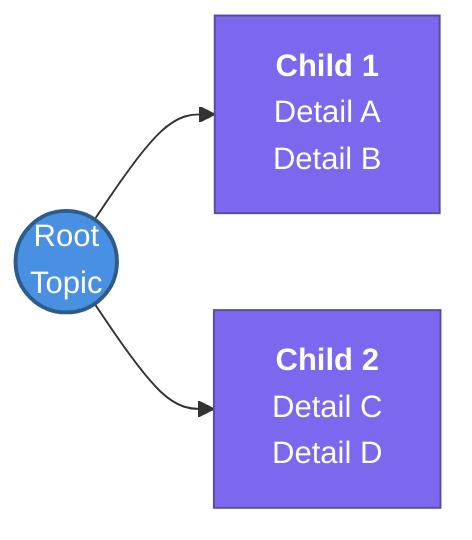

# Cloud-Engineering-Vault — Agent Instructions

This is Madhan's Obsidian study vault for DevOps/Cloud Engineering (AWS, Kubernetes, IaC, CI/CD, Agentic AI). These rules are derived from `CONVENTIONS.md`, `Templates/Master Concept Template.md`, `Templates/Tag Taxonomy.md`, and the patterns already used across existing notes. **Follow them strictly** for every note created or edited in this vault — don't freelance a different structure even if it seems reasonable in isolation.

If this file and `CONVENTIONS.md` / `Templates/Tag Taxonomy.md` ever disagree, those two are authoritative — fix this file to match, don't silently pick one.

## Folder structure
- `Knowledge Base/<Domain>/` — one folder per high-level domain (`AWS`, `Kubernetes`, `Agentic-AI`, etc.). No deep nesting, except a domain's own subtopic subfolder (see "Note types" below).
- `Templates/` — the master template and tag taxonomy. Check both before creating a new note.
- `_attachments/` — every image/screenshot goes here, flat (no subfolders). Reference with an Obsidian wikilink, `![[filename.png]]` — don't leave pasted images sitting in the vault root or next to the note, and don't reference them with a relative markdown path for new images.
- Root: `index.md` (master roadmap, links out to concept notes), `Todo.md` (informal scratch list — no template needed), `questions/`, `resume/` — these aren't Knowledge Base content, so the concept template doesn't apply to them.

## Note types
This vault uses three note shapes — pick the right one:

1. **Hub note** — numbered `N. Title.md` at the domain root (e.g. `1. VPC Deep Dive.md`, `1. AI Agents Fundamentals.md`). One per domain-area that has multiple detailed children. Opens with a one-line sentence naming it as the hub. Has a `## 🧭 Subtopics` section listing each child note with a one-line description. Connections use **Relates to:**. Mind map is an "Overview" — each subtopic gets its own detailed mind map in its own note.
2. **Subtopic note** — lives inside the matching `Domain/` subfolder, one level under a hub (e.g. `AWS/VPC/Subnets.md`, `AWS/VPC/VPC-Peering.md`). Connections section uses **Part of:** linking back to the hub note (not "Relates to:"). Flashcards use a domain-namespaced tag, `#flashcards/aws`, not the plain `#flashcards`. Must be linked from the hub note's Subtopics list — if you create one and it isn't listed there yet, add it both ways.
3. **Standalone note** — numbered `N. Title.md` sibling of a hub note but not itself a hub (e.g. `3.ALB vs NLB.md`, `5. Route53 & Hybrid DNS.md`). Use this when the topic doesn't need its own subfolder of children. Connections use **Relates to:**. Flashcards use the plain `#flashcards` tag.

File naming: `N. Title.md` (number, period, space, title). Numbers reflect study order within that domain folder.

## Every concept note follows the Master Concept Template
Frontmatter — exact shape, always:
```yaml
---
tags:
  - <topic tag from Tag Taxonomy>
  - review
status: not-started | in-progress | completed
---
```
- `status` is a frontmatter property only — never write it as an inline `#status/...` tag.
- Always include `review` as a tag (drives the spaced-repetition plugin).
- Only use topic tags already listed in `Templates/Tag Taxonomy.md` (e.g. `aws/networking`, `aws/compute`, `kubernetes/eks`, `iac/terraform`, `agent-ai/mcp`, ...). If a note doesn't fit an existing tag, add the new tag to `Tag Taxonomy.md` first, then use it — don't invent one inline.

Section order and headers — exact, don't reorder or rename:
```
# Title
## 📖 Core Concepts
## 🧭 Subtopics        (hub notes only)
## 🔗 Connections (Zettelkasten)
- **Relates to:** / **Part of:**
- **Core Use Case:**
---
## 🛠️ Study Aids
### 🧠 Mind Map
### 🗂️ Flashcards
#flashcards or #flashcards/<domain>
```

## Mind maps: keep them compact
Deep, multi-level `mindmap` blocks render oversized in Obsidian and are hard to scan. Prefer a flat `flowchart LR` with the root plus 4-6 children max, condensing sub-details into each node with `<br/>` line breaks instead of adding grandchild nodes. Style with `classDef` for a root node and a shared child node style (see `3.ALB vs NLB.md` or `5. Route53 & Hybrid DNS.md` for the reference pattern). Only use the deeper multi-level `mindmap` syntax when a hub note's "Overview" mind map genuinely needs to show every subtopic at a glance.

**Standard Template:**


## Filling in a stub or "Pending Study Session" note
- Don't answer narrowly — bring the note up to the same bar as finished sibling notes: complete `Core Concepts`, real `Connections` (not empty `[[ ]]`), a compact mind map, and several genuine flashcards (not the placeholder `**Question?**`).
- Update `status` in frontmatter to reflect the new state.
- Verify technical claims already in the note before building on them — fix anything wrong rather than preserving it.
- If it's a subtopic note, confirm it's linked from its hub's Subtopics list; add the link if missing.

## Canvas Files
When creating `.canvas` files to map out topics, do NOT use embedded file nodes (`"type": "file"`). Instead, use text nodes (`"type": "text"`) containing standard Obsidian wikilinks (e.g., `[[VPC/Subnets|Subnets]]`). Formatting the link as a Markdown header (e.g., `### [[Note Name]]`) makes it a large, clickable button. This ensures that clicking a topic in the canvas immediately navigates to the respective note rather than attempting to render a tiny embed on the canvas.

## Guided Learning & Hands-On Practice
Because the user studies asynchronously within Obsidian (rather than via live chat tutoring), the AI's role is to generate self-guided learning materials directly in the vault:
1. **Self-Guided Checklists:** Map hands-on practice (like Terraform labs or architecture exercises) into structured markdown checklists (e.g., `- [ ] Task`) in dedicated Lab notes.
2. **Clear Verification Steps:** Since the AI won't interactively review the user's work, every practical exercise must include self-verification steps (e.g., "Run `terraform plan` to verify X", or "Try pinging the IP to test the Security Group").
3. **Link to Theory:** Every practice lab or exercise must use bidirectional links (`[[ ]]`) pointing back to the core concept notes so the user can easily look up the theory while practicing.
4. **Flashcards for Knowledge Checks:** Instead of asking chat-based questions, convert testing questions into Obsidian spaced-repetition flashcards (`#flashcards`) placed at the bottom of the relevant concept notes.
