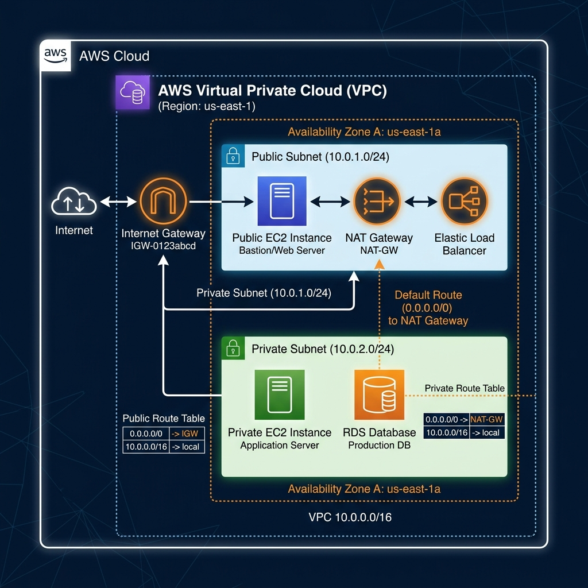
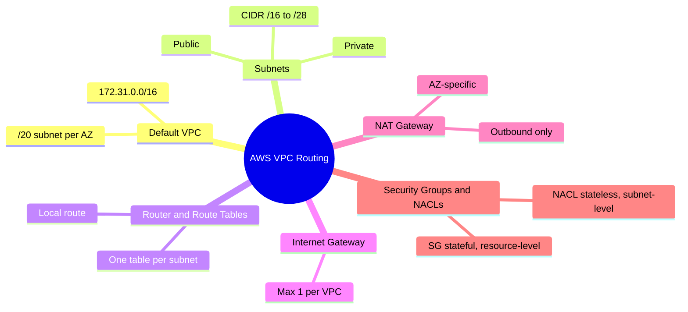

---
tags:
  - aws/networking
  - vpc
  - review
status: completed
kodekloud-basic: https://learn.kodekloud.com/user/courses/aws-networking-fundamentals
kodekloud: https://learn.kodekloud.com/user/courses/aws-solutions-architect-associate-certification
---
# AWS Virtual Private Cloud (VPC) Deep Dive

This is the hub note for AWS VPC routing. It covers the high-level concept and links out to each subtopic — Default VPC, Subnets, Router & Route Tables, Internet Gateway, and NAT Gateway — which each carry their own detailed notes, mind map, and flashcards.

## Architecture Diagram

#review

## 📖 Core Concept
- **VPC (Virtual Private Cloud)**: A logically isolated section of the AWS Cloud where you can launch AWS resources in a virtual network that you define.

## 🧭 Subtopics
- [[VPC/Default VPC|Default VPC]] — the auto-created default VPC's CIDR layout and open-by-default settings.
- [[VPC/Subnets|Subnets]] — public vs. private subnets, CIDR sizing rules, reserved addresses.
- [[VPC/Router & Route Tables|Router & Route Tables]] — how the VPC router forwards traffic between subnets.
- [[VPC/Internet Gateway (IGW)|Internet Gateway (IGW)]] — setup flow and the 1:1 VPC limit.
- [[VPC/NAT Gateway|NAT Gateway]] — AZ-specific, outbound-only internet access for private subnets.
- [[VPC/Security-group & NACLS|Security Groups & NACLs]] — stateful per-resource firewalls vs. stateless per-subnet firewalls.

## 🔗 Connections (Zettelkasten)
- **Relates to:** [[EKS Architecture]]
- **Core Use Case:** EKS worker nodes must be deployed in private subnets and routed through a NAT Gateway for security — see [[VPC/NAT Gateway|NAT Gateway]] for the full scenario.

## 🛠️ Study Aids

### 🧠 Mind Map (Overview)
*Each subtopic below has its own detailed mind map — this is just the top-level shape.*

### 🗂️ Flashcards
Flashcards for this topic are distributed across each subtopic note above (they're still tagged `#flashcards/aws`, so spaced-repetition review picks them up regardless of file).
