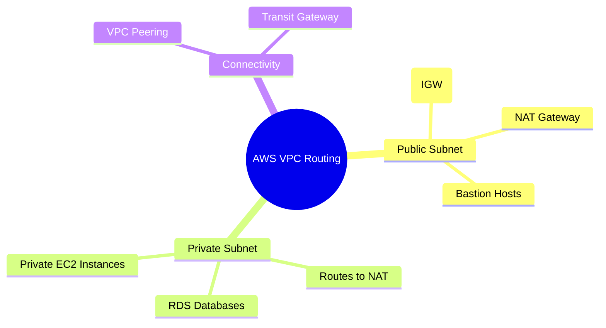

---
tags:
  - aws/networking
  - vpc
  - review
status: completed
kodekloud-basic: https://learn.kodekloud.com/user/courses/aws-networking-fundamentals
kodekloud: https://learn.kodekloud.com/user/courses/aws-solutions-architect-associate-certification
---
# AWS Virtual Private Cloud (VPC) Deep Dive

This note covers the core components of AWS VPC routing, including Public/Private subnets, Internet Gateways (IGW), and NAT Gateways.

## Architecture Diagram

#review 
## Core Concepts
- **VPC (Virtual Private Cloud)**: A logically isolated section of the AWS Cloud where you can launch AWS resources in a virtual network that you define.
- **Public Subnet**: A subnet whose route table directs the subnet's traffic to the Amazon VPC's Internet Gateway (IGW).
- **Private Subnet**: A subnet whose route table does *not* have a route to an Internet Gateway. Instead, it typically routes outbound internet traffic through a NAT Gateway or NAT Instance.
- **Internet Gateway (IGW)**: A horizontally scaled, redundant, and highly available VPC component that allows communication between instances in your VPC and the internet.
- **NAT Gateway**: Enables instances in a private subnet to connect to the internet or other AWS services, but prevents the internet from initiating a connection with those instances.

## 🔗 Connections (Zettelkasten)
- **Relates to:** [[EKS Architecture]]
- **Core Use Case:** EKS worker nodes must be deployed in private subnets and routed through a NAT Gateway for security.

### Scenario: Private Instance Accessing the Internet
*Advanced Architecture Scenario*

**Question:** What if a private instance needs to reach out to the internet to download a Python package, but no one from the internet should be able to initiate a connection to it? What do you use?

**Answer:**
You deploy a **NAT Gateway** (or NAT Instance) in a *Public* subnet. 
Then, you update the *Private* subnet's Route Table to point `0.0.0.0/0` (all internet traffic) to the NAT Gateway. The NAT Gateway then routes that traffic out through the Internet Gateway attached to the VPC.

---
*Tutor Notes to Self:* I need to review how the cost of a NAT Gateway differs from a NAT Instance for heavy data workloads (like my Selenium grid project).

## Study Aids

### 🧠 Mind Map

### 🗂️ Flashcards

#flashcards/aws

**What is the main difference between an Internet Gateway (IGW) and a NAT Gateway?**
?
An IGW allows bi-directional traffic (internet can initiate connections to your instance). A NAT Gateway only allows outbound traffic (your private instance can reach the internet, but the internet cannot reach in).

---

**If you want to connect 50 AWS VPCs together, why should you use a Transit Gateway instead of VPC Peering?**
?
VPC Peering is non-transitive, meaning you would have to build a complex web of individual connections. A Transit Gateway acts as a central hub where every VPC just connects once.

---

**If you are building a standard web application, which subnet would you put the React web server in, and which subnet would you put the Postgres database in?**
?
The React Web Server goes in a PUBLIC Subnet because regular users on the internet need to reach it. The Postgres Database goes in a PRIVATE Subnet because it holds sensitive data and should never be accessible from the internet directly.

---

**If you want to configure your Private Subnet's Route Table to send all unknown internet traffic to the NAT Gateway, what specific IP address block (CIDR block) do you put in the Route Table rule?**
?
0.0.0.0/0
