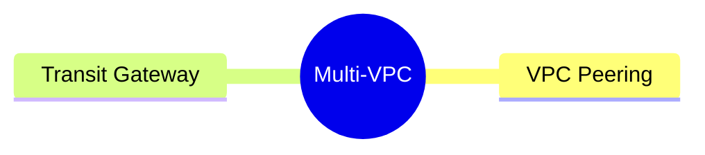

---
tags:
  - aws/networking
  - review
status: in-progress
---
# Transit Gateway & VPC Peering

## 📖 Core Concepts

### 1. The Multi-VPC Problem
When you have multiple VPCs (e.g., Dev, Staging, Prod), they need a way to talk to each other.
#### VPC peering(The Old Way)**: 
	Draws a direct line between two VPCs. However, it is **non-transitive**. If A connects to B, and B connects to C, A cannot talk to C. You have to build a complex web of individual connections.
#### Transit Gateway (The Modern Hub): 
	TGW acts as a central router. You attach all your VPCs to the TGW, and they can instantly route traffic to each other. To isolate them (e.g., stopping Dev from talking to Prod), you use multiple **TGW Route Tables**.

### 2. Hybrid Connectivity (AWS to On-Premises)
Enterprise companies don't want their corporate data traveling over the public internet.

#### AWS Direct Connect
	A physical, dedicated fiber-optic cable running from your corporate office directly into an AWS data center. It plugs directly into your Transit Gateway.

#### BGP (Border Gateway Protocol)
     The "Language" of routers. 
	The Analogy**: Imagine FedEx knows every street in New York, and UPS knows every street in California. If they partner up, they need a universal language to automatically share their delivery maps with each other. BGP is that universal language. It allows your office router and the AWS Transit Gateway to automatically share their IP addresses with each other, so you never have to manually update route tables when you launch a new subnet.

## 🔗 Connections (Zettelkasten)
- **Relates to:** [[1. VPC Deep Dive]]
- **Core Use Case:** 

---

## 🛠️ Study Aids

### 🧠 Mind Map

### 🗂️ Flashcards

#flashcards

**If you want to connect 50 AWS VPCs together, why should you use a Transit Gateway instead of VPC Peering?**
?
VPC Peering is non-transitive, meaning you would have to build a complex web of individual connections. A Transit Gateway acts as a central hub where every VPC just connects once.

---

**How do you isolate VPCs from each other when they are all attached to the same Transit Gateway?**
?
You use multiple **Transit Gateway Route Tables**. By associating the Prod VPC to a different TGW Route Table than the Dev VPC, you can control exactly which attachments can route traffic to each other.

---

**What is the name of the standard networking protocol used by AWS Direct Connect and Transit Gateways to dynamically share routing information with an on-premises data center?**
?
BGP (Border Gateway Protocol)

---

**How were you managing the networking between multiple AWS accounts?**
?
By using a central Transit Gateway (TGW) deployed in a central Hub networking account, and attaching all the Spoke VPCs from other accounts to it.

---

**Suppose you have instances across multiple accounts and regions, and you need them to communicate with each other with full ingress and egress connectivity. How would you set up that architecture?**
?
I would deploy a Transit Gateway in each region, attach the local VPCs to their respective regional TGW, and then establish a Transit Gateway Peering Connection between the regional TGWs to allow cross-region traffic.

---

**If you have instances across many regions, how many Transit Gateways would you create? How will the routing work?**
?
You create one Transit Gateway per region. For routing to work globally, you peer the Transit Gateways together and update the TGW Route Tables to point cross-region traffic across the peering connection.

---

**How do you share a Transit Gateway across multiple accounts? How do you set up the route tables and attachments?**
?
You share the Transit Gateway using AWS RAM (Resource Access Manager). Once shared, other accounts can create TGW Attachments. You control isolation by assigning different VPC attachments to different TGW Route Tables in the central hub.

---

**Are you aware of AWS RAM (Resource Access Manager)? How is it used with Transit Gateway?**
?
AWS RAM is a service used to share AWS resources securely across accounts or AWS Organizations. It is used to share the central Transit Gateway resource with spoke accounts so they can attach their VPCs to it.

---

**If a Transit Gateway is created and shared from the hub networking account, what is the next step you need to do on the spoke account side to complete the connectivity?**
?
In the spoke account, you must accept the RAM resource share (if not auto-accepted via Organizations), create a Transit Gateway Attachment pointing to your VPC, and finally update your local VPC Subnet Route Tables to send traffic to the TGW.
