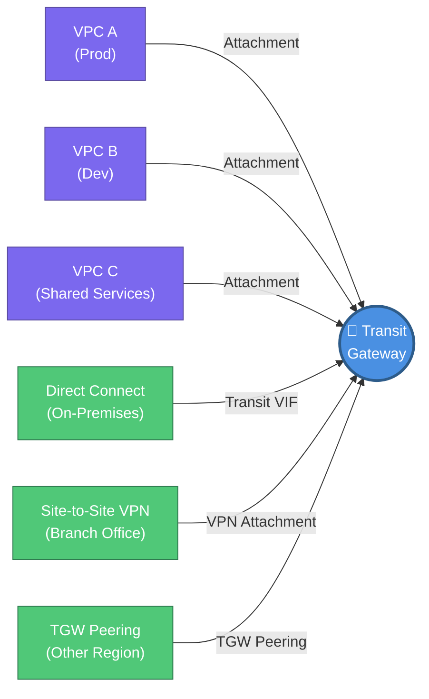
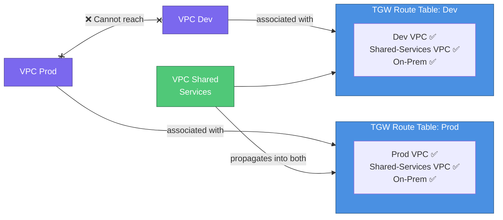
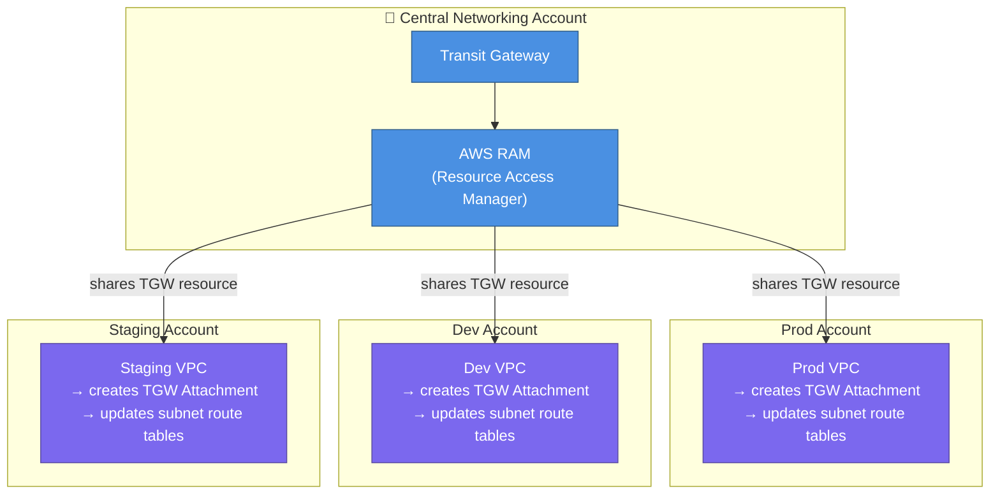
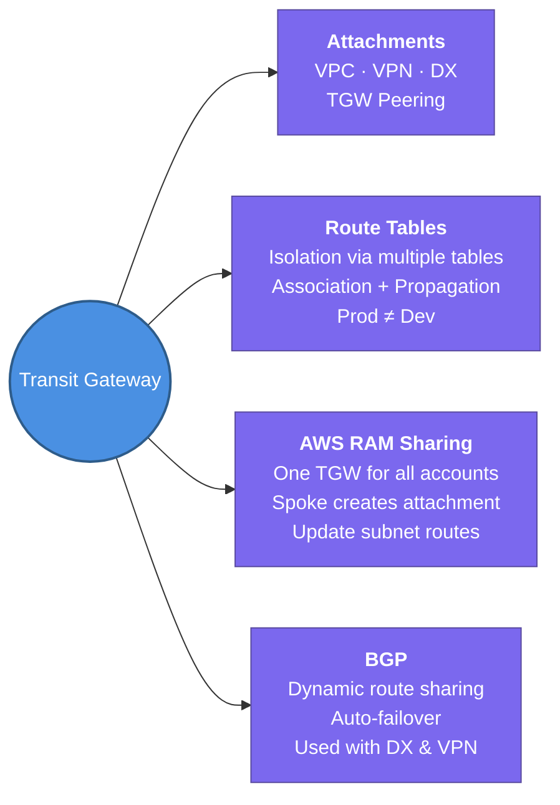

---
tags:
  - aws/networking
  - review
  - inprogress
status: completed
---
# Transit Gateway (TGW)

## 📖 Core Concepts

### What is Transit Gateway?
A **regional network hub** that connects multiple VPCs, on-premises networks, and AWS services through a single managed router — instead of building a sprawling web of individual VPC Peering connections.

> 🏙️ Think of Transit Gateway like a **central bus station** in a city. Instead of every neighbourhood needing a direct road to every other neighbourhood (full-mesh peering), all buses just route through the central station. Add a new neighbourhood? Connect it to the hub — done.

---

### The Problem It Solves — VPC Peering at Scale

VPC Peering is **non-transitive** and becomes unmaintainable fast:

| VPCs | Peering connections needed | TGW attachments needed |
|---|---|---|
| 3 | 3 | 3 |
| 5 | 10 | 5 |
| 10 | 45 | 10 |
| 50 | 1,225 | 50 |

With TGW: each VPC connects **once** to the hub. Every other VPC is reachable automatically.

---

### How Transit Gateway Works — Core Components

**Key terms:**
- **Attachment** — how a VPC, VPN, or Direct Connect connects to a TGW. Each attachment has its own set of routes.
- **TGW Route Table** — controls which attachments can send traffic to which other attachments. TGW can have multiple route tables.
- **Association** — links an attachment to a specific TGW Route Table (determines which table resolves outbound routes for that attachment).
- **Propagation** — an attachment can automatically advertise its CIDR into a TGW Route Table via BGP or static routes.

---

### TGW Route Tables — Controlling Isolation ⭐

This is the most powerful feature. By default, all attachments share one route table and can reach each other. You can **segment** traffic by creating additional route tables.

**Example: Isolating Prod from Dev**

> [!TIP]
> Shared Services VPC (hosting DNS, logging, monitoring) propagates its CIDR into **both** route tables so everyone can reach it — but Prod and Dev route tables don't know about each other.

---

### Hybrid Connectivity — On-Premises via TGW

TGW centralises hybrid connections. Instead of each VPC managing its own Direct Connect or VPN:

| Connection type | How it attaches to TGW | Best for |
|---|---|---|
| **Direct Connect** | Transit VIF → DXGW → TGW | High-bandwidth, low-latency dedicated link |
| **Site-to-Site VPN** | VPN Attachment directly on TGW | Branch offices, cost-effective |
| **TGW Peering** | Inter-region TGW peering connection | Multi-region global routing |

> [!IMPORTANT]
> Direct Connect does **not** attach directly to a TGW. The flow is: Physical Link → DX Location → **Transit VIF** → **Direct Connect Gateway (DXGW)** → TGW. The DXGW is the mandatory middle layer.

---

### BGP (Border Gateway Protocol) — How Routes Are Shared

BGP is the **routing language** used between TGW and on-premises routers to automatically exchange route information.

> 📬 BGP is like two post offices that automatically share their delivery maps with each other. When AWS launches a new subnet, BGP tells your office router about it — no manual route table update needed.

| Feature | BGP (Dynamic) | Static Routes |
|---|---|---|
| Route updates | Automatic | Manual |
| Failover | BGP withdraws failed routes automatically | Manual update required |
| Complexity | Higher — needs BGP-capable router | Simple |
| Use when | Direct Connect, production VPNs | Simple VPN, no BGP support |

---

### Multi-Account Architecture — Sharing TGW via AWS RAM

In an enterprise, VPCs live in many AWS accounts. You don't create a TGW per account — you share one central TGW:

**Steps for spoke account to complete connectivity:**
1. Accept the RAM resource share (auto-accepted if using AWS Organizations)
2. Create a TGW Attachment in your VPC (select the shared TGW ID)
3. Update your **subnet route tables** to send traffic destined for other VPCs to `tgw-xxxxxxxx`

---

### Multi-Region — TGW Peering

One TGW only operates in one region. For global architectures, peer TGWs across regions:

- TGW in `us-east-1` ↔ TGW Peering Connection ↔ TGW in `eu-west-1`
- Static routes must be manually added to each TGW Route Table for cross-region CIDRs
- Traffic crosses the AWS private global backbone — not the public internet

---

### VPC Peering vs. Transit Gateway — When to Use Each

| Factor | VPC Peering | Transit Gateway |
|---|---|---|
| Number of VPCs | Few (2–5) | Many (5+) |
| Transitivity needed? | ❌ No | ✅ Yes |
| Cost | Free (same-AZ) | Per attachment + per GB processed |
| Hybrid (on-prem) | ❌ No | ✅ Yes (VPN, DX) |
| Centralized control | ❌ Decentralized | ✅ One hub |
| Cross-region | ✅ Yes | ✅ Yes (TGW Peering) |

> [!TIP]
> **Rule of thumb:** Start with VPC Peering for simple 1:1 connections. Migrate to TGW once you have 3+ VPCs, need on-prem connectivity, or need traffic isolation.

---

## 📋 Summary

- Transit Gateway is a **regional hub router** — attach VPCs, VPNs, Direct Connect, and other TGWs to it
- Solves VPC Peering's **full-mesh scaling problem** — N VPCs need only N attachments, not N*(N-1)/2 connections
- **TGW Route Tables** control isolation — Prod and Dev can both attach to TGW but be kept in separate route tables so they can't reach each other
- **Association** = which route table an attachment uses for outbound lookups; **Propagation** = what routes an attachment advertises into a table
- Direct Connect attaches via: Physical Link → DX Location → Transit VIF → **DXGW** → TGW (DXGW is mandatory)
- Share one TGW across all accounts using **AWS RAM** — spoke accounts create TGW Attachments and update their subnet route tables
- For multi-region routing: create a **TGW Peering Connection** between regional TGWs and add static routes manually
- **BGP** dynamically shares routes between TGW and on-premises — auto-propagates new subnets and handles failover

---

## 🔗 Connections (Zettelkasten)
- **Relates to:** [[1. VPC Deep Dive]]
- **Relates to:** [[VPC/VPC-Peering|VPC Peering]] — the simpler alternative for small topologies; TGW solves the non-transitive scaling problem.
- **Relates to:** [[5. Route53 & Hybrid DNS|Direct Connect & Hybrid DNS]] — DX uses a Transit VIF + DXGW to attach to TGW.
- **Relates to:** [[VPC/VPN-connections|VPN Connections]] — Site-to-Site VPN attaches directly to TGW as a VPN attachment.
- **Core Use Case:** Central networking account pattern — one TGW shared via RAM to all org accounts. Prod/Dev isolated via separate TGW Route Tables. On-prem connected once via DX/VPN through the hub TGW.

---

## 🛠️ Study Aids

### 🧠 Mind Map

### 🗂️ Flashcards

#flashcards/aws

**What is AWS Transit Gateway and what problem does it solve over VPC Peering?**
?
Transit Gateway is a regional network hub that connects VPCs and on-premises networks through a single managed router. It solves VPC Peering's non-transitive scaling problem — instead of N*(N-1)/2 peer connections for N VPCs, each VPC attaches once to TGW.

---

**How do you isolate Prod VPCs from Dev VPCs when both are attached to the same Transit Gateway?**
?
Use multiple **TGW Route Tables**. Associate the Prod VPC attachment with a "Prod" route table and the Dev VPC attachment with a "Dev" route table. Since each table only knows about the attachments propagated into it, Prod and Dev traffic cannot reach each other.

---

**What is the difference between a TGW Route Table Association and Propagation?**
?
- **Association** — links an attachment to a route table, meaning that attachment uses that table to look up routes for outbound traffic.
- **Propagation** — the attachment advertises (pushes) its CIDR into a route table, making it reachable by other attachments that use that table.

---

**How does Direct Connect attach to a Transit Gateway? What is the mandatory middle component?**
?
Direct Connect cannot attach directly to TGW. The flow is: Physical DX Link → Transit VIF → **Direct Connect Gateway (DXGW)** → Transit Gateway. DXGW is the required intermediary.

---

**How do you share a Transit Gateway across multiple AWS accounts?**
?
Share the TGW using **AWS RAM (Resource Access Manager)**. Spoke accounts accept the resource share, create a TGW Attachment in their VPC, and update their subnet route tables to point traffic at the TGW ID.

---

**After a spoke account accepts a shared TGW via RAM, what are the two remaining steps to enable traffic flow?**
?
1. Create a **TGW Attachment** in the spoke VPC pointing to the shared TGW.
2. Update the **subnet route tables** in the spoke VPC to route destination CIDRs to `tgw-xxxxxxxx`.

---

**How do you connect Transit Gateways across different AWS regions?**
?
Create a **TGW Peering Connection** between the regional Transit Gateways. Then manually add static routes in each TGW Route Table pointing the remote region's CIDRs across the peering connection. Traffic travels over AWS's private global backbone.

---

**What is BGP and why is it used with Transit Gateway?**
?
BGP (Border Gateway Protocol) is the routing protocol used between TGW and on-premises routers to automatically exchange route information. When new subnets are created, BGP propagates the routes dynamically — no manual route table updates needed. It also handles automatic failover by withdrawing routes for failed paths.

---

**When should you choose VPC Peering over Transit Gateway?**
?
Choose VPC Peering for simple 1:1 connections between a small number of VPCs (2–5) where no on-prem connectivity, transitivity, or centralized isolation is needed. TGW has per-attachment and per-GB costs that make peering cheaper for very simple topologies.
