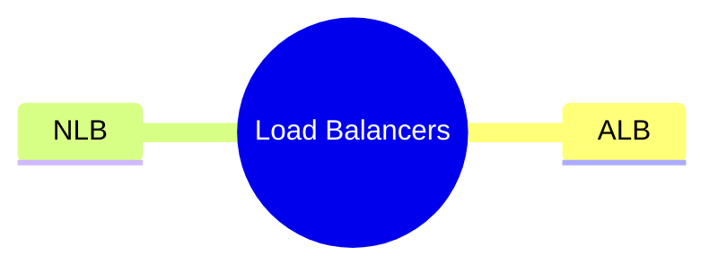

---
tags:
  - aws/networking
  - review
status: in-progress
---
# ALB vs NLB

## 📖 Core Concepts
*Explain the concept using the Feynman Technique here...*

## 🔗 Connections (Zettelkasten)
- **Relates to:** [[1. VPC Deep Dive]]
- **Core Use Case:** 

---

## 🛠️ Study Aids

### 🧠 Mind Map

### 🗂️ Flashcards

#flashcards

**When would you choose an Application Load Balancer (ALB) over a Network Load Balancer (NLB)?**
?
Choose an ALB when you need Layer 7 routing (e.g., routing based on HTTP URLs, hostnames, or headers) or SSL termination. Choose an NLB when you need ultra-fast Layer 4 TCP/UDP routing, extreme performance (millions of requests/sec), or a static IP address.

---

**Inside an ALB, what can be registered as a valid "Target" in an ALB target group?**
?
EC2 instances, IP addresses, Lambda functions, and Application Load Balancers.

---

**Can a Network Load Balancer (NLB) be a target for an ALB? Can the reverse happen (an ALB be a target for an NLB)?**
?
An NLB cannot be a target for an ALB. However, the reverse IS true: An ALB CAN be a target for an NLB. This is commonly used when you need a static IP address (provided by the NLB) but also need Layer 7 URL routing (provided by the ALB).

---

**When configuring ALB Listener Rules, what type of conditions can you specify to route traffic to different target groups?**
?
You can route traffic based on Host header (domain name), Path (e.g., `/images` vs `/api`), HTTP headers, HTTP methods (GET/POST), Query parameters, and Source IP addresses.
