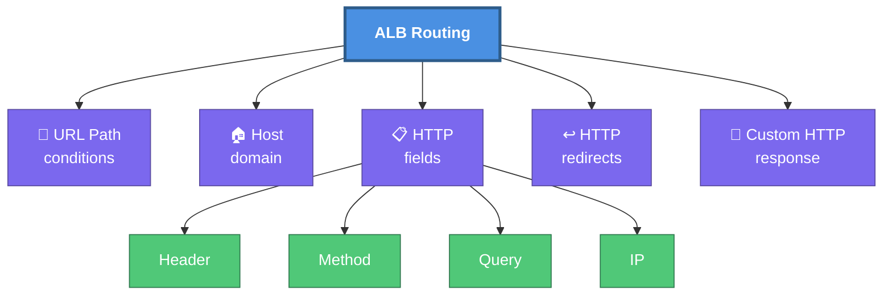
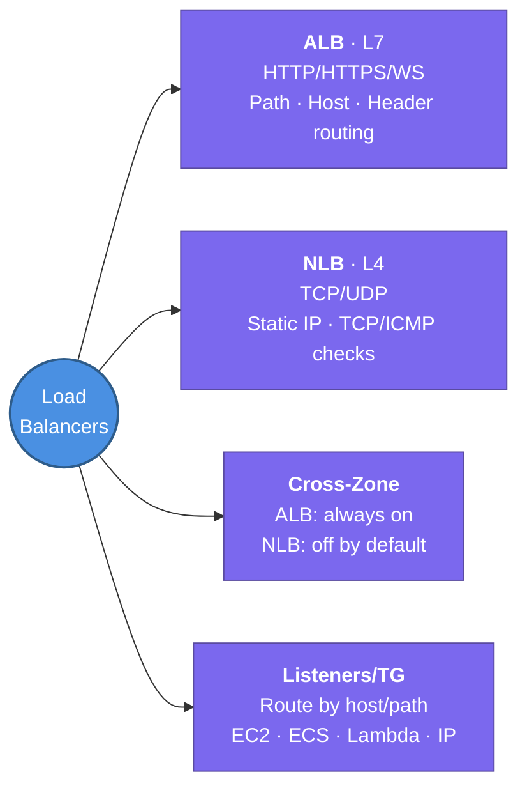

---
tags:
  - aws/networking
  - review
status: in-progress
---
# ALB vs NLB

## 📖 Core Concepts
*Explain the concept using the Feynman Technique here...*

### Application Load Balancer (ALB)
- Operates at Layer 7 (application layer) of the OSI model
- Supports HTTP/HTTPS and WebSocket
- Performs application-specific health checks (e.g. an actual HTTP request, not just a port check)
- Routes requests based on the *content* of the request, not just IP/port

**Forwards requests based on:** ⭐ Important
- URL path conditions
- Host domain
- HTTP fields — header, method, query, and IP
- Supports HTTP redirects and custom HTTP responses

### Network Load Balancer (NLB)
- Load balances traffic based on TCP/UDP (Layer 4 of the OSI model)
- Meant for applications that don't use HTTP/HTTPS
- Faster than Application Load Balancers — it isn't inspecting request content, just forwarding connections
- Health checks are basic TCP/ICMP connection checks only (not application-aware)
- Forwards TCP connections straight through to instances

## 🔗 Connections (Zettelkasten)
- **Relates to:** [[1. VPC Deep Dive]]
- **Core Use Case:** Front an ALB with an NLB when you need both a static IP (NLB) and Layer 7 host/path routing (ALB) — see flashcards below.

---

## Cross-Zone Load Balancing

![[Pasted image 20260715113337.png]]

- Incoming client traffic is split evenly across each enabled Availability Zone's LB node (e.g. 50/50 across 2 AZs).
- **Without cross-zone load balancing:** each LB node only forwards to targets within its own AZ. If AZs have an uneven number of registered targets, targets in the AZ with fewer instances take a disproportionately larger share of traffic.
- **With cross-zone load balancing** (as pictured above): each LB node spreads its share of traffic evenly across *all* registered targets in *all* AZs, regardless of which AZ the node itself sits in — evening out the imbalance.
- **ALB:** cross-zone load balancing is always on, no extra charge.
- **NLB:** off by default — can be enabled, but cross-AZ traffic then incurs standard inter-AZ data transfer charges.

---

## Listeners & Target Groups

![[Pasted image 20260715113817.png]]

- A **listener** checks for connection requests on the protocol/port you configure, then evaluates its rules in order to decide which **target group** to forward the request to.
- Rules can route by host or path to different target groups — e.g. `app1.com` → Target Group A, `app2.com/auth` → Target Group B, `app2.com/cart` → Target Group C.
- Target groups aren't limited to EC2 instances — they can also point to ECS tasks, Lambda functions, or IP addresses.
- This is what lets a single ALB front multiple microservices/backends behind one domain.

# Summary
---
	
- ELB auto-distributes incoming traffic across multiple targets in multiple Availability Zones
- Distributes traffic to EC2 instances, IPs, and Lambda functions, application load balancer.
- Three types of ELB: Classic, Application, Network
- CLBs are outdated and should be avoided
- ALB functions on application layer and forwards HTTP/HTTPS traffic
- NLB can forward non-HTTP/HTTPS traffic
- NLBs are faster than ALBs
- HTTP/HTTPS is always terminated on ALB and not Network Load Balancer
- ALB's cross-zone load balancing is always on; NLB's is off by default (and billed when enabled)
- Listener rules route requests by host/path to target groups, which can contain EC2, ECS, Lambda, or IP targets

## 🛠️ Study Aids

### 🧠 Mind Map

### 🗂️ Flashcards

#flashcards

**When would you choose an Application Load Balancer (ALB) over a Network Load Balancer (NLB)?**
?
Choose an ALB when you need Layer 7 routing (e.g., routing based on HTTP URLs, hostnames, or headers) or SSL termination. Choose an NLB when you need ultra-fast Layer 4 TCP/UDP routing, extreme performance (millions of requests/sec), or a static IP address.

---

**Inside an ALB, what can be registered as a valid "Target" in an ALB target group?**
?
EC2 instances, IP addresses, Lambda functions, and Application Load Balancers.

---

**Can a Network Load Balancer (NLB) be a target for an ALB? Can the reverse happen (an ALB be a target for an NLB)?**
?
An NLB cannot be a target for an ALB. However, the reverse IS true: An ALB CAN be a target for an NLB. This is commonly used when you need a static IP address (provided by the NLB) but also need Layer 7 URL routing (provided by the ALB).

---

**When configuring ALB Listener Rules, what type of conditions can you specify to route traffic to different target groups?**
?
You can route traffic based on Host header (domain name), Path (e.g., `/images` vs `/api`), HTTP headers, HTTP methods (GET/POST), Query parameters, and Source IP addresses.

---

**How can you authenticate or restrict traffic natively at the Application Load Balancer (ALB) level?**
?
1. **Listener Rules (Basic):** You can configure rules to only route traffic if it matches a specific URI path AND contains a specific Custom HTTP Header with a secret key.
2. **ALB Native Authentication (Advanced):** You can configure an ALB Listener with the "Authenticate" action, which automatically redirects incoming users to Amazon Cognito or an OIDC provider (like Okta/Auth0) to log in before routing them to your backend targets.

---

**What's the difference in cross-zone load balancing defaults between ALB and NLB?**
?
ALB has cross-zone load balancing always enabled at no extra cost. NLB has it disabled by default — you can turn it on, but you'll then be billed for the cross-AZ data transfer it generates.

---

**What is a Listener in the context of an Elastic Load Balancer, and what does it forward to?**
?
A Listener checks for connection requests on a configured protocol/port, evaluates its rules (host, path, header, etc.) in order, and forwards matching traffic to a Target Group — which can contain EC2 instances, ECS tasks, Lambda functions, or IP addresses.
