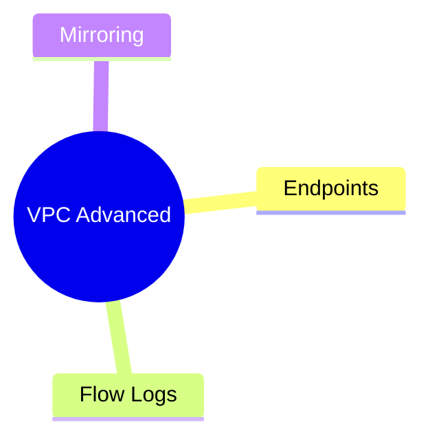

---
tags:
  - aws/networking
  - review
status: not-started
---
# VPC Advanced Features (Endpoints & Flow Logs)

## 📖 Core Concepts
*Explain the concept using the Feynman Technique here...*

#### VPC Endpoints (AWS PrivateLink)
*(Pending Study Session)*

#### VPC Flow Logs
*(Pending Study Session)*

#### Traffic Mirroring
*(Pending Study Session)*

## 🔗 Connections (Zettelkasten)
- **Relates to:** [[1. VPC Deep Dive]]
- **Core Use Case:** 

---

## 🛠️ Study Aids

### 🧠 Mind Map

### 🗂️ Flashcards

#flashcards
