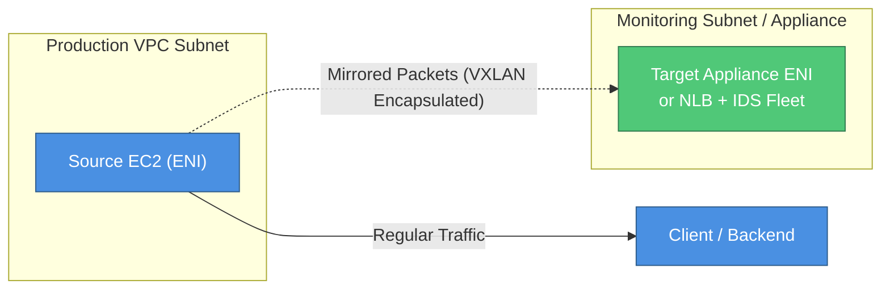
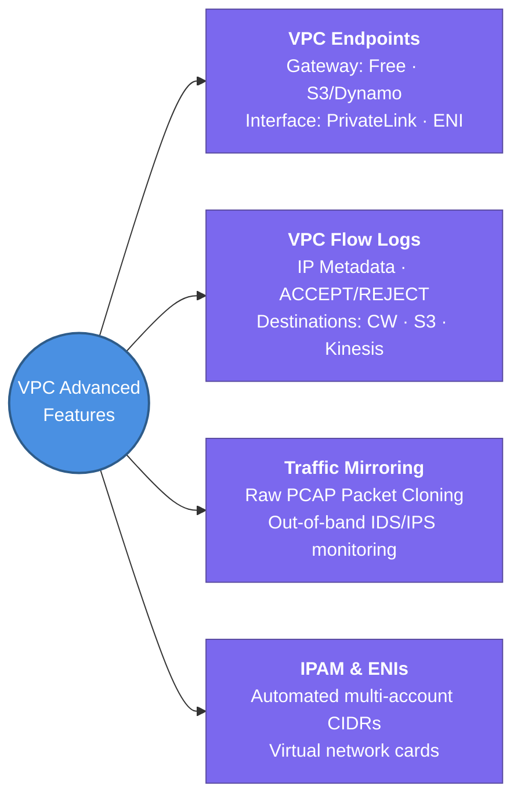

---
tags:
  - aws/networking
  - review
status: not-started
Repetition: rep/1
Next-Review: 
---
# VPC Advanced Features (Endpoints, Flow Logs & Traffic Mirroring)

## 📖 Core Concepts

As simple VPC networks mature into enterprise architectures, security, compliance, and deep observability become critical. VPC Advanced Features allow workloads to communicate privately across AWS backbones, audit network packet flows, and perform real-time intrusion inspection.

### 1. VPC Endpoints (Private Connectivity)
By default, consuming AWS services (like S3, DynamoDB, SSM, or ECR) from inside a VPC requires traffic to traverse an Internet Gateway (IGW) or NAT Gateway. **VPC Endpoints** enable private routing over the AWS internal backbone with zero public internet exposure.

| Feature | Gateway Endpoint | Interface Endpoint (AWS PrivateLink) |
|---|---|---|
| **Supported Services** | **S3 and DynamoDB only** | Most AWS services (SSM, ECR, CloudWatch, Secrets Manager) + Custom APIs & SaaS |
| **Underlying Mechanism** | **Route Table Entry** (Prefix list directed to Gateway) | **Elastic Network Interface (ENI)** with a private IP inside your subnet |
| **Security Controls** | VPC Endpoint IAM Policies | Endpoint Policies + ENI **Security Groups** |
| **Pricing** | 100% **Free** | Billed per AZ-hour + per GB of data transferred |

> [!TIP]
> Always prefer **Gateway Endpoints** for S3 and DynamoDB since they are free, highly scalable, and require no ENIs. For a deeper breakdown of PrivateLink architectures, see [[7. PrivateLink & VPC Endpoints]].

---

### 2. VPC Flow Logs (Network Metadata Observability)
**VPC Flow Logs** record IP traffic **metadata** entering and exiting network interfaces within your VPC. They do not record packet payloads, but log crucial connection telemetry: source/destination IPs, ports, protocols, bytes transferred, and **ACCEPT/REJECT** firewall decisions.

- **Granularity Scopes:** Can be enabled at the entire **VPC Level**, **Subnet Level**, or on individual **ENIs**.
- **Log Destinations:**
  - **CloudWatch Logs:** For near real-time alerting and metric filters.
  - **S3 Bucket:** Most cost-effective long-term storage; easily queryable via **Amazon Athena SQL**.
  - **Kinesis Data Firehose:** Directly streaming to third-party SIEM platforms (Splunk, Datadog).
- **Debugging Value:** A `REJECT` action in flow logs definitively indicates traffic was dropped by either a Security Group (stateful) or a NACL (stateless). See [[VPC/VPC Flow Logs|VPC Flow Logs Deep Dive]].

---

### 3. VPC Traffic Mirroring (Deep Packet Inspection)
While Flow Logs capture connection *metadata*, **VPC Traffic Mirroring** allows you to copy inbound and outbound **raw network packet payloads (full PCAP)** from an EC2 instance's network interface and send them out-of-band to a monitoring appliance for deep packet inspection (IDS/IPS, compliance auditing, threat hunting).

```mermaid
flowchart LR
    subgraph PROD["Production VPC Subnet"]
        SRC["Source EC2 (ENI)"]
    end
    subgraph MONITOR["Monitoring Subnet / Appliance"]
        TGT["Target Appliance ENI\nor NLB + IDS Fleet"]
    end
    SRC --->|"Regular Traffic"| CLIENT["Client / Backend"]
    SRC -..->|"Mirrored Packets (VXLAN Encapsulated)"| TGT

    classDef prod fill:#4A90E2,stroke:#2E5C8A,color:#fff
    classDef mon fill:#50C878,stroke:#2F7A4F,color:#fff
    class SRC,CLIENT prod
    class TGT mon
```

- **Source:** The AWS Elastic Network Interface (ENI) whose traffic you want to monitor.
- **Target:** An ENI of a monitoring EC2 instance or a **Network Load Balancer (NLB)** fronting a farm of inspection tools (like Zeek, Suricata, or Wireshark).
- **Traffic Mirror Filter:** Custom rules specifying exactly what packets to mirror or reject (e.g., only mirror TCP port 80/443 traffic, exclude internal SSH to reduce processing noise).
- **Non-Intrusive:** Packet copying takes place out-of-band on the AWS Nitro hardware card. It adds zero latency to production application traffic and cannot be detected by an attacker inside the guest OS.

---

### 4. VPC IPAM & Elastic Network Interfaces (ENI)
- **VPC IPAM (IP Address Manager):** An automated enterprise management service that monitors, pools, and assigns CIDR blocks across multiple AWS accounts and Regions. It actively prevents CIDR overlaps, audits IP utilization, and simplifies multi-VPC routing topologies.
- **ENI (Elastic Network Interface):** A virtual network interface card assigned to a subnet. ENIs hold one primary private IPv4 address, optional secondary private IPs, elastic IPs, MAC addresses, and security groups. ENIs can be dynamically detached from a failing instance and reattached to a hot standby in the same AZ to retain IP identity.

---

## 🔗 Connections (Zettelkasten)
- **Relates to:** [[1. VPC Deep Dive]]
- **Relates to:** [[7. PrivateLink & VPC Endpoints]] — Deep dive into Interface Endpoints and cross-account service sharing.
- **Relates to:** [[VPC/VPC Flow Logs|VPC Flow Logs]] — Dedicated reference for metadata log fields, Athena SQL queries, and troubleshooting.
- **Relates to:** [[VPC/VPC-Terraform-Labs|VPC Terraform Labs]] — Hands-on implementation of routing, endpoints, and firewall security.
- **Core Use Case:** Enforcing zero-internet AWS service integrations, diagnosing dropped network packets via metadata analysis, and conducting deep packet forensic capture without impacting production latency.

---

## 🏗️ Proof of Work
- **Lab/Script:** [[VPC/VPC-Terraform-Labs]]
- **Verification Command:** `aws ec2 describe-vpc-endpoints && aws ec2 describe-flow-logs`

---

## 🛠️ Study Aids

### 🧠 Mind Map

```mermaid
flowchart LR
    VPCADV((VPC Advanced<br/>Features))
    VPCADV --> EP["<b>VPC Endpoints</b><br/>Gateway: Free · S3/Dynamo<br/>Interface: PrivateLink · ENI"]
    VPCADV --> FL["<b>VPC Flow Logs</b><br/>IP Metadata · ACCEPT/REJECT<br/>Destinations: CW · S3 · Kinesis"]
    VPCADV --> TM["<b>Traffic Mirroring</b><br/>Raw PCAP Packet Cloning<br/>Out-of-band IDS/IPS monitoring"]
    VPCADV --> IPAM["<b>IPAM & ENIs</b><br/>Automated multi-account CIDRs<br/>Virtual network cards"]

    classDef root fill:#4A90E2,stroke:#2E5C8A,color:#fff,stroke-width:2px
    classDef node fill:#7B68EE,stroke:#5A4BA0,color:#fff
    class VPCADV root
    class EP,FL,TM,IPAM node
```

### 🗂️ Flashcards

#flashcards/aws

**What is the difference in cost, underlying mechanism, and target services between Gateway VPC Endpoints and Interface VPC Endpoints?**
?
- **Gateway Endpoints:** Free, implemented as a Route Table prefix list entry, supports S3 and DynamoDB ONLY.
- **Interface Endpoints:** Billed per AZ-hour + data processed, uses an Elastic Network Interface (ENI) with a private IP in your subnet, supports most other AWS services and custom SaaS APIs via AWS PrivateLink.
<!--SR:!2026-08-05,3,250-->

---

**What is the core distinction between VPC Flow Logs and VPC Traffic Mirroring?**
?
VPC Flow Logs capture connection **metadata only** (IPs, ports, protocol, bytes, ACCEPT/REJECT status) for observability and debugging. VPC Traffic Mirroring clones **raw network packet payloads (full PCAP)** and sends them out-of-band to monitoring or IDS/IPS appliances for deep packet inspection.
<!--SR:!2026-08-05,3,250-->

---

**Does enabling VPC Traffic Mirroring cause latency or performance degradation to production application traffic?**
?
No. Traffic Mirroring happens out-of-band natively on the AWS Nitro hypervisor card. It adds zero latency to production traffic and is completely transparent to the operating system and running applications.
<!--SR:!2026-08-05,3,250-->

---

**What AWS architectural tool should an enterprise use to centrally manage, pool, and prevent overlapping CIDR block allocations across hundreds of accounts and regions?**
?
VPC IPAM (IP Address Manager).
<!--SR:!2026-08-05,3,250-->

---

**If you need to deploy an Intrusion Detection System (IDS) farm to monitor raw packet payloads across multiple EC2 instances without routing all production traffic directly through the IDS inline, what AWS networking feature should you use?**
?
VPC Traffic Mirroring. You can set the monitored EC2 ENIs as "Mirrored Sources" and send the cloned packet stream to a Network Load Balancer (NLB) fronting your IDS/IPS appliance fleet as the "Target".
<!--SR:!2026-08-05,3,250-->
