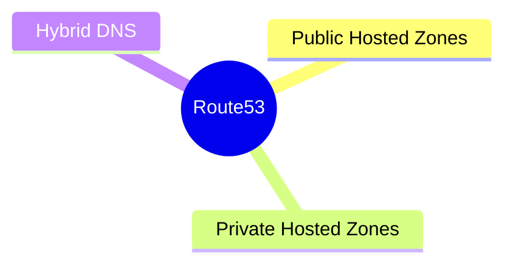

---
tags:
  - aws/networking
  - review
status: not-started
---
# Route53 & Hybrid DNS

## 📖 Core Concepts
*Explain the concept using the Feynman Technique here...*

#### Route53 Basics
*(Pending Study Session)*

#### Hybrid DNS (Inbound/Outbound Endpoints)
*Pending Study Session answering: How do you resolve internal domain names (like `db.corp.local`) between your on-premises data center and your AWS VPC?*

## 🔗 Connections (Zettelkasten)
- **Relates to:** [[1. VPC Deep Dive]]
- **Core Use Case:** 

---

## 🛠️ Study Aids

### 🧠 Mind Map

### 🗂️ Flashcards

#flashcards
