---
tags:
  - aws/networking
  - review
status: completed
---
# Route53, Hybrid DNS & Direct Connect

## 📖 Core Concepts

> [!NOTE]
> **Big Picture First — What problem does each service solve?**

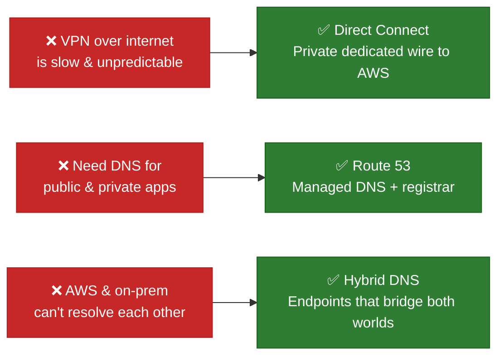

---

### 🔌 Part 1 — AWS Direct Connect (DX)

#### What is it?
A **physical, private cable** between your data center and an AWS DX location (a colocation facility). Traffic never touches the public internet.

> 🚂 **VPN over internet** = driving on a public highway. Fast most of the time, but traffic jams happen.
> 🛤️ **Direct Connect** = your own private railway track. Reserved, predictable, and consistent.

#### When to use Direct Connect

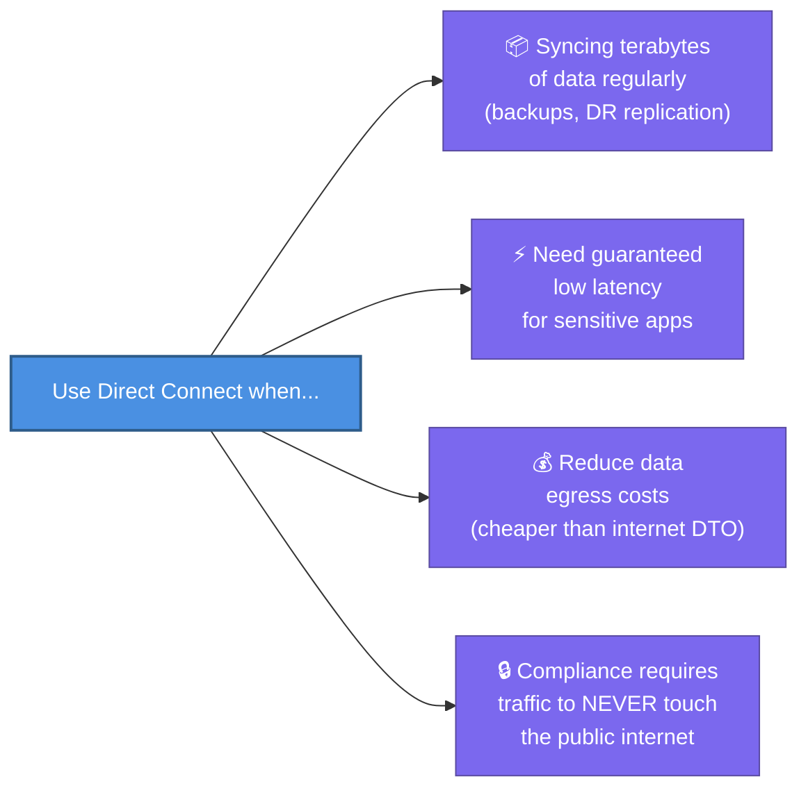

#### Connection Types — Dedicated vs. Hosted

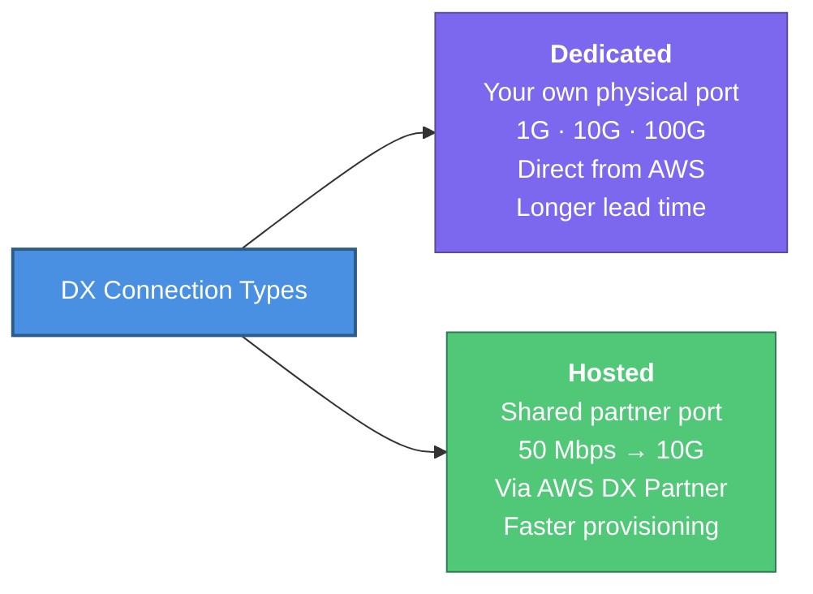

#### Virtual Interfaces (VIFs) — The 3 Lanes on Your Track

Once your physical link is live, you divide it into **Virtual Interfaces**. Think of each VIF as a separate lane with a different destination:

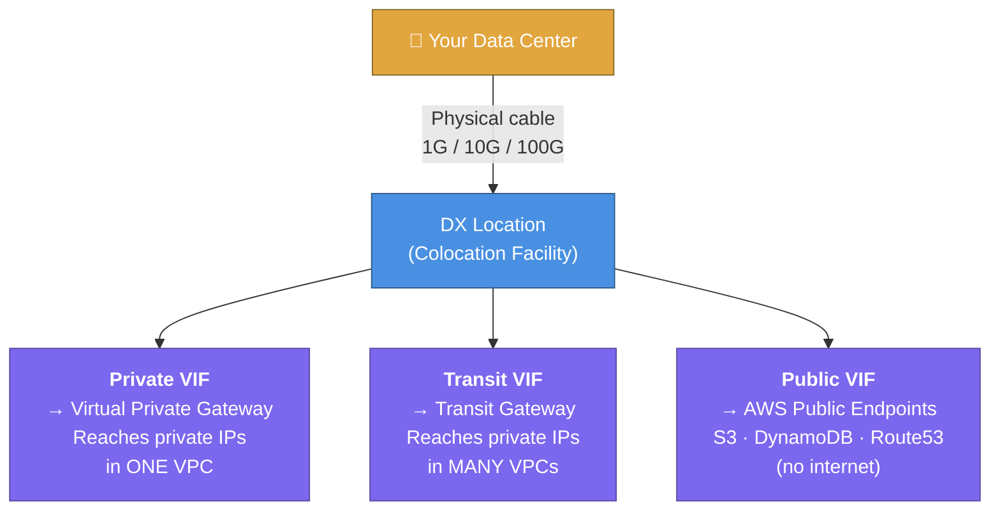

> [!TIP]
> **Memory trick:** Private = **one VPC**. Transit = **many VPCs**. Public = **AWS public services** (still private wire, not the internet).

#### Direct Connect Gateway (DXGW) — Going Multi-Region

**Problem:** A VIF only reaches a TGW/VGW in **one region**. What if you have VPCs in `us-east-1` AND `eu-west-1`?

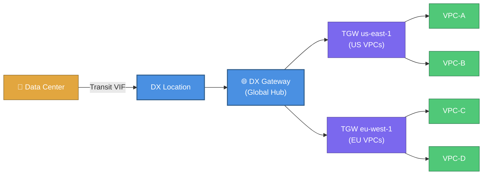

> [!IMPORTANT]
> DXGW supports **Private VIF** and **Transit VIF** only — not Public VIFs. A Transit VIF must attach to DXGW first; you **cannot** wire it directly to a TGW.

#### Is Direct Connect Encrypted?

> [!WARNING]
> **No. Direct Connect is NOT encrypted by default.** It's private (no internet), but unencrypted. Physical tap at the DX location = readable traffic.

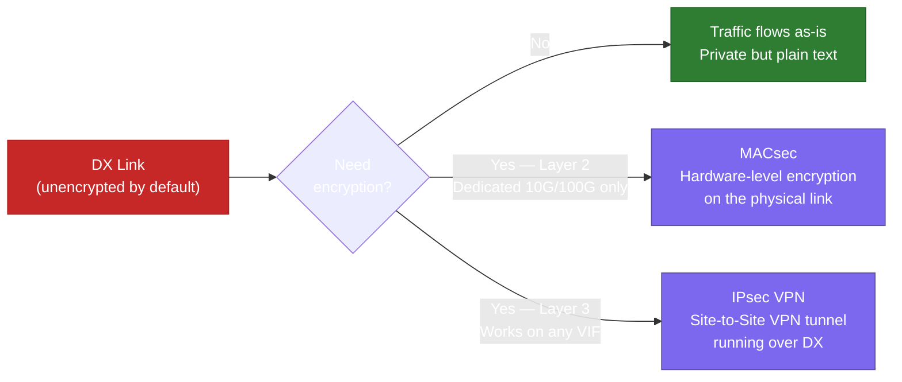

#### High Availability — BGP Path Control

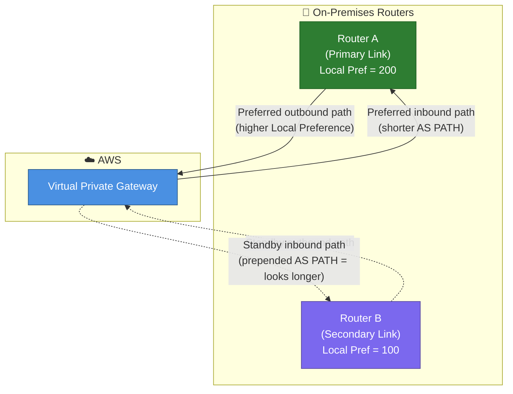

> **On-Prem → AWS:** Use **BGP Local Preference** (higher = preferred path) on your router.
> **AWS → On-Prem:** Use **BGP AS PATH Prepending** (shorter path = AWS prefers it).

---

### 🌐 Part 2 — Route 53 (DNS)

#### What is DNS — One Sentence
DNS is a phone book: you look up a name (`api.example.com`) and get back an IP address (`52.10.1.5`) that your computer can connect to.

#### Route 53's 3 Jobs

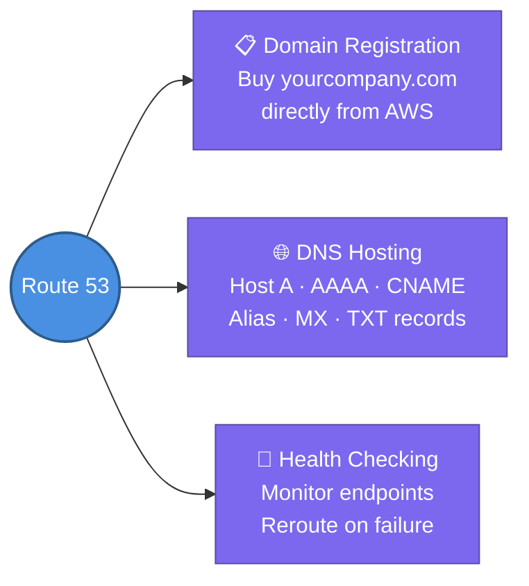

#### Hosted Zones — Public vs. Private

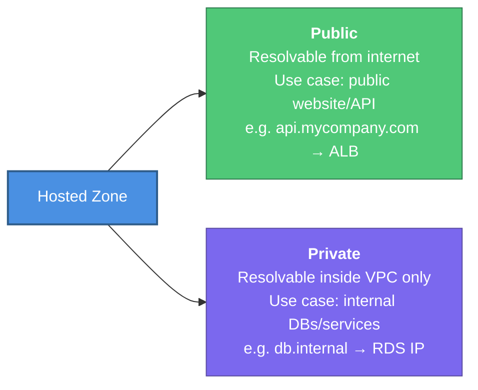

#### Alias Record vs. CNAME ⭐

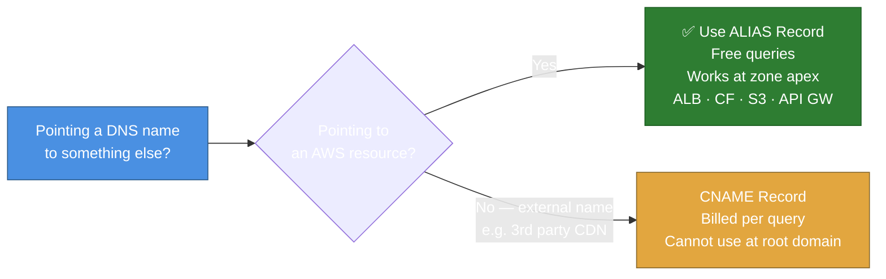

#### Routing Policies — Decision Guide

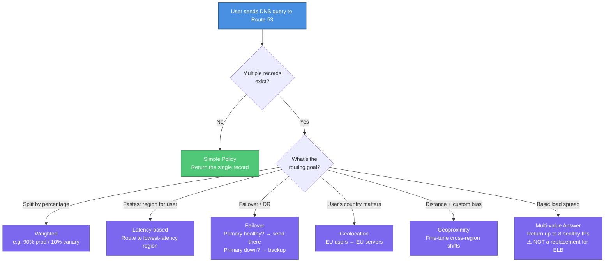

---

### 🔗 Part 3 — Hybrid DNS (The Bridge Between DNS Worlds)

#### The Problem — Two Isolated DNS Worlds

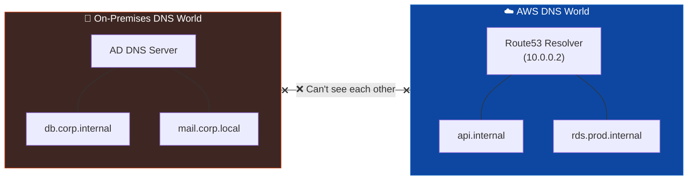

**Problem 1:** EC2 can't resolve `db.corp.internal` — it only lives in on-prem DNS.
**Problem 2:** On-prem servers can't resolve `api.internal` — it only lives in Route53.

**Hybrid DNS solves both** by creating ENI-backed bridges (endpoints) that forward queries across DX or VPN.

#### Bridge 1 — Inbound Endpoint (On-Prem → AWS)

> On-prem wants to resolve an AWS private name like `rds.prod.internal`

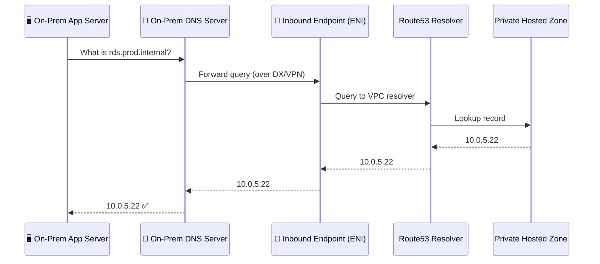

#### Bridge 2 — Outbound Endpoint (AWS → On-Prem)

> An EC2 instance wants to resolve an on-prem name like `db.corp.internal`

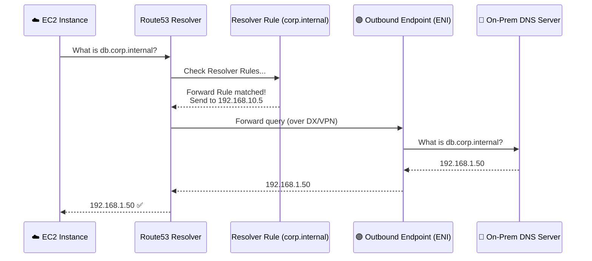

#### Centralized Hybrid DNS at Scale

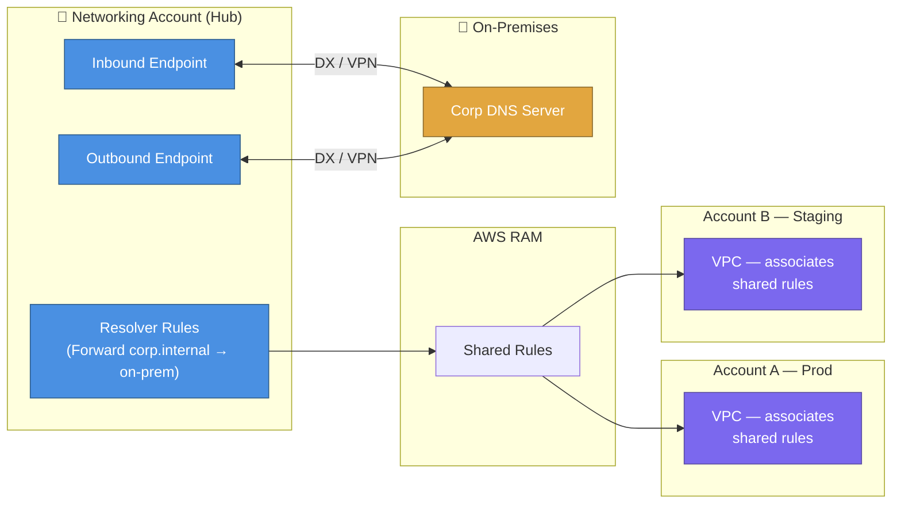

> [!TIP]
> Create endpoints **once** in the Hub account. Share Resolver Rules via **AWS RAM** to all spoke accounts. No need to manage endpoints per-account.

---

## 📋 Summary

- **Direct Connect (DX)** — dedicated private physical cable to AWS; consistent latency, lower egress cost, no public internet
- DX connection types: **Dedicated** (your own port, 1G/10G/100G) vs **Hosted** (partner-shared, 50 Mbps–10G)
- Three VIF types: **Private VIF** (one VPC via VGW) | **Transit VIF** (many VPCs via TGW) | **Public VIF** (AWS public services)
- **DXGW (Direct Connect Gateway)** — global hub: one VIF → multiple regions (Private + Transit VIFs only)
- **DX is NOT encrypted by default** — add MACsec (L2, dedicated 10G/100G) or IPsec VPN (L3, any VIF)
- BGP failover: **Local Preference** controls on-prem→AWS path; **AS PATH Prepending** controls AWS→on-prem path
- **Route 53** — Hosted Zones (Public = internet-resolvable, Private = VPC-only), 7 routing policies, Alias records (free, apex-capable)
- **Hybrid DNS**: VPC built-in resolver at `VPC CIDR+2` can't be reached by on-prem natively
- **Inbound Endpoint** — on-prem DNS queries flow into AWS to resolve Private Hosted Zones
- **Outbound Endpoint + Forward Rules** — VPC queries for on-prem domains forwarded out to on-prem DNS servers
- Share Resolver Rules centrally via **AWS RAM** — one set of endpoints for the whole org

---

## 🔗 Connections (Zettelkasten)
- **Relates to:** [[1. VPC Deep Dive]], [[2.Transit Gateway|Transit Gateway]], [[VPC/VPN-connections|VPN Connections]]
- **Core Use Case:** Enterprise hybrid migration — databases stay on-prem during phase 1. EC2 app servers in AWS resolve `db.corp.internal` via Outbound Endpoint. On-prem clients resolve `api.internal` (now migrated to ECS) via Inbound Endpoint. All traffic flows over a Dedicated Connection for consistent latency.

---

## 🛠️ Study Aids

### 🧠 Mind Map

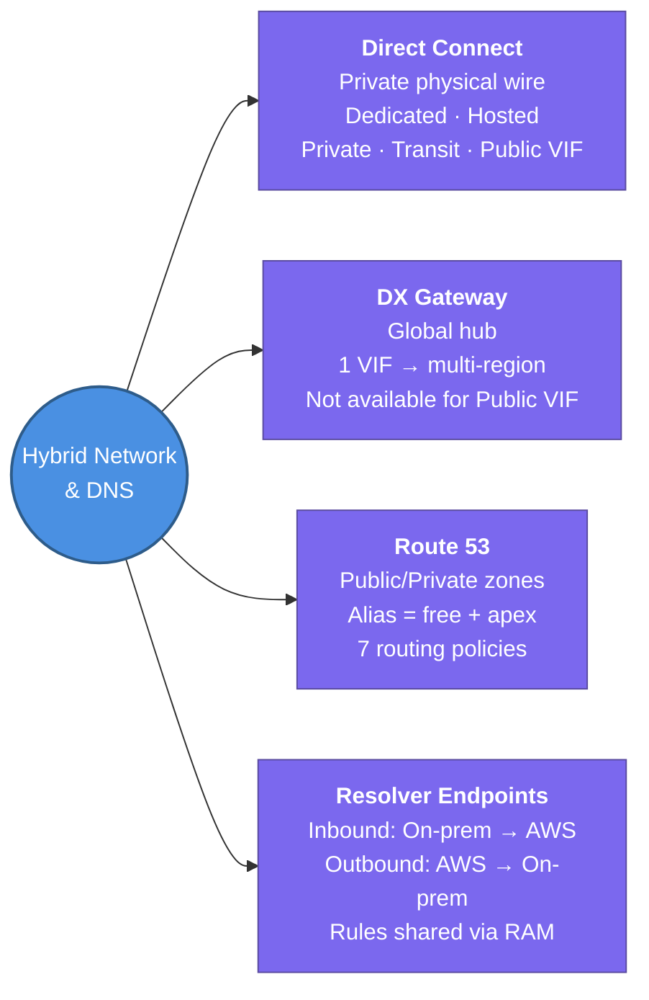

### 🗂️ Flashcards

#flashcards

**What is AWS Direct Connect and what is the main reason to use it over a VPN?**
?
Direct Connect is a dedicated private physical cable between your data center and AWS. The main reason to prefer it over VPN: consistent, guaranteed network performance (no internet congestion), lower egress costs, and higher bandwidth ceilings (up to 100 Gbps).

---

**Name the 3 VIF types in Direct Connect and what each one connects to.**
?
- **Private VIF** → Virtual Private Gateway (VGW) → private IPs in ONE VPC.
- **Transit VIF** → Transit Gateway (TGW) → private IPs across MANY VPCs.
- **Public VIF** → AWS public service endpoints (S3, DynamoDB, public Route 53) — no internet.

---

**Is Direct Connect encrypted? How do you add encryption?**
?
No, DX is private but NOT encrypted. Add encryption with:
1. **MACsec** (Layer 2 — hardware level, dedicated 10G/100G links only)
2. **IPsec VPN** (Layer 3 — run a Site-to-Site VPN tunnel *over* the DX link)

---

**What problem does a Direct Connect Gateway (DXGW) solve?**
?
A plain VIF only reaches resources in one region. DXGW acts as a global hub — a single Private or Transit VIF connects to DXGW, which then routes to VPCs/TGWs across multiple AWS Regions (except China).

---

**In Route 53, why prefer an Alias record over a CNAME for pointing to an AWS ALB?**
?
Two reasons:
1. **Alias works at the zone apex** (e.g., `example.com`). CNAMEs are forbidden at the zone apex.
2. **Alias queries are free**. CNAMEs are billed per DNS query.

---

**What Route 53 routing policy would you use for a gradual canary release (10% new / 90% old)?**
?
**Weighted routing policy** — assign weight 10 to the new version record and weight 90 to the old version record.

---

**In one sentence each, what is a Resolver Inbound Endpoint vs. an Outbound Endpoint?**
?
- **Inbound** — lets on-premises servers send DNS queries *into* AWS to resolve Private Hosted Zone records.
- **Outbound** — lets EC2 instances send DNS queries *out* of AWS to on-prem DNS servers to resolve corporate domain names.

---

**What is a Route 53 Resolver Forward Rule and how does it work?**
?
A Forward Rule maps a domain (e.g., `corp.internal`) to one or more on-prem DNS server IPs. When the VPC resolver receives a query matching that domain, it forwards the query through the Outbound Endpoint to those on-prem servers instead of resolving it locally.

---

**How do you scale Hybrid DNS across 20 AWS accounts without creating separate endpoints in each?**
?
Create the Inbound and Outbound Endpoints once in a central networking account, then share the Resolver Rules to all other accounts using **AWS Resource Access Manager (RAM)**. Each spoke account associates the shared rules with its VPCs.
