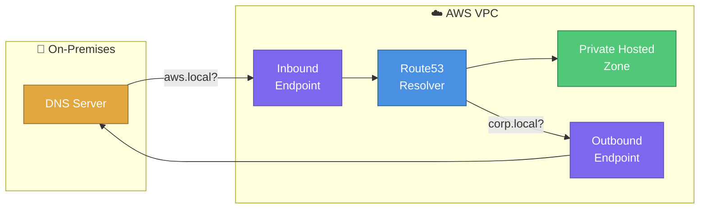
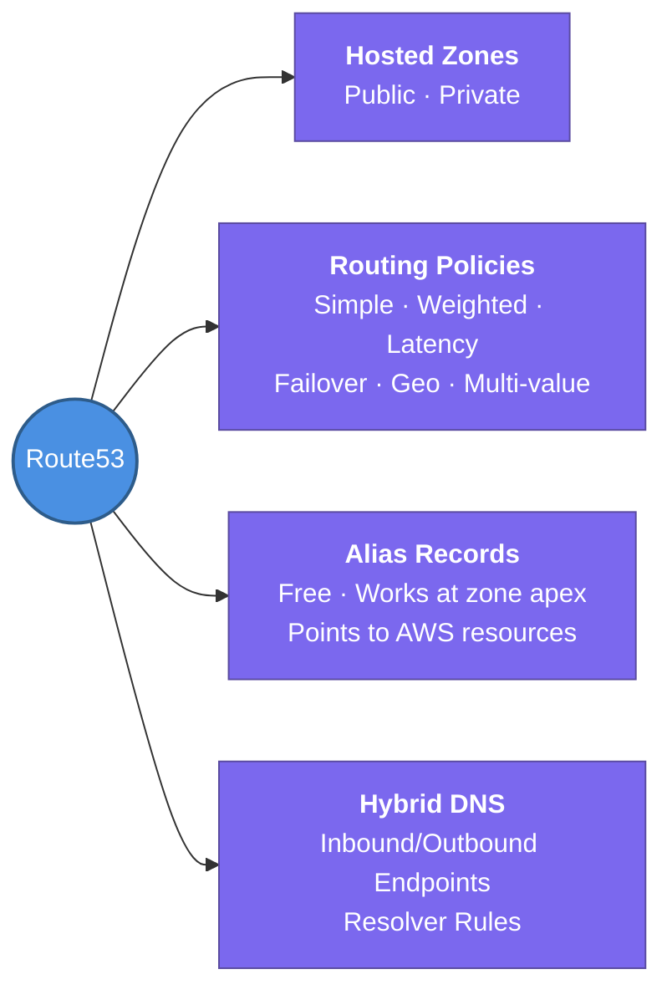

---
tags:
  - aws/networking
  - review
status: review
---
# Route53 & Hybrid DNS

## 📖 Core Concepts
*Explain the concept using the Feynman Technique here...*

#### Route53 Basics
- Route 53 is AWS's highly available, scalable DNS web service — it also handles domain registration and endpoint health checking.
- **Hosted Zone:** a container for records that defines how traffic is routed for a domain.
  - **Public Hosted Zone** — routes traffic on the public internet for a domain name.
  - **Private Hosted Zone** — routes traffic only within the VPC(s) it's associated with; not resolvable from the public internet.
- **Standard record types:** A, AAAA, CNAME, MX, NS, SOA, TXT, etc.
- **Alias records** — a Route 53-specific extension of A/AAAA records:
  - Free of charge (standard records are billed per query)
  - Can be used at the zone apex/root domain (e.g. `example.com`), unlike CNAME
  - Points directly at AWS resources: ALB/NLB, CloudFront, S3 website endpoints, API Gateway, VPC endpoints, or another record in the same hosted zone
- **Routing policies** — control *which* answer Route 53 returns to a query: ⭐ Important
  - **Simple** — one record, no health checks
  - **Weighted** — split traffic by assigned weight (e.g. canary/blue-green testing)
  - **Latency-based** — routes to the region with lowest latency for the user
  - **Failover** — active/passive, backed by health checks
  - **Geolocation** — routes based on the user's geographic location
  - **Geoproximity** (via Traffic Flow) — routes based on geographic distance, with a "bias" to shift more/less traffic to a region
  - **Multi-value answer** — returns multiple healthy records, client-side selects one (lightweight load balancing, not a substitute for an ELB)
- **Health checks** — Route 53 actively monitors an endpoint (HTTP/HTTPS/TCP) and can route traffic away from unhealthy resources; required for Failover routing.

#### Hybrid DNS (Inbound/Outbound Endpoints)
*Answers: How do you resolve internal domain names (like `db.corp.local`) between your on-premises data center and your AWS VPC?*

- Every VPC has a built-in resolver at the **VPC base + 2** address (a.k.a. the "Amazon-provided DNS" / `AmazonProvidedDNS`) that resolves public DNS and any Private Hosted Zones associated with that VPC — but it isn't reachable from outside the VPC, and it doesn't know about on-prem domains.
- **Route 53 Resolver Endpoints** extend that resolution across a hybrid network over Direct Connect or Site-to-Site VPN:
  - **Inbound Endpoint** — lets DNS queries *from outside the VPC* (e.g. an on-prem DNS server) reach the Route 53 Resolver, so on-prem clients can resolve records in your Private Hosted Zones / VPC.
  - **Outbound Endpoint** — lets DNS queries *originating inside the VPC* be forwarded to DNS resolvers outside the VPC (e.g. an on-prem AD/DNS server), so EC2 instances can resolve on-prem domain names.
- **Resolver Rules** determine what happens to outbound queries:
  - **Forward rule** — sends queries for a specific domain (e.g. `corp.local`) to specified on-prem DNS server IPs, via the Outbound Endpoint
  - **System rule** — the default VPC+AWS resolution behavior
  - Rules are associated with one or more VPCs, so they can be shared centrally (e.g. via AWS RAM / a shared networking account)
- **Requirements:** Direct Connect or VPN connectivity to on-prem, and security groups on the resolver endpoint ENIs allowing DNS traffic (port 53, TCP/UDP) to/from the on-prem DNS server IPs.

## 🔗 Connections (Zettelkasten)
- **Relates to:** [[1. VPC Deep Dive]]
- **Core Use Case:** A hybrid enterprise migrating workloads to AWS in phases — EC2 instances need to resolve on-prem hostnames like `db.corp.local` (via Outbound Endpoint + Forward rule) while on-prem servers need to resolve newly-migrated AWS private services (via Inbound Endpoint), without re-pointing every client's DNS server.

---

## 🛠️ Study Aids

### 🧠 Mind Map

### 🗂️ Flashcards

#flashcards

**What's the difference between a Public and a Private Hosted Zone in Route 53?**
?
A Public Hosted Zone routes traffic for a domain on the public internet. A Private Hosted Zone routes traffic for a domain only within the VPC(s) it's explicitly associated with, and is not resolvable from outside those VPCs.

---

**Why would you use a Route 53 Alias record instead of a CNAME?**
?
Alias records are free (CNAMEs are billed per query), can be used at the zone apex/root domain (CNAMEs cannot), and can point directly at AWS resources like an ALB, CloudFront distribution, or S3 website endpoint.

---

**Which Route 53 routing policy would you use to run a canary release, sending 10% of traffic to a new version?**
?
Weighted routing policy — assign a low weight (e.g. 10) to the new version's record and a high weight (e.g. 90) to the existing version.

---

**What is the difference between a Route 53 Resolver Inbound Endpoint and an Outbound Endpoint?**
?
An Inbound Endpoint allows DNS queries from outside the VPC (e.g. on-premises) to resolve records in your Route 53 Private Hosted Zones. An Outbound Endpoint allows DNS queries originating inside the VPC to be forwarded out to external resolvers (e.g. an on-prem DNS server), based on Resolver Rules.

---

**In a hybrid DNS setup, what AWS component decides whether a VPC-originated DNS query gets forwarded to an on-premises DNS server?**
?
A Resolver Rule (specifically a Forward rule) — it maps a domain name (e.g. `corp.local`) to target on-prem DNS server IPs, and routes matching queries out through the Outbound Endpoint.

---

**What connectivity is required between AWS and on-premises for Route 53 Resolver endpoints to work?**
?
A Direct Connect connection or a Site-to-Site VPN between the VPC and the on-premises network, plus security groups on the resolver endpoints allowing DNS traffic (port 53 TCP/UDP) to and from the relevant IP ranges.
