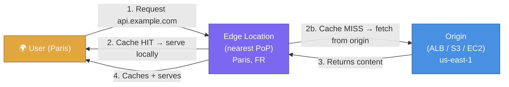
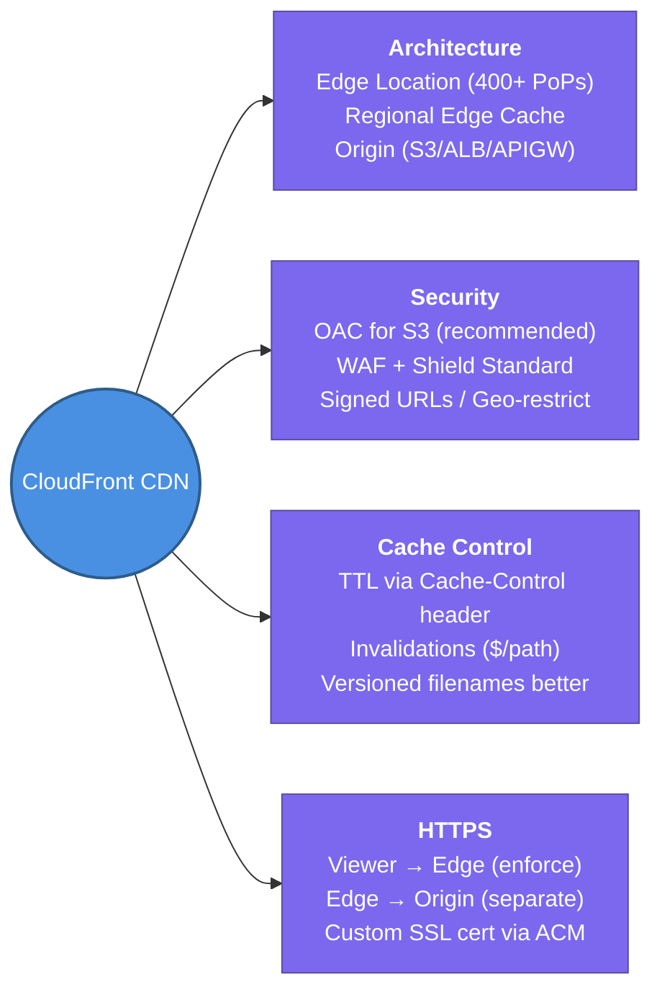

---
tags:
  - aws/networking
  - review
status: completed
---
# CloudFront (CDN) & Edge Locations

## 📖 Core Concepts

### What is CloudFront?
Amazon CloudFront is a **Content Delivery Network (CDN)** — a globally distributed network of servers that caches your content close to your users, so requests are served from the nearest location instead of travelling all the way back to your origin server.

> 📦 Think of CloudFront like a **chain of local warehouses** for an e-commerce company. Instead of shipping every order from one central factory (your origin server in `us-east-1`), you stock popular items in warehouses near your customers. Orders are fulfilled locally — faster delivery, less strain on the factory.

---

### The Problem It Solves

| Without CloudFront | With CloudFront |
|---|---|
| Every request hits your origin (ALB, S3, EC2) | Cached responses served from nearest Edge Location |
| High latency for global users | Sub-10ms cache hits globally |
| Origin absorbs all traffic spikes | Edge handles spikes; origin sees only cache misses |
| No built-in DDoS protection | AWS Shield Standard included by default |

---

### Key Components

| Component | Description |
|---|---|
| **Edge Location** | One of 400+ CloudFront PoPs worldwide where content is cached |
| **Regional Edge Cache** | Larger mid-tier cache between Edge Locations and the origin — reduces origin hits further |
| **Distribution** | The CloudFront configuration — maps domain to origin(s), sets cache behaviours |
| **Origin** | Where CloudFront fetches content on a cache miss: S3, ALB, EC2, API Gateway, or custom HTTP server |
| **Cache Behaviour** | Rules that control caching per URL path — e.g., `/api/*` not cached, `/static/*` cached for 1 day |

---

### Origins CloudFront Supports

| Origin | Common Use |
|---|---|
| **S3 Bucket** | Static websites, assets (images, CSS, JS) |
| **ALB / EC2** | Dynamic API responses, web apps |
| **API Gateway** | Serverless API caching & global acceleration |
| **Custom HTTP endpoint** | On-premises or 3rd party servers |

---

### Securing S3 Origins — OAI vs OAC ⭐

By default, an S3 bucket with CloudFront in front can still be accessed **directly via its S3 URL** — bypassing CloudFront, your WAF, and your geo-restrictions.

**Fix:** Lock the bucket so **only CloudFront can read it**:

| Method | How it works | Use when |
|---|---|---|
| **OAI** (Origin Access Identity) — legacy | A CloudFront special IAM principal added to the S3 bucket policy | Existing setups (being deprecated) |
| **OAC** (Origin Access Control) — recommended | IAM-based signing of requests from CloudFront to S3 | All new setups — supports SSE-KMS, all S3 regions |

> [!IMPORTANT]
> **OAC is the current recommended approach.** OAI does not support S3 buckets encrypted with SSE-KMS or newer S3 features. Always use OAC for new distributions.

---

### Cache Control — TTL & Invalidations

- **TTL (Time To Live)** — how long CloudFront holds a cached object. Set via `Cache-Control: max-age=86400` on the origin response, or in the CloudFront distribution settings.
- **Cache Invalidation** — force CloudFront to evict cached objects before TTL expires.
  - `/*` — invalidate everything (costs money per invalidation path, first 1000 free/month)
  - `/static/logo.png` — invalidate specific file

> [!TIP]
> Instead of invalidating on every deploy, use **versioned filenames** (e.g., `app.v2.js`) and set long TTLs. Old files expire naturally; new files are fetched fresh.

---

### CloudFront Security Features

| Feature | What it does |
|---|---|
| **AWS Shield Standard** | Always-on DDoS protection — included free with CloudFront |
| **AWS WAF** | Web Application Firewall — block SQL injection, XSS, bad bots |
| **Geo-Restriction** | Block or allow viewers based on country |
| **HTTPS / TLS** | Enforce HTTPS between viewer↔Edge and Edge↔Origin separately |
| **Signed URLs / Cookies** | Grant time-limited access to private content (e.g., paid video streams) |
| **Field-Level Encryption** | Encrypt specific form fields at the edge (e.g., credit card numbers) |

---

## 🔗 Connections (Zettelkasten)
- **Relates to:** [[3.ALB vs NLB|ALB vs NLB]] — ALB is a common CloudFront origin for dynamic content; NLB can be fronted by CloudFront for static IP requirements.
- **Relates to:** [[5. Route53 & Hybrid DNS|Route53]] — Route 53 Alias records point `example.com` to a CloudFront distribution; geo-routing and failover can layer on top.
- **Core Use Case:** A global SaaS app serving static React assets from S3 via CloudFront (with OAC, long TTL) and API calls to an ALB origin with a `no-cache` behaviour — 95% of traffic served from edge, origin only sees API calls and cache misses.

---

## 🛠️ Study Aids

### 🧠 Mind Map

### 🗂️ Flashcards

#flashcards

**What is Amazon CloudFront and what is the main benefit over serving content directly from an origin?**
?
CloudFront is a CDN that caches content at 400+ Edge Locations worldwide. The main benefit: requests are served from the nearest location, drastically reducing latency for global users and offloading traffic from the origin.

---

**What is the difference between OAI and OAC when securing an S3 origin behind CloudFront?**
?
OAI (Origin Access Identity) is the legacy method — a CloudFront special principal added to the S3 bucket policy. OAC (Origin Access Control) is the modern recommended method — uses IAM-based request signing and supports SSE-KMS encrypted buckets and all S3 regions. Always use OAC for new setups.

---

**What is a Cache Behaviour in CloudFront and how is it used?**
?
A Cache Behaviour maps URL path patterns to caching rules. Example: `/api/*` → no-cache (always fetch from origin), `/static/*` → cache for 24h. Multiple behaviours let you serve dynamic and static content differently from the same distribution.

---

**What is the recommended way to handle cache busting on new deployments instead of using CloudFront invalidations?**
?
Use **versioned filenames** (e.g., `app.a3f91c.js`). Set long TTLs and reference the new filename in your HTML on deploy. Old cached files expire naturally; new files are cache misses and fetched fresh. This avoids invalidation costs and propagation delays.

---

**What is the difference between AWS Shield Standard and AWS WAF in the context of CloudFront?**
?
Shield Standard is always-on, automatic DDoS protection (Layer 3/4) included free with CloudFront — it protects against volumetric attacks. WAF (Web Application Firewall) is opt-in and operates at Layer 7, letting you write rules to block SQL injection, XSS, bad bots, or specific IP ranges.
