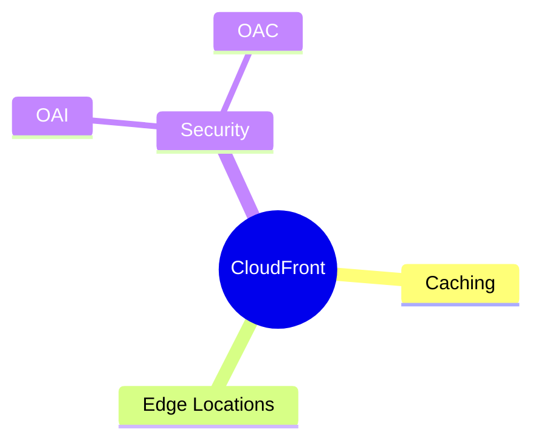

---
tags:
  - aws/networking
  - review
status: not-started
---
# CloudFront (CDN) & Edge Locations

## 📖 Core Concepts
*Explain the concept using the Feynman Technique here...*

#### Edge Locations & Caching
*Pending Study Session answering: How do you globally cache your application?*

#### Security (OAI / OAC)
*Pending Study Session answering: How do you secure your origins (like S3) using Origin Access Identity (OAI) or Origin Access Control (OAC)? (This was asked in Round 1!)*

## 🔗 Connections (Zettelkasten)
- **Relates to:** [[3.ALB vs NLB]]
- **Core Use Case:** 

---

## 🛠️ Study Aids

### 🧠 Mind Map

### 🗂️ Flashcards

#flashcards
