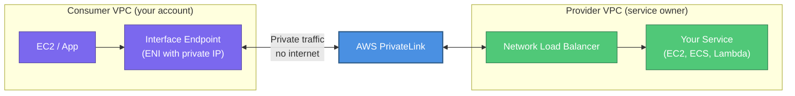
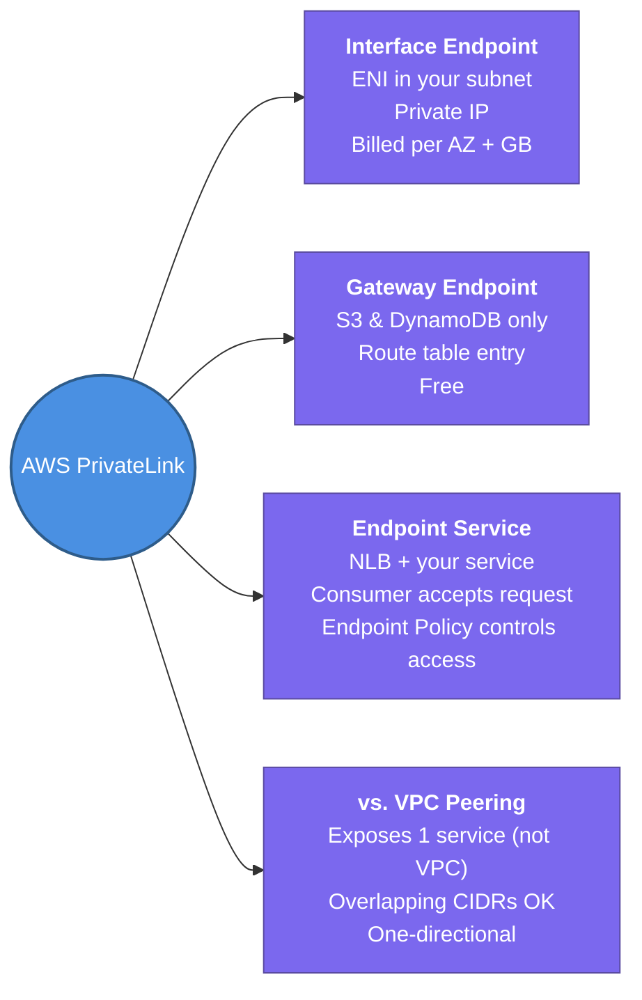

---
tags:
  - aws/networking
  - review
status: completed
---
# AWS PrivateLink

## 📖 Core Concepts

### What is PrivateLink?
AWS PrivateLink lets you access AWS services **or your own services hosted in another VPC** using **private IP addresses** — without the traffic ever touching the public internet or requiring VPC Peering, NAT, an Internet Gateway, or route table changes.

> 🏪 Think of PrivateLink like a **private delivery entrance** to a department store. Instead of your customer walking through the busy public street entrance (internet), you open a private internal door directly from your building into the store — only your building gets access, and no one else even knows the door exists.

---

### The Problem It Solves

| Scenario | Without PrivateLink | With PrivateLink |
|---|---|---|
| SaaS vendor exposes API | You hit their public endpoint over internet | You connect via private IP in your own VPC |
| Shared internal service in another account | VPC Peering (exposes entire VPC CIDR) | Only the specific service is reachable |
| Consuming AWS services (S3, DynamoDB) | Traffic exits VPC through IGW/NAT | Traffic stays on AWS backbone via Interface Endpoint |

---

### Core Components

| Component | Role |
|---|---|
| **Interface Endpoint** | An ENI in your VPC subnet with a private IP — this is your entry point to the service |
| **Endpoint Service** | The provider side — wraps a Network Load Balancer (NLB) in front of the actual service |
| **Network Load Balancer** | Required on the provider side to front the service being shared |
| **Endpoint Policy** | IAM-style JSON policy that controls which principals can use the endpoint |

---

### Two Flavours of Endpoints

| Type | What it connects to | Protocol |
|---|---|---|
| **Interface Endpoint** (PrivateLink) | AWS services or custom Endpoint Services | Private IP via ENI in your subnet |
| **Gateway Endpoint** | S3 and DynamoDB **only** | Route table prefix list — no ENI |

> [!IMPORTANT]
> **Gateway Endpoints** (for S3 and DynamoDB) are **free** and don't use PrivateLink architecture — they modify your route table. **Interface Endpoints** (for everything else) use PrivateLink and are **billed per AZ per hour + per GB**.

---

### PrivateLink vs. VPC Peering

| Factor | VPC Peering | PrivateLink |
|---|---|---|
| What's exposed | Entire VPC CIDR | Only the specific service / NLB |
| Overlapping CIDRs allowed? | ❌ No | ✅ Yes |
| Direction | Bidirectional | One-way (consumer → provider) |
| Transitive? | ❌ No | ❌ No |
| Use when | Full VPC-to-VPC connectivity needed | Exposing one service to many consumers securely |

---

### Common PrivateLink Use Cases

1. **Consume AWS services privately** — access S3 (Interface Endpoint), SSM, Secrets Manager, ECR, API Gateway without internet
2. **SaaS integration** — connect to third-party SaaS APIs (e.g., Datadog, Snowflake) over private IP
3. **Internal service marketplace** — share a microservice from one account/VPC to 50 other accounts without peering each one
4. **Compliance** — PCI/HIPAA requirements that traffic must never leave the AWS network

---

## 📋 Summary

- **PrivateLink** lets you access services over private IPs without internet, VPC Peering, NAT, or route table changes
- **Interface Endpoint** — ENI in your subnet with a private IP; connects to most AWS services or custom Endpoint Services; **billed per AZ-hour + per GB**
- **Gateway Endpoint** — modifies your route table; connects to **S3 and DynamoDB only**; **free**
- To expose your own service via PrivateLink, front it with an **NLB** and create an **Endpoint Service** — consumers create Interface Endpoints pointing to it
- PrivateLink exposes **one service** (not the whole VPC) — overlapping CIDRs are fine; traffic is **one-directional**
- VPC Peering = full VPC-to-VPC connectivity; **PrivateLink = single service access** (more secure, more scoped)
- Common uses: SSM, Secrets Manager, ECR, API Gateway, CloudWatch Logs, plus 3rd-party SaaS (Datadog, Snowflake)

---

## 🔗 Connections (Zettelkasten)
- **Relates to:** [[1. VPC Deep Dive]]
- **Relates to:** [[VPC/VPC-Peering|VPC Peering]] — PrivateLink is the alternative when you only need to expose one service, not connect entire VPCs.
- **Relates to:** [[2.Transit Gateway|Transit Gateway]] — TGW connects whole VPCs; PrivateLink exposes individual services.
- **Core Use Case:** A SaaS company exposes their API as an Endpoint Service backed by an NLB. Each customer creates an Interface Endpoint in their own VPC — traffic never touches the internet and the customer's full VPC is never exposed.

---

## 🛠️ Study Aids

### 🧠 Mind Map

### 🗂️ Flashcards

#flashcards/aws

**What is AWS PrivateLink and what problem does it solve?**
?
PrivateLink lets you consume AWS services or services in another VPC using private IP addresses, without traffic touching the internet, and without exposing your entire VPC CIDR (unlike VPC Peering).

---

**What are the two types of VPC Endpoints and what does each connect to?**
?
- **Interface Endpoint** (PrivateLink) — creates an ENI in your subnet with a private IP. Connects to most AWS services and custom Endpoint Services. Billed per AZ-hour + per GB.
- **Gateway Endpoint** — modifies your route table with a prefix list. Connects to **S3 and DynamoDB only**. Free.

---

**What is required on the provider side to expose a service via PrivateLink?**
?
A **Network Load Balancer (NLB)** fronting the service. AWS PrivateLink creates an Endpoint Service that wraps the NLB — consumers then create Interface Endpoints pointing to this Endpoint Service.

---

**When would you use PrivateLink over VPC Peering?**
?
Use PrivateLink when you only want to expose a **single service** (not your whole VPC), when overlapping CIDRs exist between VPCs (peering doesn't allow this), or when you want one-directional access from many consumers without bidirectional routing.

---

**Name 3 AWS services commonly accessed via Interface Endpoints (PrivateLink).**
?
AWS Systems Manager (SSM), Secrets Manager, ECR (Elastic Container Registry), API Gateway, and CloudWatch Logs are common examples. S3 can use either Gateway (free) or Interface Endpoint.
