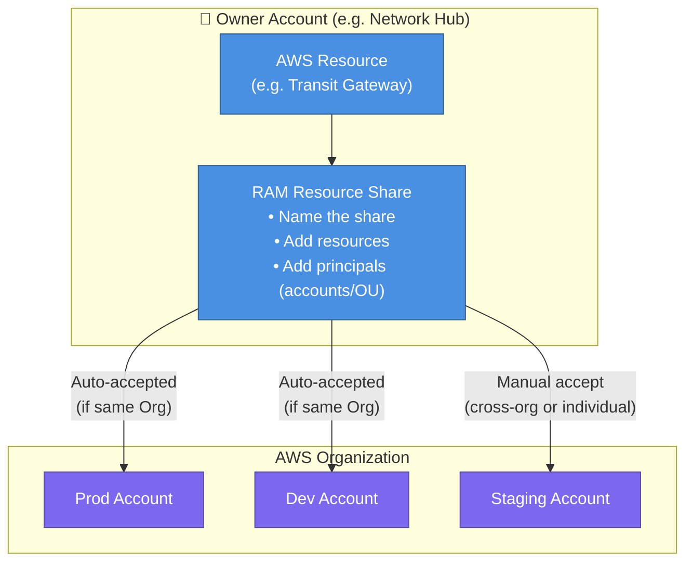
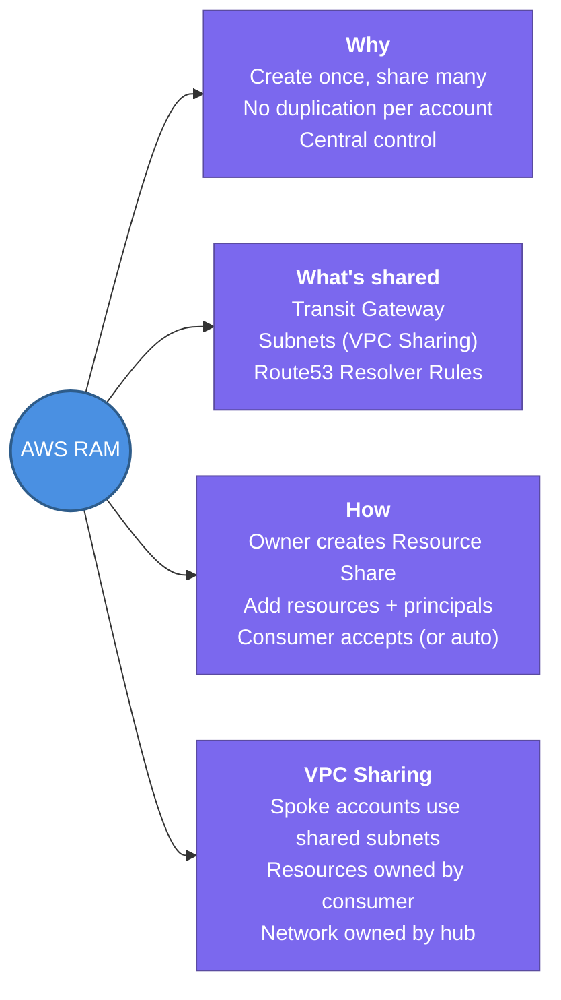

---
tags:
  - aws/networking
  - review
status: completed
---
# AWS RAM (Resource Access Manager)

## 📖 Core Concepts

### What is AWS RAM?
AWS Resource Access Manager (RAM) lets you **share specific AWS resources across AWS accounts or across an entire AWS Organization** — without needing to duplicate them in every account.

> 🗝️ Think of RAM like a **master key system** in an office building. Instead of making a copy of every key for every tenant, the building manager issues one master key that can open approved doors. The resource (the door) stays in one place — access is simply granted.

---

### Why it exists — The Multi-Account Problem

In a well-architected AWS environment, you use **separate accounts per environment** (Prod, Dev, Staging) for security and blast radius isolation. But some resources are expensive or operationally complex to replicate per account:

- A **Transit Gateway** in every account = management nightmare
- A **subnet in a shared VPC** in every account = address space waste
- A **Route 53 Resolver Rule** in every account = drift and inconsistency

RAM solves this: **create once in a central account, share to all**.

---

### Resources Commonly Shared via RAM

| Resource | Shared From | Why |
|---|---|---|
| **Transit Gateway** | Central networking account | Hub-and-spoke multi-account connectivity |
| **Subnets (VPC Sharing)** | Central networking account | Spoke accounts launch resources into shared subnets |
| **Route 53 Resolver Rules** | Central networking account | Hybrid DNS without per-account endpoints |
| **AWS License Manager configurations** | Management account | Centralized licence tracking |
| **AWS Glue Data Catalog** | Data platform account | Shared data mesh |

---

### How RAM Works — Step by Step

**Key steps:**
1. In the **owner account**, create a RAM Resource Share — name it, add the resource(s), add principals (account IDs, OUs, or entire Organization)
2. In the **consumer account**, accept the share (automatic if `EnableSharingWithAwsOrganization` is turned on in AWS Organizations)
3. Consumer account can now use the shared resource — e.g., create a TGW Attachment to the shared TGW

---

### RAM + VPC Sharing (Shared Subnets)

One powerful RAM pattern is **VPC Sharing** — the networking account creates subnets in a central VPC and shares them with other accounts. Each spoke account then launches EC2, RDS, or ECS into those subnets.

**Benefits:**
- All resources share the same private address space — no peering or routing needed between them
- Network team controls VPC layout, subnets, NACLs centrally
- Application teams just deploy their resources into the shared subnet

> [!IMPORTANT]
> Resources in shared subnets are **owned by the consumer account** — they appear in their console and billing. The VPC and subnet are still **owned by the network account**. Security Groups in the consumer account cannot reference Security Groups in the owner account and vice versa.

---

### RAM vs. Other Sharing Mechanisms

| Mechanism | What it shares | Scope |
|---|---|---|
| **AWS RAM** | Specific resources (TGW, subnets, etc.) | Cross-account, cross-OU, cross-org |
| **Resource-based policies** (e.g. S3 bucket policy) | Specific S3 objects/buckets | Cross-account per-resource |
| **IAM cross-account roles** | Actions (permissions), not resources | Cross-account access |
| **VPC Peering** | Full VPC network connectivity | VPC-to-VPC |

---

## 📋 Summary

- AWS RAM lets you **share specific resources across accounts or an AWS Organization** — create once, use everywhere
- Most commonly shared: **Transit Gateway** (network hub), **Subnets** (VPC Sharing), **Route 53 Resolver Rules** (Hybrid DNS)
- **Owner account** creates the Resource Share, adds resources and principals (accounts, OUs, or whole org)
- **Consumer account** accepts the share (auto-accepted when `EnableSharingWithAwsOrganization` is on), then uses the resource
- After accepting a shared TGW: create a TGW Attachment → update subnet route tables → done
- **VPC Sharing** — spoke accounts deploy EC2/RDS into subnets owned by the networking account; resources are owned by the consumer, the subnet/VPC is owned by the hub
- In VPC Sharing: consumer account SGs **cannot reference** owner account SGs and vice versa

---

## 🔗 Connections (Zettelkasten)
- **Relates to:** [[1. VPC Deep Dive]]
- **Relates to:** [[2.Transit Gateway|Transit Gateway]] — RAM is the mechanism used to share a central TGW across spoke accounts.
- **Relates to:** [[5. Route53 & Hybrid DNS|Hybrid DNS]] — Resolver Rules shared via RAM for centralised hybrid DNS.
- **Core Use Case:** Central networking account owns one Transit Gateway. RAM shares it to all 20 org accounts. Each spoke account creates a TGW Attachment and updates their subnet route tables — no per-account TGW needed.

---

## 🛠️ Study Aids

### 🧠 Mind Map

### 🗂️ Flashcards

#flashcards/aws

**What is AWS RAM and what problem does it solve?**
?
AWS Resource Access Manager (RAM) shares specific AWS resources across accounts or an AWS Organization without duplicating them. It solves the multi-account problem of managing the same resource (e.g., Transit Gateway, shared subnets) in every account separately.

---

**Name 3 resources commonly shared via AWS RAM and why.**
?
1. **Transit Gateway** — share from a central networking account so all VPCs attach to one TGW hub.
2. **Subnets (VPC Sharing)** — spoke accounts deploy resources into centrally-managed subnets without their own VPC.
3. **Route 53 Resolver Rules** — centralised hybrid DNS without creating endpoints per account.

---

**In a RAM resource share, when is consumer acceptance automatic vs. manual?**
?
Automatic when `EnableSharingWithAwsOrganization` is enabled in AWS Organizations and the consumer is in the same org. Manual acceptance is required for shares to individual accounts outside the organization.

---

**In VPC Sharing (RAM), who owns the VPC/subnet vs. who owns the resources launched into it?**
?
The **owner (network) account** owns the VPC and subnets. The **consumer account** owns the EC2 instances, RDS, or other resources they launch into the shared subnets — those resources appear in the consumer account's console and billing.

---

**What are the 3 steps a spoke account must perform after accepting a shared Transit Gateway via RAM?**
?
1. Accept the RAM resource share (or it's auto-accepted via Organizations).
2. Create a **TGW Attachment** in the spoke VPC, referencing the shared TGW ID.
3. Update the **subnet route tables** in the spoke VPC to route target CIDRs to `tgw-xxxxxxxx`.
