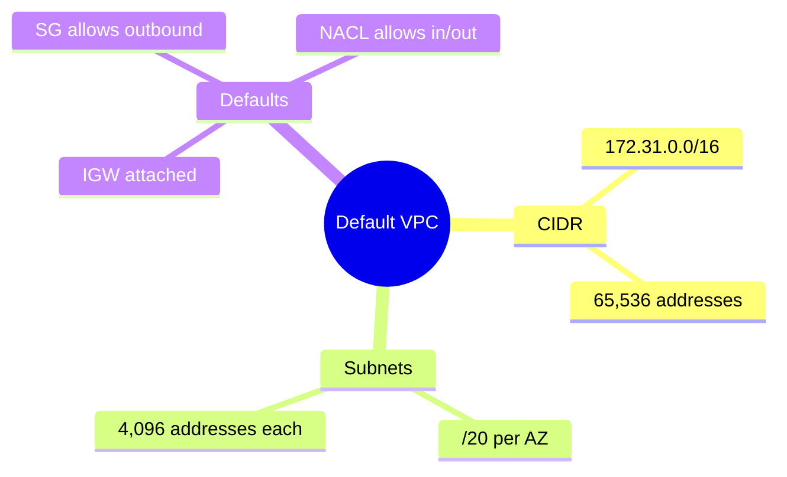

---
tags:
  - aws/networking
  - vpc
status: completed
---
# Default VPC

## 📖 Core Concepts
- One default VPC per region, created automatically by AWS.
- CIDR block: `172.31.0.0/16` (65,536 addresses), with one default `/20` subnet per Availability Zone (4,096 addresses each).
- Comes with an Internet Gateway attached and a default route sending all traffic (`0.0.0.0/0`) to it — both inbound and outbound are open by default.
- Default Security Group allows all outbound traffic; default NACL allows both inbound and outbound.

## 🔗 Connections (Zettelkasten)
- **Part of:** [[1. VPC Deep Dive]]
- **Relates to:** [[VPC/Subnets|Subnets]]

## 🛠️ Study Aids

### 🧠 Mind Map

### 🗂️ Flashcards

#flashcards/aws

**What's the CIDR block and subnet layout of a Default VPC?**
?
`172.31.0.0/16` for the VPC, with one `/20` subnet auto-created in each Availability Zone.

---

**Does a Default VPC's Internet Gateway allow inbound traffic by default, or only outbound?**
?
Both — the default route table, default Security Group (outbound), and default NACL (inbound + outbound) leave it fully open in both directions out of the box.
