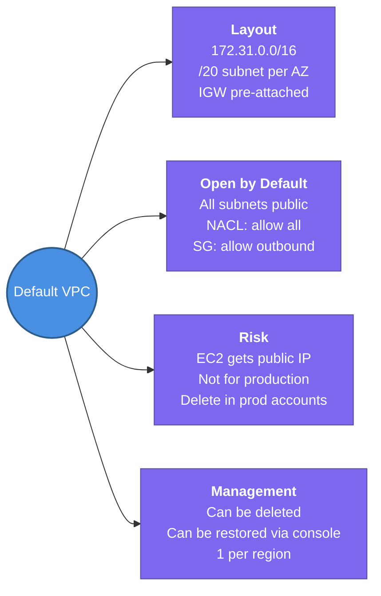

---
tags:
  - aws/networking
  - vpc
  - review
status: completed
---
# Default VPC

## 📖 Core Concepts

### What is the Default VPC?
Every AWS region comes with a **pre-built VPC** ready to use the moment you create an account — no setup required. AWS creates it so you can launch EC2 instances immediately without understanding VPC fundamentals first.

> 🏠 Think of it like a furnished apartment that's ready when you move in. All the basics — furniture (subnets), electricity (IGW), door keys (security groups) — are already set up. You can start living immediately, but a serious tenant would eventually renovate to their own specifications.

> [!WARNING]
> The Default VPC is designed for **convenience, not production**. Its subnets are all public (internet-routable), which means any EC2 you launch is exposed to the internet by default. Always build a custom VPC for real workloads.

---

### Default VPC Layout

| Property | Value | Notes |
|---|---|---|
| **CIDR block** | `172.31.0.0/16` | 65,536 total addresses |
| **Subnets** | One `/20` per AZ | 4,096 addresses per subnet |
| **Internet Gateway** | Pre-attached | Cannot be detached without replacing |
| **Route table** | `0.0.0.0/0 → igw-xxxxx` | All subnets are public by default |
| **Security Group (default)** | All outbound allowed, inbound from same SG | |
| **NACL (default)** | All inbound + outbound allowed | Fully permissive |
| **DNS resolution** | Enabled | Instances get public DNS hostnames |

---

### Can you delete the Default VPC?

Yes — but with consequences:

- You **can** delete it per region, and AWS will not automatically recreate it.
- You **can** restore it via the console (`Actions → Create Default VPC`) or AWS CLI.
- Once deleted, **any region that depends on it** (e.g., quick Lambdas, EC2 console launches) will require a custom VPC.

> [!TIP]
> In security-focused environments, deleting the Default VPC is a best practice — it prevents accidental public deployments. Use AWS Config rule `vpc-default-security-group-closed` to audit it.

---

### Default VPC vs. Custom VPC

| | Default VPC | Custom VPC |
|---|---|---|
| Setup time | Instant | Manual |
| Subnet visibility | All public | You control public/private split |
| CIDR range | Fixed `172.31.0.0/16` | You choose (e.g. `10.0.0.0/16`) |
| For production? | ❌ Not recommended | ✅ Yes |
| For quick testing/demos | ✅ Convenient | Overkill |

---

## 📋 Summary

- AWS auto-creates **one Default VPC per region** with CIDR `172.31.0.0/16` and a `/20` subnet per AZ
- All subnets are **public by default** — the route table points `0.0.0.0/0` to a pre-attached IGW
- Default NACL allows **all in/out**; default SG allows **all outbound + same-SG inbound**
- **Not for production** — use a custom VPC with private subnets for real workloads
- Can be **deleted** (per region) and **restored** manually — AWS doesn't auto-recreate it
- Best practice in locked-down accounts: **delete the Default VPC** to prevent accidental public deployments

---

## 🔗 Connections (Zettelkasten)
- **Part of:** [[1. VPC Deep Dive]]
- **Relates to:** [[VPC/Subnets|Subnets]], [[VPC/Internet Gateway (IGW)|Internet Gateway (IGW)]], [[VPC/Security-group & NACLS|Security Groups & NACLs]]
- **Core Use Case:** A developer wants to quickly spin up an EC2 for a demo — they use the Default VPC so they don't have to configure subnets or routing. For the actual production system, a custom VPC with isolated private subnets is built instead.

---

## 🛠️ Study Aids

### 🧠 Mind Map

### 🗂️ Flashcards

#flashcards/aws/1_vpc

**What is the CIDR block and subnet layout of a Default VPC?**
?
`172.31.0.0/16` for the VPC (65,536 addresses), with one `/20` subnet auto-created in each Availability Zone (4,096 addresses each).

---

**What is a Subnet?**
?
A **subnet** (subnetwork) is a smaller, logical division of a larger IP network.
**Purpose:** It improves performance, enhances security, and prevents IP address waste.
**Mechanism:** Uses a **subnet mask** (like `255.255.255.0` or `/24`) to split an IP address into network and host parts.
Traffic: Keeps local data isolated. Data traveling _between_ different subnets must pass through a router.

---

**Why are Default VPC subnets considered "public" by default?**
?
Because the Default VPC's route table contains a `0.0.0.0/0 → igw-xxxxx` route, which directs all internet-bound traffic to the pre-attached Internet Gateway. Any EC2 launched there with a public IP is reachable from the internet.

---

**What happens if you delete the Default VPC in a region?**
?
AWS does not automatically recreate it. You can manually restore it via the AWS console (`Actions → Create Default VPC`) or CLI. Until restored, any service in that region requiring a VPC will need a custom one.

---

**What is the default NACL and Security Group behaviour in a Default VPC?**
?
The default NACL allows ALL inbound and outbound traffic. The default Security Group allows all outbound traffic and allows inbound traffic only from other resources in the same security group.

---

**When would you actually use the Default VPC?**
?
For quick demos, personal experiments, or testing AWS features where security and isolation are not a concern. For any production workload, a custom VPC with private/public subnet separation should always be used.
