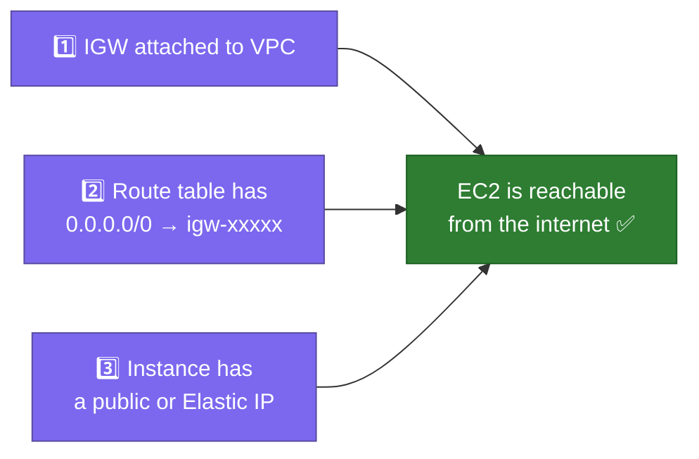
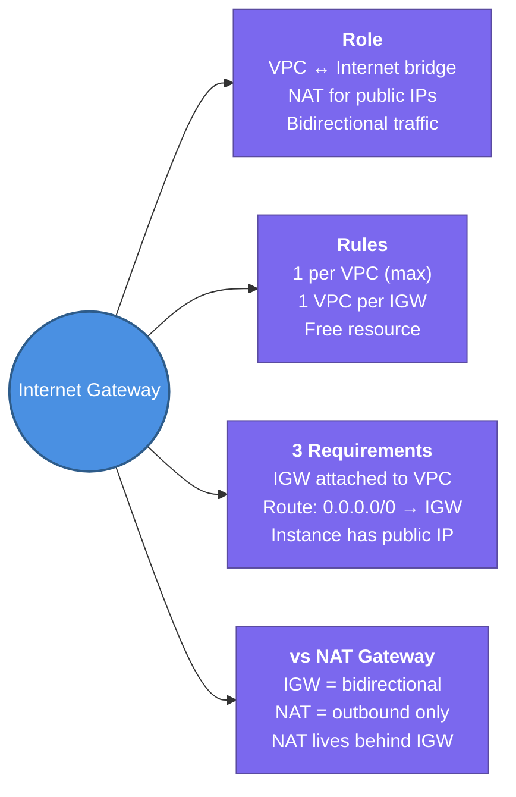

---
tags:
  - aws/networking
  - vpc
  - review
status: completed
---
# Internet Gateway (IGW)

## 📖 Core Concepts

### What is an Internet Gateway?
An Internet Gateway is a **horizontally scaled, redundant, highly available VPC component** that acts as the **bridge between your VPC and the public internet**. It performs two jobs: routing internet-bound traffic out, and routing inbound internet traffic to public-IP instances.

> 🚪 Think of the IGW as the **main entrance door to your office building**. Without it, the building is sealed — no one can enter or leave via the public street. The door itself doesn't filter who enters (that's the Security Group's job); it just provides the physical opening.

---

### How It Works — The Two-Way Bridge

The IGW does something subtle but critical: it performs **NAT for public IPs**.

When an EC2 instance sends traffic to the internet:
1. EC2 puts its **private IP** as the source in the packet
2. The packet hits the IGW
3. IGW **swaps the source IP** to the instance's **Elastic/public IP**
4. Packet goes out to the internet

Return traffic comes back to the public IP → IGW swaps it back to the private IP → delivers to EC2. The EC2 instance itself never knows its own public IP.

> [!TIP]
> This is why `curl ifconfig.me` (shows your public IP) returns a different IP than `hostname -I` (shows private IP) inside an EC2 instance.

---

### Key Rules

| Rule | Detail |
|---|---|
| **1 IGW per VPC** | A VPC can only have one IGW attached at a time |
| **1 VPC per IGW** | An IGW can only be attached to one VPC at a time |
| **Not enough alone** | Adding an IGW to a VPC doesn't make instances internet-accessible — you also need a route in the subnet's route table and a public IP on the instance |
| **Managed by AWS** | No performance limits, no availability concerns — AWS handles it |
| **Free** | No charge for the IGW itself; you pay for data transfer through it |

---

### 3 Things Required for an Instance to Be Internet-Accessible

All three must be true simultaneously:

> [!IMPORTANT]
> Missing **any one** of these three makes the instance unreachable from the internet. This is the most common misconfiguration checklist item in AWS networking troubleshooting.

---

### IGW vs. NAT Gateway — Clear Distinction

| | Internet Gateway | NAT Gateway |
|---|---|---|
| **Direction** | Bidirectional (in + out) | Outbound only |
| **Who uses it** | Public subnet instances | Private subnet instances |
| **Internet can initiate connection?** | ✅ Yes | ❌ No |
| **Requires public IP on instance?** | ✅ Yes | ❌ No (NAT GW has the public IP) |
| **Placement** | Attached to VPC | Lives in a public subnet |
| **Cost** | Free (data transfer billed) | Hourly + per GB |

---

### Setup Flow

1. **Create IGW** — available but not yet connected
2. **Attach IGW to VPC** — now the door exists for that VPC
3. **Add route** in the target subnet's route table: `0.0.0.0/0 → igw-xxxxxxxx`
4. **Assign public IP** to the EC2 instance (Elastic IP or auto-assigned)
5. **Check Security Group** — inbound rules must allow the desired traffic (e.g., port 443)

---

## 📋 Summary

- IGW is the **bridge between a VPC and the public internet** — horizontally scaled, HA, managed by AWS
- **1 IGW per VPC**, **1 VPC per IGW** — strictly 1:1 relationship
- IGW performs : swaps the EC2's private IP with its public IP for outbound packets, and reverses for inbound
- The EC2 instance itself never sees its own public IP — the IGW handles the translation transparently
- **3 things required** for an instance to be internet-accessible: IGW attached + route `0.0.0.0/0 → igw` + instance has a public IP
- IGW is **free** — you only pay for data transfer through it
- IGW is **bidirectional** (internet can initiate); NAT Gateway is **outbound only**

---

## 🔗 Connections (Zettelkasten)
- **Part of:** [[1. VPC Deep Dive]]
- **Relates to:** [[VPC/Router & Route Tables|Router & Route Tables]] — the route `0.0.0.0/0 → igw-xxxxx` must be added to a subnet's route table to make it public.
- **Relates to:** [[VPC/NAT Gateway|NAT Gateway]] — the complementary component for private subnets; NAT GW itself lives in a public subnet behind the IGW.
- **Relates to:** [[VPC/Subnets|Subnets]] — a subnet is only "public" if its route table points to an IGW.
- **Relates to:** [[VPC/VPC-Terraform-Labs|VPC Terraform Labs]] — practice attaching an IGW with `aws_internet_gateway` in Lab 2.
- **Core Use Case:** An ALB must be deployed in a public subnet — the IGW is the component that lets the ALB receive requests from the internet. EC2 app servers behind the ALB go in private subnets with no IGW route.

---

## 🛠️ Study Aids

### 🧠 Mind Map

### 🗂️ Flashcards

#flashcards/aws/4_Internet_Gateway_IGW

Does a NAT Gateway need an Internet Gateway to connect to the internet?
?
**Yes.** A NAT Gateway cannot access the internet on its own. It relies on an Internet Gateway to route its translated public traffic to the outside world [vpc-nat-gateway].
<!--SR:!2026-07-20,3,250-->

---

What is the primary purpose of a NAT Gateway?
?
**Security through outbound-only access.** It allows instances in a private subnet to safely connect outward to the internet (for updates/APIs) while completely blocking unsolicited inbound traffic from entering [vpc-nat-gateway].
<!--SR:!2026-07-20,3,250-->

---

Do you need a NAT Gateway for internal, private-to-private cloud communication?
?
**No.** Internal resources (like EC2 to a private Database) communicate directly via private IPs using Route Tables, VPC Peering, or VPC Endpoints without touching a NAT Gateway.
<!--SR:!2026-07-20,3,250-->

---

How does an Internet Gateway route inbound traffic to a specific public EC2 instance?
?
**Static 1-to-1 NAT.** The Internet Gateway maps the instance's Public IP directly to its Private IP, translating the destination address automatically as traffic passes through [VPC_Internet_Gateway].
<!--SR:!2026-07-20,3,250-->

---

Can you SSH directly from the internet into an EC2 instance located in a private subnet?
?
No. Private instances lack public IPs, and a NAT Gateway rejects all inbound connection attempts [vpc-nat-gateway]. You must use a Bastion Host, SSM Session Manager, or an EC2 Instance Connect Endpoint.
<!--SR:!2026-07-20,3,250-->

---

What is the difference between a Public Subnet and a Private Subnet regarding internet access?
  ?
**Public Subnets** route traffic directly to an Internet Gateway (allowing two-way traffic) [VPC_Internet_Gateway]. **Private Subnets** route traffic to a NAT Gateway (allowing outbound-only traffic) [vpc-nat-gateway].
<!--SR:!2026-07-20,3,250-->

---

**What are the 3 things that must ALL be true for an EC2 instance to be reachable from the internet?**
?
An Internet Gateway is **attached to the VPC**.
The subnet's route table has `0.0.0.0/0 → igw-xxxxx`.
The EC2 instance has a **public IP or Elastic IP** assigned.
Missing any one of these three breaks internet connectivity.
<!--SR:!2026-07-20,3,250-->

---

**What does the Internet Gateway do when an EC2 instance (private IP only) sends traffic to the internet?**
?
The IGW performs replaces the packet's source private IP with the instance's associated public/Elastic IP before forwarding it to the internet. Return traffic hits the public IP, and the IGW translates it back to the private IP for delivery.
<!--SR:!2026-07-20,3,250-->

---

**How many IGWs can a VPC have, and how many VPCs can an IGW be attached to?**
?
A VPC can have **at most 1 IGW** attached. An IGW can be attached to **at most 1 VPC**. It's a strict 1:1 relationship.
<!--SR:!2026-07-20,3,250-->

---

**What is the key difference between an IGW and a NAT Gateway in terms of traffic direction?**
?
An IGW is **bidirectional** — internet can initiate connections to public-IP instances. A NAT Gateway is **outbound only** — private instances can reach the internet, but the internet cannot initiate connections back.
<!--SR:!2026-07-20,3,250-->

---

**If you attach an IGW to a VPC but don't add a route to the route table, what happens?**
?
Nothing — the instance remains unreachable from the internet. The IGW must be referenced in the subnet's route table (`0.0.0.0/0 → igw-xxxxx`) for traffic to actually flow through it.
<!--SR:!2026-07-20,3,250-->
