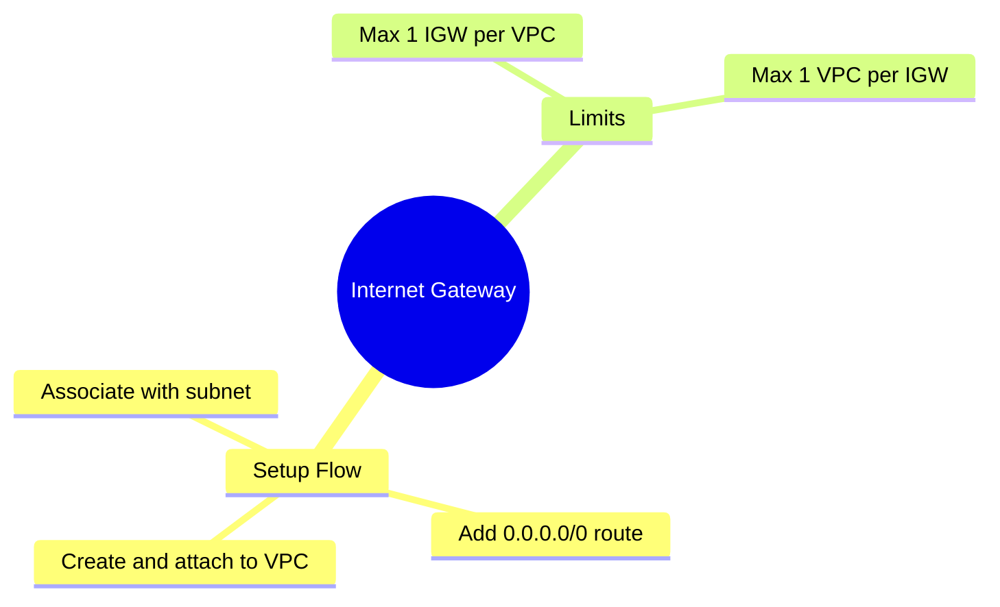

---
tags:
  - aws/networking
  - vpc
status: completed
---
# Internet Gateway (IGW)

## 📖 Core Concepts
- A horizontally scaled, redundant, and highly available VPC component that allows communication between instances in your VPC and the internet.
- Setup flow: create IGW → attach to VPC → add a `0.0.0.0/0` route to it in a route table → associate that route table with the subnet (making it public).
- Limit: a VPC can have at most 1 IGW, and an IGW can attach to at most 1 VPC.

## 🔗 Connections (Zettelkasten)
- **Part of:** [[1. VPC Deep Dive]]
- **Relates to:** [[VPC/Subnets|Subnets]], [[VPC/Router & Route Tables|Router & Route Tables]], [[VPC/NAT Gateway|NAT Gateway]]

## 🛠️ Study Aids

### 🧠 Mind Map

### 🗂️ Flashcards

#flashcards/aws

**What is the main difference between an Internet Gateway (IGW) and a NAT Gateway?**
?
An IGW allows bi-directional traffic (internet can initiate connections to your instance). A NAT Gateway only allows outbound traffic (your private instance can reach the internet, but the internet cannot reach in).
