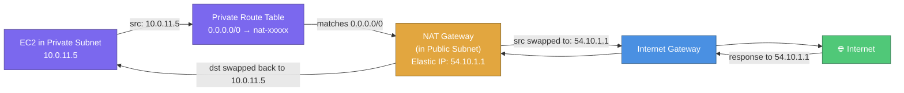
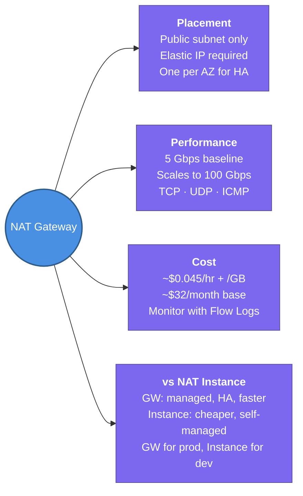

---
tags:
  - aws/networking
  - vpc
  - review
status: completed
---
# NAT Gateway

## 📖 Core Concepts

### What is a NAT Gateway?
A NAT Gateway is a **managed, highly available networking component** that lets instances in **private subnets** access the internet (or other AWS services) while **preventing the internet from initiating connections back** to those instances.

> 🚪🔒 Think of a NAT Gateway like a **one-way mail slot** in a secure office door. People inside the office (private instances) can push letters out (outbound requests), and responses come back through the slot. But nobody outside can reach in or open the door — the slot only works in one direction.

---

### How It Works — Traffic Flow

**Step by step:**
1. EC2 in private subnet sends a packet to `pypi.org` to download a package
2. Private subnet route table matches `0.0.0.0/0 → nat-xxxxx` and sends the packet to the NAT Gateway
3. NAT Gateway **replaces the source IP** (private `10.0.11.5`) with its own **Elastic IP** (`54.10.1.1`)
4. Packet exits through the IGW to the internet
5. Response comes back to the Elastic IP → NAT Gateway swaps destination back to `10.0.11.5` → delivers to EC2

> [!IMPORTANT]
> The NAT Gateway **must live in a public subnet** with an Elastic IP. If it were in a private subnet, it couldn't reach the IGW itself.

---

### Key Rules

| Rule | Detail |
|---|---|
| **Placement** | Must be in a **public subnet** with an Elastic IP assigned |
| **AZ-scoped** | One NAT Gateway operates in one AZ only — it does NOT failover across AZs |
| **For HA** | Deploy **one NAT Gateway per AZ** and point each AZ's private subnet route table at its own NAT GW |
| **Bandwidth** | 5 Gbps baseline, auto-scales to **100 Gbps** |
| **Protocols** | Supports TCP, UDP, and ICMP |
| **Cannot be used by instances in the same subnet** | Instances in the NAT GW's own subnet can't route through it |

---

### Pricing — Why NAT Gateway Costs Add Up

| Component | Cost |
|---|---|
| **Hourly availability** | ~$0.045/hr per NAT GW (~$32/month) |
| **Per GB processed** | ~$0.045 per GB of data flowing through |
| **Elastic IP** | Free while attached; charged if orphaned |
| **Cross-AZ data transfer** | Standard cross-AZ rates if private subnet is in a different AZ than the NAT GW |

> [!WARNING]
> NAT Gateway costs can spike unexpectedly. A single NAT GW processing 1 TB/month costs ~$45 in data charges alone, on top of the hourly fee. Monitor with **VPC Flow Logs** and **Cost Explorer → "NAT Gateway" filter**.

---

### NAT Gateway vs. NAT Instance ⭐

| | NAT Gateway | NAT Instance |
|---|---|---|
| **Managed by** | AWS (fully managed) | You (self-managed EC2) |
| **Availability** | HA within one AZ | You must script failover |
| **Bandwidth** | 5–100 Gbps auto-scale | Depends on EC2 instance type |
| **Maintenance** | None — AWS patches | You patch the OS and software |
| **Security Groups** | ❌ Cannot be attached | ✅ Can attach SGs |
| **Bastion host?** | ❌ No | ✅ Can double as a bastion |
| **Cost** | Higher (hourly + per GB) | Lower (just EC2 cost) |
| **Use when** | Production workloads | Dev/test, very low traffic, or budget-constrained |

> [!TIP]
> For production: always use **NAT Gateway** — the operational overhead of a NAT Instance isn't worth the cost savings at scale. For a personal lab or dev account with minimal traffic, a `t3.micro` NAT Instance can save money.

---

### Common Scenario: Private Instance Downloading Packages

**Question:** An EC2 in a private subnet needs to `pip install requests` from PyPI. How does the traffic flow?

**Answer:**
1. EC2 sends the request to `pypi.org` (internet)
2. Private subnet route table: `0.0.0.0/0 → nat-xxxxx`
3. NAT Gateway (in public subnet) swaps source IP to its Elastic IP
4. NAT Gateway's subnet route table: `0.0.0.0/0 → igw-xxxxx`
5. Packet exits via IGW → reaches PyPI → response flows back the same path in reverse

---

## 📋 Summary

- NAT Gateway provides **outbound-only internet access** for private subnet instances — the internet **cannot** initiate connections back
- Must live in a **public subnet** with an **Elastic IP** assigned
- **AZ-scoped** — deploy one per AZ for high availability; each AZ's private subnets point at their local NAT GW
- Bandwidth: **5 Gbps baseline**, auto-scales to **100 Gbps**
- Billed: **~$0.045/hr** + **~$0.045/GB** — monitor costs with Flow Logs + Cost Explorer
- **NAT Gateway vs. NAT Instance**: Gateway is managed/HA/faster; Instance is cheaper but self-managed — use Gateway for prod, Instance for dev labs
- NAT GW performs source IP translation (private IP → Elastic IP) just like IGW does for public instances

---

## 🔗 Connections (Zettelkasten)
- **Part of:** [[1. VPC Deep Dive]]
- **Relates to:** [[VPC/Subnets|Subnets]] — private subnets route `0.0.0.0/0` to the NAT Gateway.
- **Relates to:** [[VPC/Internet Gateway (IGW)|Internet Gateway (IGW)]] — the NAT Gateway itself uses the IGW to reach the internet; it must be in a public subnet with an IGW route.
- **Relates to:** [[VPC/Router & Route Tables|Router & Route Tables]] — the private subnet's route table must point `0.0.0.0/0` at the NAT Gateway ID.
- **Core Use Case:** EKS worker nodes in private subnets need to pull container images from ECR and download Helm charts — they route through a NAT Gateway per AZ for outbound internet access while remaining unreachable from the internet.

---

## 🛠️ Study Aids

### 🧠 Mind Map

### 🗂️ Flashcards

#flashcards/aws

**What is the NAT Gateway and what direction of traffic does it allow?**
?
A managed networking component that enables instances in private subnets to access the internet (outbound only). The internet cannot initiate connections back to private instances through the NAT Gateway.

---

**Where must a NAT Gateway be placed, and what does it need?**
?
In a **public subnet** with an **Elastic IP** assigned. The public subnet must have a route to an IGW so the NAT Gateway can reach the internet.

---

**How many NAT Gateways do you need for a multi-AZ private subnet setup, and why?**
?
One per Availability Zone. NAT Gateway is AZ-scoped — if the AZ with the single NAT GW goes down, all private subnets in other AZs lose internet access. Each AZ's private route table should point at its own local NAT GW.

---

**What bandwidth does a single NAT Gateway support?**
?
5 Gbps baseline, auto-scaling up to 100 Gbps.

---

**When would you choose a NAT Instance over a NAT Gateway?**
?
For dev/test environments or very low-traffic workloads where cost matters more than operational overhead. A `t3.micro` NAT Instance is much cheaper than a NAT Gateway (~$32/month base). For production, always use NAT Gateway — it's managed, HA, and auto-scales.

---

**How does a NAT Gateway route a packet from a private EC2 to the internet?**
?
The private subnet route table sends the packet (`0.0.0.0/0`) to the NAT Gateway. The NAT Gateway replaces the source IP (private) with its own Elastic IP, then forwards the packet to the IGW via the public subnet's route table. Return traffic is translated back from the Elastic IP to the private IP and delivered to the EC2 instance.

---

**Why can NAT Gateway costs spike unexpectedly, and how do you monitor them?**
?
NAT Gateway charges both hourly (~$0.045/hr) AND per-GB processed (~$0.045/GB). High-throughput workloads like container image pulls or large data syncs can generate significant per-GB charges. Monitor with **VPC Flow Logs** to identify top talkers and **Cost Explorer** filtered by "NAT Gateway".
