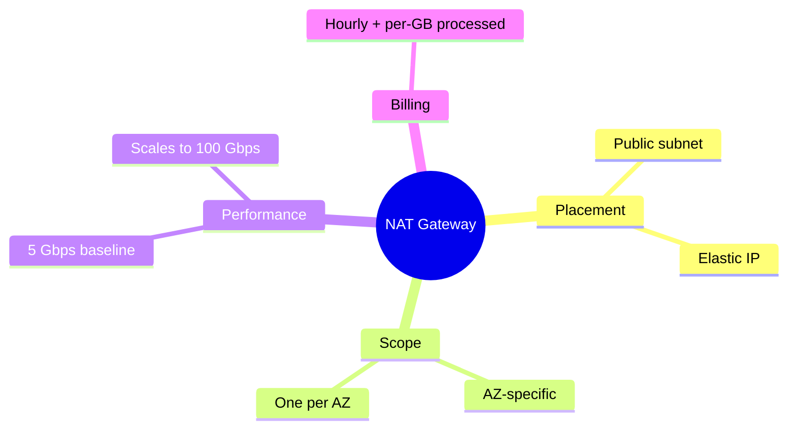

---
tags:
  - aws/networking
  - vpc
  - review
  - redo
status: completed
---
# NAT Gateway

## 📖 Core Concepts
- Enables instances in a private subnet to connect to the internet or other AWS services, but prevents the internet from initiating a connection with those instances.
- Must sit in a **public** subnet (needs a public/Elastic IP); private subnet route tables point `0.0.0.0/0` to it.
- AZ-specific — deploy one NAT Gateway per AZ for resilience.
- Supports 5 Gbps baseline bandwidth, auto-scales up to 100 Gbps.
- Billed hourly for availability plus per-GB of data processed.

## 🔗 Connections (Zettelkasten)
- **Part of:** [[1. VPC Deep Dive]]
- **Relates to:** [[VPC/Subnets|Subnets]], [[VPC/Internet Gateway (IGW)|Internet Gateway (IGW)]]
- **Core Use Case:** EKS worker nodes must be deployed in private subnets and routed through a NAT Gateway for security. See [[EKS Architecture]].

### Scenario: Private Instance Accessing the Internet
*Advanced Architecture Scenario*

**Question:** What if a private instance needs to reach out to the internet to download a Python package, but no one from the internet should be able to initiate a connection to it? What do you use?

**Answer:**
You deploy a **NAT Gateway** (or NAT Instance) in a *Public* subnet.
Then, you update the *Private* subnet's Route Table to point `0.0.0.0/0` (all internet traffic) to the NAT Gateway. The NAT Gateway then routes that traffic out through the Internet Gateway attached to the VPC.

---
*Tutor Notes to Self:* I need to review how the cost of a NAT Gateway differs from a NAT Instance for heavy data workloads (like my Selenium grid project).

## 🛠️ Study Aids

### 🧠 Mind Map

### 🗂️ Flashcards

#flashcards/aws

**How many NAT Gateways do you need for a multi-AZ private subnet setup, and why?**
?
One per Availability Zone — NAT Gateway is an AZ-specific (not VPC-wide) service.

---

**What bandwidth does a single NAT Gateway support?**
?
5 Gbps baseline, auto-scaling up to 100 Gbps.
