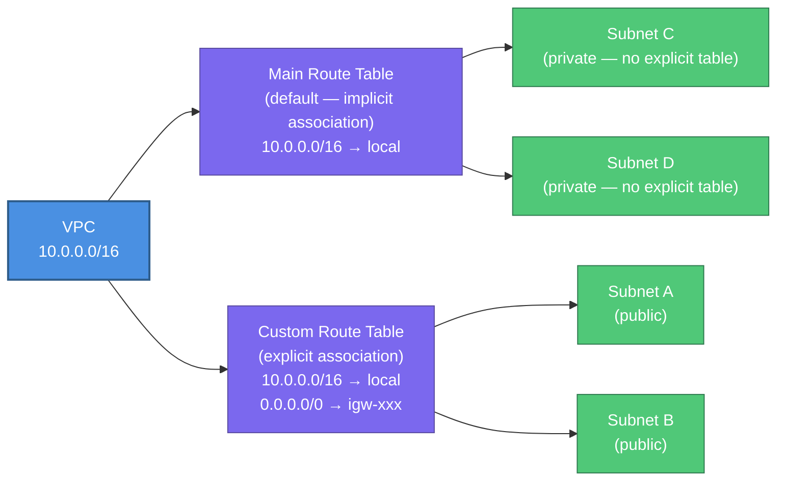
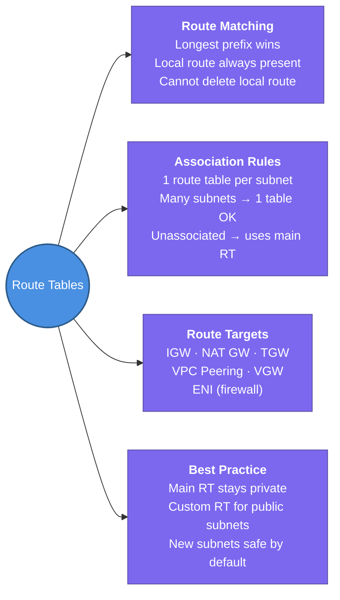

---
tags:
  - aws/networking
  - vpc
  - review
status: completed
---
# Router & Route Tables

## 📖 Core Concepts

### What is the VPC Router?
Every VPC has an **implicit router** — a built-in, highly available, managed routing component that AWS runs on your behalf. You never see it as a resource; you only interact with it through **route tables**.

> 🚦 Think of the VPC Router like a **traffic control centre** for a city. Every intersection (subnet) has a traffic controller who checks an instruction book (route table) to decide: "This car wants to go to `10.0.2.0/24` — send it down Route A. This car wants to go to the internet — send it to the highway entrance (IGW)."

The router has **one interface per subnet**, reachable at the subnet's **network address + 1** (e.g., if subnet is `10.0.1.0/24`, the router is at `10.0.1.1`).

---

### Route Tables — The Instruction Book

A route table is a **list of rules (routes)**. When a packet leaves an EC2 instance, the VPC router looks up the destination IP in the route table and forwards the packet to the matching **target**.

**How route matching works:**
- AWS uses **longest-prefix match** — the most specific route wins.
- Every route table has a mandatory **local route** that cannot be deleted: traffic stays inside the VPC.

**Example route table for a public subnet:**

| Destination | Target | Meaning |
|---|---|---|
| `10.0.0.0/16` | `local` | Stay inside the VPC — talk to any instance |
| `0.0.0.0/0` | `igw-0a1b2c3d` | Everything else → go to internet via IGW |

**Example route table for a private subnet:**

| Destination | Target | Meaning |
|---|---|---|
| `10.0.0.0/16` | `local` | Stay inside the VPC |
| `0.0.0.0/0` | `nat-0x1y2z3w` | Outbound internet → go through NAT Gateway |
| `10.1.0.0/16` | `pcx-xxxxxxxx` | Route to peered VPC |

---

### Key Rules

| Rule | Detail |
|---|---|
| **One route table per subnet** | Each subnet is associated with exactly one route table at a time |
| **Multiple subnets, one table** | Many subnets can share the same route table |
| **Main route table** | Every VPC has a default main route table; any subnet not explicitly associated uses it |
| **Longest prefix wins** | `/24` beats `/16` beats `0.0.0.0/0` for the same destination |
| **Local route is immutable** | The VPC-local route cannot be deleted or overridden |

---

### Main Route Table vs. Custom Route Tables

> [!TIP]
> Best practice: keep the **main route table private** (no IGW route) and create separate **custom route tables** for public subnets. This means any new subnet you forget to explicitly associate stays private — safe by default.

---

### Route Targets — What Can a Route Point To?

| Target | Resource |
|---|---|
| `local` | Stay within VPC |
| `igw-xxxxx` | Internet Gateway |
| `nat-xxxxx` | NAT Gateway |
| `pcx-xxxxx` | VPC Peering connection |
| `tgw-xxxxx` | Transit Gateway |
| `vpgw-xxxxx` | Virtual Private Gateway (VPN/DX) |
| `eigw-xxxxx` | Egress-Only Internet Gateway (IPv6 outbound) |
| `eni-xxxxx` | Network Interface (e.g., a firewall appliance) |

---

## 📋 Summary

- Every VPC has an **implicit router** — you never create it, only control it via route tables
- The router sits at **subnet network address + 1** (e.g., `10.0.1.1` for `10.0.1.0/24`)
- A route table is a list of rules: **destination CIDR → target** (IGW, NAT GW, TGW, VGW, ENI, etc.)
- Route matching uses **longest prefix match** — more specific routes always win
- Every route table has an **immutable local route** covering the VPC CIDR — cannot be deleted
- Each subnet is associated with **exactly one route table** at a time; many subnets can share one table
- Subnets without an explicit association fall back to the **main route table**
- Best practice: keep the **main route table private** (no IGW route) — new subnets are safe by default
- Public subnets need: `0.0.0.0/0 → igw-xxxxx` | Private subnets need: `0.0.0.0/0 → nat-xxxxx`

---

## 🔗 Connections (Zettelkasten)
- **Part of:** [[1. VPC Deep Dive]]
- **Relates to:** [[VPC/Subnets|Subnets]] — each subnet is associated with exactly one route table; the route table defines whether the subnet is public or private.
- **Relates to:** [[VPC/Internet Gateway (IGW)|Internet Gateway (IGW)]] — public subnets point `0.0.0.0/0` at the IGW.
- **Relates to:** [[VPC/NAT Gateway|NAT Gateway]] — private subnets point `0.0.0.0/0` at the NAT Gateway.
- **Relates to:** [[VPC/VPC-Peering|VPC Peering]] — peering adds a route like `10.1.0.0/16 → pcx-xxxxx` to reach the peer VPC's instances.
- **Core Use Case:** A misconfigured route table is the #1 cause of VPC connectivity failures. If EC2 can't reach the internet, the first check is always: does the subnet's route table have a `0.0.0.0/0` route to the IGW (public) or NAT Gateway (private)?

---

## 🛠️ Study Aids

### 🧠 Mind Map

### 🗂️ Flashcards

#flashcards/aws

**How does the VPC router decide where to forward a packet?**
?
It checks the packet's destination IP against all routes in the subnet's route table and picks the **most specific match** (longest prefix). The matched route's target is where the packet is forwarded.

---

**What is the local route in a VPC route table, and can it be deleted?**
?
The local route (e.g., `10.0.0.0/16 → local`) allows all instances within the VPC to communicate with each other directly. It is **automatically present in every route table** and **cannot be deleted or modified**.

---

**If a subnet has no explicit route table association, what happens?**
?
It automatically inherits the VPC's **main route table**. This is why the best practice is to keep the main route table with only the local route (no IGW) — so any forgotten subnet stays private by default.

---

**To make a private subnet's EC2 instance reach the internet, what route do you add and where does it point?**
?
Add `0.0.0.0/0 → nat-xxxxx` (the NAT Gateway ID) to the private subnet's route table. The NAT Gateway must be in a public subnet.

---

**What is longest-prefix matching and why does it matter in route tables?**
?
When multiple routes match a destination IP, the router picks the one with the most specific (longest) CIDR prefix. E.g., `10.0.1.0/24` beats `10.0.0.0/16` beats `0.0.0.0/0`. This lets you route specific subnets differently (e.g., to a VPN) without affecting other traffic.

---

**Can two subnets share the same route table?**
?
Yes — many subnets can be associated with the same route table. But each subnet can only be associated with **one** route table at a time. If you need different routing for different subnets, you need separate route tables.
