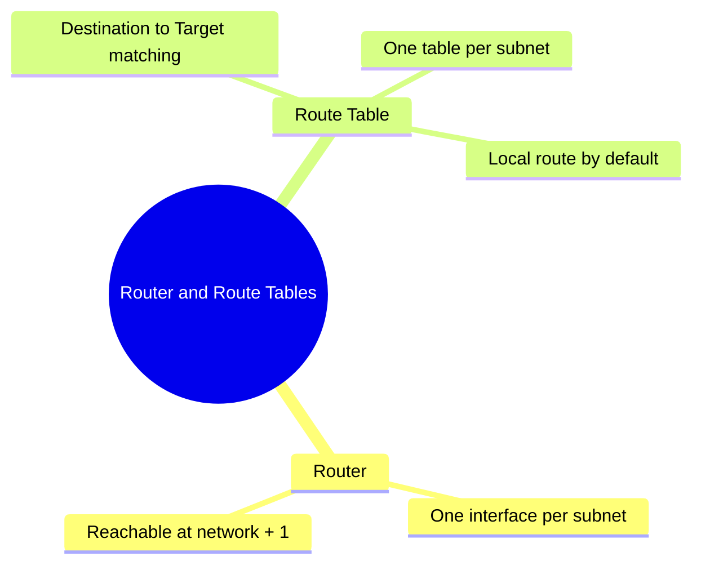

---
tags:
  - aws/networking
  - vpc
status: completed
---
# Router & Route Tables

## 📖 Core Concepts
- Every VPC has a router that forwards traffic between subnets and in/out of the VPC.
- The router has an interface in every subnet, reachable at the subnet's network + 1 address.
- A route table is the set of rules (routes) the router uses; it matches a packet's destination IP against the table and forwards to the matching target.
- Every route table has one default local route (two if IPv6 is enabled), and every subnet is tied to exactly one route table.

## 🔗 Connections (Zettelkasten)
- **Part of:** [[1. VPC Deep Dive]]
- **Relates to:** [[VPC/Subnets|Subnets]], [[VPC/Internet Gateway (IGW)|Internet Gateway (IGW)]], [[VPC/NAT Gateway|NAT Gateway]]

## 🛠️ Study Aids

### 🧠 Mind Map

### 🗂️ Flashcards

#flashcards/aws

**How does a VPC router decide where to forward a packet leaving a subnet?**
?
It checks the packet's destination IP against the route table's destination column and forwards it to the matching route's target. Every route table always has a default local route.

---

**If you want to configure your Private Subnet's Route Table to send all unknown internet traffic to the NAT Gateway, what specific IP address block (CIDR block) do you put in the Route Table rule?**
?
0.0.0.0/0
