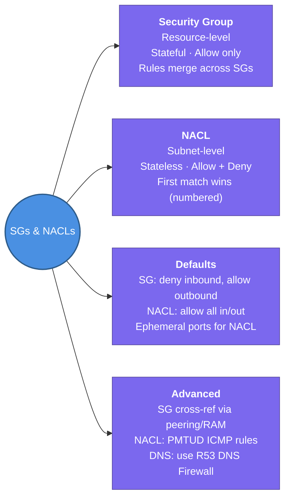

---
tags:
  - aws/networking
  - vpc
  - review
status: completed
---
# Security Groups & NACLs

## 📖 Core Concepts

### What are Security Groups and NACLs?
AWS gives you **two layers of firewalls** in a VPC. They work together but at different levels and with different rules.

> 🏢 Think of a VPC like a secure office building:
> - The **NACL** is the **building-wide security desk** at the lobby entrance. It checks everyone entering or leaving the building (subnet) and can turn people away. It checks both directions independently — stateless.
> - The **Security Group** is the **keycard lock on each individual office door**. It controls who can enter that specific room (EC2, RDS). Once you swipe in, you can leave freely — stateful.

---

### Security Group vs. NACL — Side-by-Side ⭐

| | Security Group | NACL |
|---|---|---|
| **Scope** | Resource-level (EC2, ENI, RDS) | Subnet-level |
| **Stateful/Stateless** | **Stateful** — responses auto-allowed | **Stateless** — must explicitly allow both directions |
| **Allow / Deny** | **Allow only** — no deny rules | **Allow AND Deny** |
| **Rule evaluation** | All rules evaluated together (union) | Rules evaluated in **ascending number order** — first match wins |
| **Default behaviour** | Outbound: allow all · Inbound: deny all | Default NACL: allow all in/out |
| **Association** | Attached to individual resources | One NACL per subnet (many subnets can share one) |
| **When to use** | Day-to-day firewall — your primary tool | Subnet-wide blocking (e.g., deny a known bad IP range) |

---

### Security Group Deep Dive

- **Stateful** — only the inbound direction needs to be permitted; the response is automatically allowed.
- Rules can **only allow** traffic — there is no explicit deny.
- By default, a new SG allows **all outbound** traffic and **denies all inbound**.
- Multiple Security Groups attached to the same resource have their rules **merged** (union of all rules).
- SGs can **reference other security groups** (even cross-account via RAM or cross-VPC via peering) — matching happens via private IPs. A rule referencing another SG counts as **one rule** regardless of that group's size.
- SGs **cannot block DNS traffic** to/from the Route 53 Resolver (the VPC+2 address) — use **Route 53 Resolver DNS Firewall** for that.
- SGs can be shared across accounts in the same AWS Organization via **AWS RAM** (except default VPC SGs, which can never be shared).

---

### NACL Deep Dive

- **Stateless** — inbound and outbound rules must **both** be explicitly configured; return traffic is not auto-allowed.
- Rules can **allow or deny** traffic.
- Rules are evaluated in **ascending numerical order** — the first matching rule wins. The unnumbered `*` rule is the default catch-all **deny** and cannot be deleted.
- The default NACL ships with rule `100` allowing all IPv4 traffic (`0.0.0.0/0`). IPv6 rules are only auto-added when an IPv6 CIDR block is associated with the VPC.
- NACL rule changes apply **immediately** to every associated subnet.
- Stateless return traffic typically requires the **ephemeral port range `1024–65535`** to be opened for outbound responses.
- Does **not** filter traffic to/from: Amazon DNS, DHCP, EC2 instance metadata, ECS task metadata, Windows licence activation, Amazon Time Sync, and reserved IPs used by the default VPC router.

---

### Rule Evaluation — Advanced Mechanics

- A **"stale" SG rule** is one that references a security group that has since been deleted in a peered or shared VPC.
- Rules referencing a **prefix list**: a customer-managed prefix list counts against the quota as its maximum size; an AWS-managed prefix list counts as its assigned "weight."
- **Path MTU Discovery (PMTUD)**: NACLs must allow ICMP Type 3, Code 4 (IPv4: "Fragmentation Needed") and ICMPv6 Type 2 ("Packet Too Big") for PMTUD to work, plus Type 11, Code 0 ("Time Exceeded") for `traceroute`.

---

### When Do You Use Each?

> **Security Groups** are your default, day-to-day tool — stateful and per-resource, so you only manage one direction of traffic.
>
> **NACLs** are usually left at their default (allow-all) and reached for when you need a **subnet-wide rule** — like blocking a specific IP range across every resource in a subnet. Since Security Groups can only allow (never deny), NACLs are your only option for explicit denies.

---

### Traffic Flow: How Both Layers Work Together

For traffic to reach your instance, it must be allowed by **both** layers:

1. **Inbound traffic arrives** → NACL evaluates first (subnet level). If the NACL denies it, the packet is dropped immediately.
2. **Traffic passes NACL** → Security Group evaluates next (resource level). If no SG rule allows it, the packet is dropped.
3. **Response traffic** → SG is stateful so the response is auto-allowed. But the NACL is stateless — the outbound NACL rules must also explicitly allow the response (typically via the ephemeral port range).

**Example:** If your NACL only allows port `8080` inbound, and your SG allows all ports — only port `8080` traffic reaches the instance. The NACL blocks everything else before the SG even sees it.

## 📋 Summary

- **Security Group** — resource-level firewall (EC2, ENI). **Stateful** — only write inbound rules; responses auto-allowed. Can only **allow**, never deny.
- **NACL** — subnet-level firewall. **Stateless** — must write both inbound AND outbound rules explicitly. Can **allow or deny**.
- NACL rules evaluated in **ascending number order**; first match wins. `*` is the catch-all deny at the bottom.
- Security Groups can **reference other SGs** (cross-account via RAM, cross-VPC via peering) — counts as one rule regardless of group size.
- NACLs must allow **ephemeral ports `1024–65535`** outbound to permit return traffic from clients.
- One NACL per subnet; **many subnets can share one NACL**. NACL changes apply immediately.
- Security Groups **cannot block DNS** traffic to/from the Route 53 Resolver (`VPC+2`) — use Route 53 DNS Firewall instead.
- **Default SG**: all outbound allowed, inbound only from same SG. **Default NACL**: all inbound + outbound allowed.

---

## 🔗 Connections (Zettelkasten)
- **Part of:** [[1. VPC Deep Dive]]
- **Relates to:** [[VPC/Subnets|Subnets]], [[VPC/Default VPC|Default VPC]], [[VPC/VPC Flow Logs|VPC Flow Logs]] — REJECT records in flow logs directly reflect SG/NACL decisions.
- **Core Use Case:** An ALB in a public subnet has an SG allowing port 443 inbound. The private subnet hosting EC2 app servers has an SG allowing inbound only from the ALB's SG. The NACL on the private subnet is left at default (allow-all) but could add an explicit deny for a known bad CIDR range if needed.

## 🛠️ Study Aids

### 🧠 Mind Map

### 🗂️ Flashcards

#### Security Groups - Core
#flashcards/aws/6_security_group/core

**What happens when a resource has multiple Security Groups attached?**
?
Their rules are merged — the resource ends up with the union of all rules from every attached Security Group.

---

**At which level of the network hierarchy do security groups operate?**
?
The instance level.

---

**Security groups support only _____ rules.**
?
Allow.

---

**Why is a security group described as "stateful" regarding return traffic?**
?
Because return traffic is automatically allowed regardless of rules.

---

**What is the default inbound traffic policy for a newly created security group?**
?
No inbound traffic is allowed until rules are added.

---

**What is the default outbound traffic policy for a newly created security group?**
?
All outbound traffic is allowed by default.

---

**What are the three most common protocol numbers used in security group rules?**
?
6 (TCP), 17 (UDP), and 1 (ICMP).

---

**How does the IPv6 protocol handle packets that exceed a device's MTU along a path?**
?
The device drops the packet and returns an ICMPv6 Packet Too Big (PTB) message.

---

#### Security Groups - Referencing & Quotas
#flashcards/aws/6_security_group/limits

**In security group referencing, what addresses are used for communication between instances?**
?
The private IP addresses of the instances.

---

**Can a security group reference another security group if they are in different VPCs connected by a peering connection?**
?
Yes.

---

**When using a middlebox appliance between two subnets, how must security groups reference each other to allow traffic?**
?
They must reference the private IP address or CIDR range of the other instance/subnet.

---

**In a security group, how many rules does a single CIDR block reference count as?**
?
One rule.

---

**How does a rule referencing a customer-managed prefix list affect the security group's rule quota?**
?
It counts as the maximum size of the prefix list.

---

**How does a rule referencing an AWS-managed prefix list affect the security group's rule quota?**
?
It counts as the weight of the prefix list.

---

**How many rules does a security group rule referencing another security group count as toward the quota?**
?
One rule, regardless of the referenced group's size.

---

**In a security group rule for ICMP, what is Type 8 commonly used for?**
?
ICMP Echo Request (Ping).

**What is the maximum character length for a security group rule description?**
?
255 characters.

---

**Can a security group rule reference an IPv6 address?**
?
Yes, using the `/128` prefix length.

---

**What is the canonical form of an IPv4 address rule in a security group?**
?

The address followed by the `/32` prefix length.

---

#### Security Groups - Cross-Account (RAM)
#flashcards/aws/6_security_group/ram

**What defines a "stale" security group rule?**
?
A rule referencing a deleted security group in a peered or shared VPC.

---

**What is the primary requirement for sharing a security group using the Shared Security Group feature?**
?
The accounts must be part of the same AWS Organisation.

---

**Which type of security groups are strictly prohibited from being shared with other accounts?**
?
Default security groups.

---

**Can a security group located in a default VPC be shared?**
?
No.

---

**Who must own the VPC to enable the sharing of a security group within it?**
?
The account that shares the security group.

---

**Which AWS service is used to manage the sharing of security groups across an organisation?**
?
AWS Resource Access Manager (RAM).

---

**What determines the "Security groups per network interface" quota when an ENI uses both shared and owned groups?**
?
The minimum of the owner's and the participant's quota applies.

---

**What is the effect of "unsharing" a security group on existing participant ENIs?**
?
They continue to receive rule updates but cannot make new associations.

---

**Under what condition can an owner delete a security group that was previously shared?**
?
Only after participants disassociate it from all their ENIs.

---

**Can a participant account share a security group it created within a shared VPC subnet?**
?
No, participant accounts cannot share security groups.

---

**What happens to participant EC2 instances if they attempt to launch using an ENI associated with an unshared security group?**
?
They cannot be launched.

---

#### Security Groups - Misc
#flashcards/aws/6_security_group/misc

**What happens to the rules when multiple security groups are associated with a single resource?**
?
The rules from each group are aggregated into a single set.

**Which specific DNS traffic can security groups NOT block?**
?
DNS requests to or from the Route 53 Resolver (the VPC+2 IP address).

---

**What tool should be used to filter DNS requests through the Route 53 Resolver?**
?
Route 53 Resolver DNS Firewall.

---

**What term describes the process of allowing inbound or outbound access in a security group?**
?
Authorising.

---

**What term describes the process of removing inbound or outbound access in a security group?**
?
Revoking.

---

#### NACLs - Core
#flashcards/aws/6_nacls/core

**What's the key difference between a stateless and a stateful firewall?**
?
A stateless firewall (NACL) requires you to explicitly permit both the inbound request and the outbound response. A stateful firewall (Security Group) only requires the request direction to be permitted — the response is automatically allowed.

---

**Can a NACL rule deny traffic? Can a Security Group rule deny traffic?**
?
NACL rules can allow or deny. Security Group rules can only allow — there's no explicit deny.

---

**How many NACLs can a single subnet be associated with, and how many subnets can one NACL cover?**
?
A subnet can be associated with exactly one NACL at a time, but a single NACL can be associated with multiple subnets.

---

**In an inbound network ACL rule, what does the "Source" field specify?**
?
The CIDR range originating the traffic.

---

**In an outbound network ACL rule, what does the "Destination" field specify?**
?
The CIDR range to which the traffic is being sent.

---

**To deny a specific port within a wider allowed range in a network ACL, what must be true of the deny rule's number?**
?
It must be lower than the rule that allows the wider range.

---

**In the context of NACLs, what range of ports is typically used for outbound responses to a remote computer (ephemeral ports)?**
?
1024–65535.

---

**Which security layer supports both "allow" and "deny" rules?**
?
Network ACLs.

---

**Why is a network ACL described as "stateless" regarding return traffic?**
?
Because return traffic must be explicitly allowed by a rule.

---

**How does the rule evaluation of a security group differ from a network ACL?**
?
A security group evaluates all rules before deciding, whereas a network ACL stops at the first match.

---

**A security group applies to all instances associated with it, whereas a network ACL applies to _____.**
?
All instances in the associated subnets.

---

**When a network ACL rule is added or removed, when do the changes apply to associated subnets?**
?
The changes are automatically and immediately applied.

---

**Which security layer acts as a "backup layer of defence" if security groups are accidentally misconfigured?**
?
Network ACLs.

---

#### NACLs - Rules & Evaluation
#flashcards/aws/6_nacls/rules

**Name some traffic types that NACLs never filter, regardless of your rules.**
?
Amazon DNS, DHCP, EC2 instance metadata, ECS task metadata endpoints, Windows license activation traffic, Amazon Time Sync Service, and reserved IPs used by the default VPC router.

**By default, what is the traffic allowance policy of a VPC's default network ACL?**
?
It allows all inbound and outbound traffic.

---

**In a network ACL, what is the function of the rule numbered `*`?**
?
It ensures that any packet not matching other numbered rules is denied.

---

**Which specific network ACL rule cannot be deleted?**
?
The rule where the rule number is an asterisk (`*`).

---

**How are rules in a network ACL evaluated?**
?
In ascending numerical order, starting with the lowest numbered rule — the first match wins.

---

**In a default network ACL, what does inbound rule 100 allow?**
?
All IPv4 traffic from any source (`0.0.0.0/0`).

---

**When are IPv6 rules automatically added to a default network ACL?**
?
When an IPv6 CIDR block is associated with the VPC.

---

**If a default network ACL's inbound rules have already been modified, what happens when an IPv6 block is later associated with the VPC?**
?
The rule allowing all inbound IPv6 traffic is not automatically added.

---

**What happens to a CIDR range like `100.68.0.18/18` when added to an ACL via the CLI?**
?
It is automatically modified to its canonical form, such as `100.68.0.0/18`.

---

**What is the risk if a user deletes network ACL rules and then exceeds the rule quota when adding new ones?**
?
The deleted rules are removed but the new entries aren't added, potentially causing connectivity loss.

**At which level of the network hierarchy do network ACLs operate?**
?
The subnet level.

---

#### NACLs - Path MTU Discovery
#flashcards/aws/6_nacls/pmtud

**Which IAM managed policies are recommended to ensure a principal can share security groups?**
?
AmazonEC2FullAccess and AWSResourceAccessManagerFullAccess.

**What is the purpose of Path MTU Discovery?**
?
To determine the maximum packet size supported on the path between two hosts.

---

**In Path MTU Discovery for IPv4, what ICMP message is returned when a packet is too large and the DF flag is set?**
?
Destination Unreachable: Fragmentation Needed (Type 3, Code 4).

---

**To support Path MTU Discovery, which ICMP type and code must be allowed in a network ACL for IPv4?**
?
Type 3, Code 4.

---

**Which ICMP message must be allowed in a network ACL to enable the "traceroute" utility?**
?
Time Exceeded, TTL expired in transit (Type 11, Code 0).

---

**For IPv6 Path MTU Discovery, what is the ICMPv6 Type number for "Packet Too Big"?**
?
Type 2.

---

## 📚 References
- [Security Groups for Your VPC](https://docs.aws.amazon.com/vpc/latest/userguide/vpc-security-groups.html)
- [Security Group Rules](https://docs.aws.amazon.com/vpc/latest/userguide/security-group-rules.html)
- [Default Security Group](https://docs.aws.amazon.com/vpc/latest/userguide/default-security-group.html)
- [Working with Security Group Rules](https://docs.aws.amazon.com/vpc/latest/userguide/working-with-security-group-rules.html)
- [Security Group Associations](https://docs.aws.amazon.com/vpc/latest/userguide/security-group-assoc.html)
- [Sharing Security Groups](https://docs.aws.amazon.com/vpc/latest/userguide/security-group-sharing.html)
- [Network ACLs](https://docs.aws.amazon.com/vpc/latest/userguide/vpc-network-acls.html)
- [NACL Rules](https://docs.aws.amazon.com/vpc/latest/userguide/nacl-rules.html)
- [Default Network ACL](https://docs.aws.amazon.com/vpc/latest/userguide/default-network-acl.html)
- [Custom Network ACL](https://docs.aws.amazon.com/vpc/latest/userguide/custom-network-acl.html)
- [Path MTU Discovery](https://docs.aws.amazon.com/vpc/latest/userguide/path_mtu_discovery.html)
- [NACL Examples](https://docs.aws.amazon.com/vpc/latest/userguide/nacl-examples.html)
