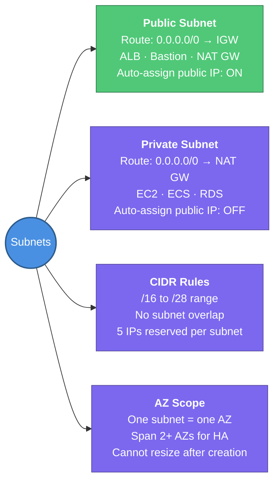

---
tags:
  - aws/networking
  - vpc
  - review
status: completed
---
# Subnets

## 📖 Core Concepts

### What is a Subnet?
A subnet is a **range of IP addresses carved out of your VPC's CIDR block**, and it lives entirely within **one Availability Zone**. It's how you divide a VPC into smaller, purposeful segments — some facing the internet, others isolated.

> 🏢 Think of a VPC like a large office building. A subnet is one **floor** in that building. Some floors are public (reception, lobby — accessible to visitors), others are private (server room, finance — employees only). Each floor is on one physical level (one AZ) and has its own set of access rules.

---

### Public vs. Private Subnet — The Only Difference That Matters

The term "public" or "private" is **not a setting on the subnet itself** — it's determined entirely by its **route table**.

| | Public Subnet | Private Subnet |
|---|---|---|
| **Route table has** | `0.0.0.0/0 → igw-xxxxx` | `0.0.0.0/0 → nat-xxxxx` (or no route) |
| **Internet can initiate connections?** | ✅ Yes (if instance has public IP) | ❌ No |
| **Instance can reach internet?** | ✅ Yes | ✅ Yes (via NAT Gateway) |
| **Typical resources** | ALB, Bastion Host, NAT Gateway | EC2 app servers, RDS, ECS tasks |

> [!TIP]
> The NAT Gateway itself must live in a **public subnet** — it needs internet access to forward private subnet traffic outbound.

---

### CIDR Sizing Rules

| Rule | Detail |
|---|---|
| **Allowed range** | `/16` (65,536 IPs) to `/28` (16 IPs) |
| **No overlap** | A subnet CIDR cannot overlap with any other subnet in the same VPC |
| **One AZ** | A subnet spans exactly one AZ — it cannot stretch across AZs |
| **5 reserved addresses** | AWS reserves the first 4 addresses and the last 1 in every subnet |

**The 5 reserved addresses in every subnet** (example: `10.0.1.0/24`):

| Address | Reserved for |
|---|---|
| `10.0.1.0` | Network address |
| `10.0.1.1` | VPC router |
| `10.0.1.2` | AWS DNS server |
| `10.0.1.3` | Future AWS use |
| `10.0.1.255` | Broadcast (not used but reserved) |

> [!IMPORTANT]
> In a `/28` subnet (the smallest allowed), you only get **16 − 5 = 11 usable IP addresses**. Plan your CIDR carefully — you cannot resize a subnet after creation.

---

### Designing a Subnet Layout — Best Practice

A typical 3-tier web app across 2 AZs:

```
VPC: 10.0.0.0/16
├── Public Subnet AZ-a:   10.0.1.0/24   (ALB, NAT Gateway)
├── Public Subnet AZ-b:   10.0.2.0/24   (ALB, NAT Gateway)
├── Private Subnet AZ-a:  10.0.11.0/24  (EC2, ECS)
├── Private Subnet AZ-b:  10.0.12.0/24  (EC2, ECS)
├── DB Subnet AZ-a:       10.0.21.0/24  (RDS)
└── DB Subnet AZ-b:       10.0.22.0/24  (RDS)
```

- Assign larger CIDR blocks to subnets that will grow (app/EC2 tiers)
- Keep DB subnets small — RDS only needs a handful of IPs
- Always span 2+ AZs for high availability

---

### Auto-assign Public IP

Each subnet has a setting: **Auto-assign public IPv4 address**.
- When **enabled**: every EC2 launched gets a public IP automatically
- When **disabled**: EC2 gets only a private IP (you must manually assign an Elastic IP if needed)

For private subnets, this should always be **disabled**.

---

## 📋 Summary

- A subnet is a **range of IPs inside a VPC, scoped to one AZ** — it cannot span multiple AZs
- **Public subnet** = route table has `0.0.0.0/0 → IGW`. **Private subnet** = routes to NAT GW or no internet route
- "Public" and "private" are **not a subnet property** — they are defined entirely by the route table
- Valid CIDR sizes: `/16` (65,536 IPs) to `/28` (16 IPs) — **cannot resize after creation**
- AWS reserves **5 IPs** in every subnet: network address, VPC router, DNS, future use, broadcast
- **NAT Gateway must be in a public subnet** — it needs IGW access to forward private subnet traffic out
- For HA, always deploy **one subnet per tier per AZ** (e.g., 2 public + 2 private + 2 DB = 6 subnets minimum for 2 AZs)
- Disable **Auto-assign public IPv4** on all private subnets

---

## 🔗 Connections (Zettelkasten)
- **Part of:** [[1. VPC Deep Dive]]
- **Relates to:** [[VPC/Router & Route Tables|Router & Route Tables]] — the route table attached to a subnet defines whether it's public or private.
- **Relates to:** [[VPC/Internet Gateway (IGW)|Internet Gateway (IGW)]] — public subnets route `0.0.0.0/0` to the IGW.
- **Relates to:** [[VPC/NAT Gateway|NAT Gateway]] — private subnets route outbound traffic through a NAT Gateway in a public subnet.
- **Core Use Case:** A standard 3-tier web app — ALB in public subnets (2 AZs), EC2 app servers in private subnets, RDS in isolated DB subnets. Each tier has its own CIDR range and route table so blast radius is contained per layer.

---

## 🛠️ Study Aids

### 🧠 Mind Map


### 🗂️ Flashcards

#flashcards/aws

**What actually makes a subnet "public" vs. "private" in AWS?**
?
Not a setting on the subnet itself — it's the **route table** attached to it. A public subnet has a `0.0.0.0/0 → igw-xxxxx` route. A private subnet routes `0.0.0.0/0` to a NAT Gateway or has no internet route at all.

---

**What is the allowed CIDR size range for a subnet, and why can't you use a /29?**
?
The allowed range is `/16` to `/28`. A `/29` is outside this range and cannot be used. Even the smallest valid subnet (`/28`) only gives 16 IPs − 5 reserved = 11 usable.

---

**Which 5 IP addresses does AWS reserve in every subnet, and what are they used for?**
?
In any subnet `x.x.x.0/n`: first address (network), `.1` (VPC router), `.2` (AWS DNS), `.3` (future use), and last address (broadcast). Total: 5 reserved.

---

**If you need a NAT Gateway for your private subnets, which subnet do you put it in and why?**
?
In a **public subnet** — the NAT Gateway itself needs a route to the internet (via IGW) to forward outbound traffic from private instances. If it were in a private subnet, it couldn't reach the internet either.

---

**Can a single subnet span multiple Availability Zones?**
?
No. A subnet is scoped to exactly **one AZ**. For high availability, you create duplicate subnets in each AZ (e.g., one public and one private subnet per AZ).

---

**You're building a 3-tier web app (ALB, EC2, RDS) in 2 AZs. How many subnets do you need at minimum?**
?
6 subnets: 2 public (ALB/NAT GW, one per AZ) + 2 private app (EC2/ECS, one per AZ) + 2 private DB (RDS, one per AZ). Each tier gets its own subnet per AZ for isolation and HA.
