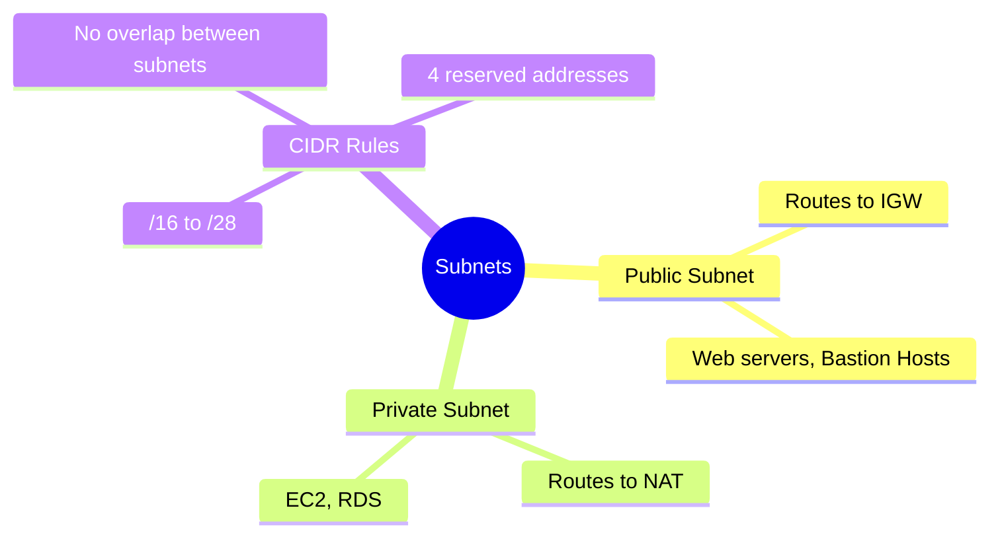

---
tags:
  - aws/networking
  - vpc
status: completed
---
# Subnets

## 📖 Core Concepts
- **Public Subnet**: A subnet whose route table directs traffic to the VPC's Internet Gateway (IGW).
- **Private Subnet**: A subnet whose route table does *not* have a route to an Internet Gateway. Instead, it typically routes outbound internet traffic through a NAT Gateway or NAT Instance.
- A subnet resides within a single Availability Zone and cannot overlap with other subnets in the same VPC.
- Allowed CIDR block size: between `/16` and `/28`.
- 4 addresses per subnet are reserved and can't be assigned to instances: network address, router address, DNS address, and the broadcast address (last address).

## 🔗 Connections (Zettelkasten)
- **Part of:** [[1. VPC Deep Dive]]
- **Relates to:** [[VPC/Router & Route Tables|Router & Route Tables]], [[VPC/Internet Gateway (IGW)|Internet Gateway (IGW)]], [[VPC/NAT Gateway|NAT Gateway]]

## 🛠️ Study Aids

### 🧠 Mind Map

### 🗂️ Flashcards

#flashcards/aws

**What size range is allowed for a subnet's CIDR block?**
?
Between `/16` and `/28`.

---

**Which 4 addresses in a subnet's range can't be assigned to an instance?**
?
Network address, router address, DNS address, and the broadcast address (last address in the range).

---

**If you are building a standard web application, which subnet would you put the React web server in, and which subnet would you put the Postgres database in?**
?
The React Web Server goes in a PUBLIC Subnet because regular users on the internet need to reach it. The Postgres Database goes in a PRIVATE Subnet because it holds sensitive data and should never be accessible from the internet directly.
