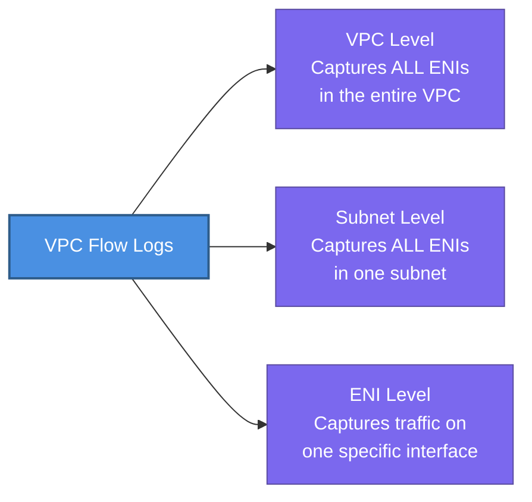
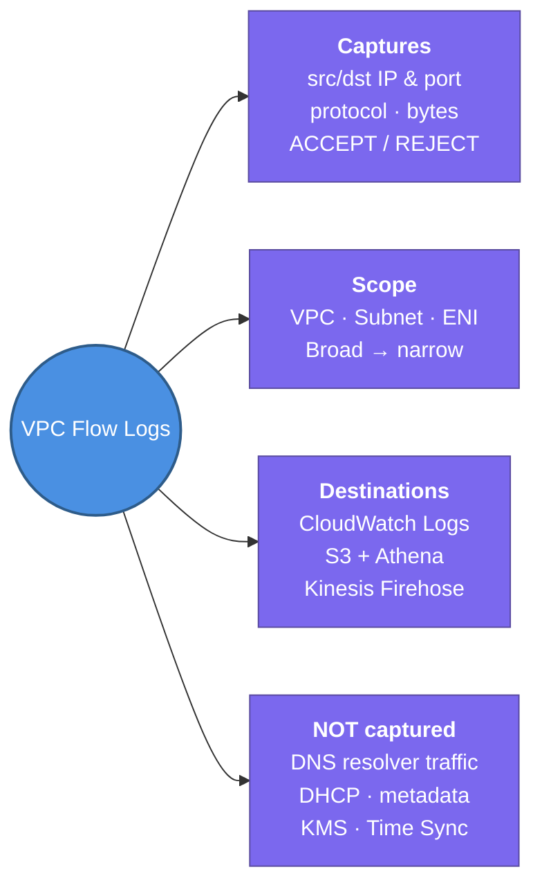

---
tags:
  - aws/networking
  - vpc
  - review
status: completed
---
# VPC Flow Logs

## 📖 Core Concepts

### What is it?
VPC Flow Logs capture **metadata about IP traffic** flowing through your VPC network interfaces — not the packet content itself, just who talked to whom, on what port, and whether it was accepted or rejected.

> 🔍 Think of it like a **security camera log at a building entrance**. It records "John entered at 9:02am through Door 3" but not what John said inside. You know the who, when, and where — not the content.

### What it captures (per flow record)
Each log record is a fixed-format line including:

| Field | Example | Meaning |
|---|---|---|
| `srcaddr` | `10.0.1.5` | Source IP |
| `dstaddr` | `52.10.1.1` | Destination IP |
| `srcport` | `443` | Source port |
| `dstport` | `8080` | Destination port |
| `protocol` | `6` | 6=TCP, 17=UDP, 1=ICMP |
| `action` | `ACCEPT` or `REJECT` | Did the Security Group / NACL allow it? |
| `bytes` | `2340` | Data transferred |
| `start` / `end` | epoch timestamps | When the flow occurred |

> [!IMPORTANT]
> Flow Logs capture **ACCEPT and REJECT** decisions. A `REJECT` means a Security Group or NACL blocked the traffic — very useful for debugging connectivity issues.

---

### Where can you enable Flow Logs?

You can capture at 3 levels of granularity:



> [!TIP]
> Start with **VPC-level** for broad visibility. Narrow down to ENI-level when debugging a specific instance.

---

### Where do logs go? (Destinations)

| Destination | Best for | Querying |
|---|---|---|
| **CloudWatch Logs** | Real-time alerting, metric filters | CloudWatch Log Insights |
| **S3 Bucket** | Long-term storage, cost-effective | Amazon Athena (SQL queries) |
| **Kinesis Data Firehose** | Streaming to SIEM tools (Splunk, Datadog) | Your SIEM |

---

### Traffic NOT captured by Flow Logs

Flow Logs do **not** capture everything. Know these exclusions:

- Traffic to/from the **VPC DNS resolver** (`169.254.169.253`)
- **DHCP traffic**
- Traffic to the **AWS metadata endpoint** (`169.254.169.254`)
- **Windows licence activation** traffic to KMS
- Traffic for **Amazon Time Sync** (`169.254.169.123`)

> [!NOTE]
> These are all AWS-internal housekeeping flows — they are excluded by design to reduce noise in your logs.

---

### Common Use Cases

| Use Case | How Flow Logs Help |
|---|---|
| **Debugging connectivity** | Check for REJECT records — which SG or NACL is blocking? |
| **Security monitoring** | Detect port scanning (many REJECT from one IP) or unusual protocols |
| **Compliance auditing** | Prove network traffic patterns for PCI/HIPAA |
| **Cost analysis** | Identify unexpected cross-AZ or internet data transfer |

---

### Querying with Athena (S3 destination)

When Flow Logs go to S3, you can query them with Athena SQL:

```sql
-- Find all REJECTED traffic to port 22 in the last 24h
SELECT srcaddr, dstaddr, action, bytes
FROM vpc_flow_logs
WHERE dstport = 22
  AND action = 'REJECT'
  AND from_unixtime(start) > now() - interval '1' day;
```

---

## 📋 Summary

- VPC Flow Logs capture **IP traffic metadata** (src/dst IP, port, protocol, bytes, ACCEPT/REJECT) — not packet content
- Can be enabled at **VPC level** (all ENIs), **subnet level**, or **individual ENI level**
- Three destinations: **CloudWatch Logs** (real-time alerting), **S3 + Athena** (cheap long-term query), **Kinesis Firehose** (SIEM streaming)
- `ACCEPT` = traffic allowed by SG/NACL; `REJECT` = blocked — useful for debugging connectivity failures
- **NOT captured**: DNS resolver traffic, DHCP, EC2 metadata (`169.254.169.254`), KMS, Time Sync
- Use **Athena SQL** to query logs stored in S3 — much cheaper than keeping everything in CloudWatch
- Flow logs do **not** affect network performance or latency — they are captured asynchronously

---

## 🔗 Connections (Zettelkasten)
- **Part of:** [[1. VPC Deep Dive]]
- **Relates to:** [[VPC/Security-group & NACLS|Security Groups & NACLs]] — REJECT records in flow logs directly reflect SG/NACL decisions.
- **Core Use Case:** A production incident where EC2 can't reach RDS — flow logs reveal `REJECT` on port 5432, pointing to a missing inbound SG rule on the RDS security group.

---

## 🛠️ Study Aids

### 🧠 Mind Map


### 🗂️ Flashcards

#flashcards/aws

**What does VPC Flow Logs capture — and what does it NOT capture?**
?
It captures metadata: source/destination IP, port, protocol, bytes, and whether traffic was ACCEPTED or REJECTED. It does NOT capture packet contents. It also excludes DNS resolver traffic, DHCP, EC2 metadata endpoint, KMS, and Time Sync traffic.

---

**At what 3 levels can VPC Flow Logs be enabled?**
?
VPC level (all ENIs in the VPC), Subnet level (all ENIs in a subnet), and ENI level (one specific network interface).

---

**What are the 3 destinations for VPC Flow Logs and when would you choose each?**
?
- **CloudWatch Logs** — real-time alerting and metric filters.
- **S3** — long-term storage with Athena SQL querying; most cost-effective.
- **Kinesis Firehose** — streaming directly to a SIEM like Splunk or Datadog.

---

**A developer says EC2 can't connect to RDS. How would you use Flow Logs to diagnose this?**
?
Enable flow logs on the RDS ENI or the subnet. Look for REJECT records with `dstport = 5432` (Postgres) or `3306` (MySQL). A REJECT tells you a Security Group or NACL is blocking the traffic — then trace which rule is responsible.

---

**Why would a flow log show REJECT even when a Security Group rule allows the traffic?**
?
Because NACLs are also evaluated. A NACL DENY on the subnet will reject traffic before (or after) the Security Group is checked. Since NACLs are stateless, an outbound return flow can also be rejected if the ephemeral port range isn't explicitly allowed.
