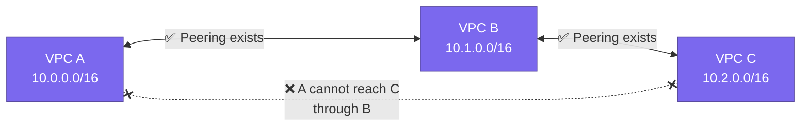
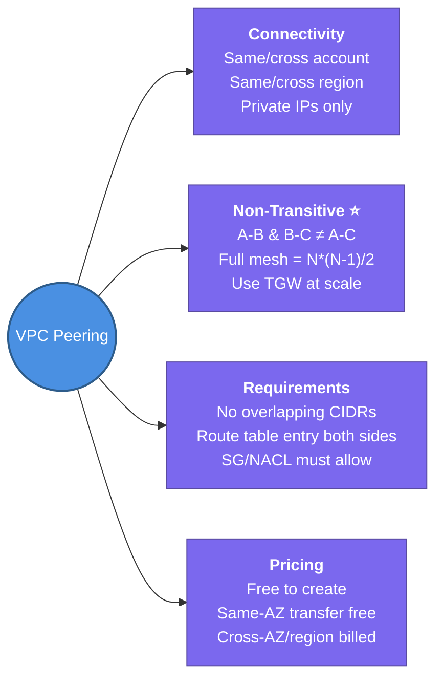

---
tags:
  - aws/networking
  - vpc
  - review
status: completed
---
# VPC Peering

## 📖 Core Concepts

### What is VPC Peering?
A **direct, private networking connection between two VPCs** that lets instances in each VPC communicate using private IPv4/IPv6 addresses — as if they were on the same local network. No internet, no VPN, no gateway required.

> 🤝 Think of it like cutting a private hole in the wall between two apartments so the residents can pass things directly, without going through the building lobby (the internet).

Works across:
- **Same account or different accounts**
- **Same region or different regions** (inter-region peering)

---

### ⭐ The Most Important Rule — Non-Transitive

> [!IMPORTANT]
> VPC Peering is **non-transitive**. A peering connection is a **direct, one-to-one link** — it does NOT allow traffic to flow *through* a VPC to reach another.

**What this means in practice:** Connecting 5 VPCs fully with peering requires **10 separate connections** (a full mesh). This is why [[2.Transit Gateway|Transit Gateway]] exists — one hub, each VPC connects once.

---

### Hard Requirements Before You Can Peer

| Rule | Why it matters |
|---|---|
| **No overlapping CIDRs** | If `10.0.0.0/16` exists in both VPCs, AWS can't route between them unambiguously — peering will be rejected |
| **Routes must be added manually on both sides** | Peering doesn't auto-propagate routes — you must update route tables in **both** VPCs to point the peer's CIDR at the `pcx-xxxxxxxx` connection ID |
| **Security Groups / NACLs must allow traffic** | Creating the peering connection opens the pipe, but your firewall rules still control what's allowed through |

---

### Setup Flow (4 Steps)

1. **Requester** creates a peering connection request targeting the peer VPC (by VPC ID or account).
2. **Accepter** (owner of the other VPC/account) accepts the request in their console.
3. **Both sides** add a route table entry: *"traffic for peer's CIDR → pcx-xxxxxxxx"*
4. **Both sides** update Security Groups / NACLs if the peer's CIDR needs explicit inbound/outbound access.

> [!TIP]
> Step 3 is the most commonly forgotten step. Accepting the peering request does **not** make traffic flow — routes must be manually added.

---

### DNS Resolution Across Peering

By default, if an instance in VPC-A queries the **private DNS hostname** of an instance in VPC-B, it resolves to the **public IP** — not the private IP.

Enable **DNS resolution support** on the peering connection to fix this:
- Private DNS hostnames resolve to private IPs across the peering link.
- Must be enabled on **both sides** of the connection.

---

### Pricing

| Traffic | Cost |
|---|---|
| Creating / accepting the peering connection | 🆓 Free |
| Data transfer — **same AZ** | 🆓 Free |
| Data transfer — **cross-AZ** | 💰 Billed (standard AZ data transfer rates, both sides) |
| Data transfer — **cross-region** | 💰 Billed (inter-region rates, both sides) |

> [!TIP]
> Deploy your peered resources in the **same AZ** when possible to eliminate cross-AZ data transfer costs.

---

## 📋 Summary

- VPC Peering creates a **direct, private, 1:1 connection** between two VPCs using private IP addresses — no internet, no VPN
- Supports **same/cross-account** and **same/cross-region** (inter-region peering)
- **Non-transitive** ⭐ — A↔B and B↔C does NOT mean A can reach C. Each pair needs its own direct peering connection
- **No overlapping CIDRs** — peering will be rejected if CIDR blocks conflict
- After acceptance, **routes must be manually added** to both sides' route tables pointing the peer CIDR at `pcx-xxxxxxxx`
- Security Groups and NACLs still apply — peering opens the pipe, your firewall rules control what flows
- Enable **DNS resolution support** (both sides) so private hostnames resolve to private IPs across the peering link
- **Pricing**: free to create; same-AZ traffic free; cross-AZ and cross-region traffic billed on both sides
- For many VPCs, use **Transit Gateway** instead to avoid the full-mesh explosion (N VPCs = N*(N-1)/2 peering connections)

---

## 🔗 Connections (Zettelkasten)
- **Part of:** [[1. VPC Deep Dive]]
- **Relates to:** [[VPC/Router & Route Tables|Router & Route Tables]] — routes must be manually added on both sides after acceptance; peering does not auto-propagate.
- **Relates to:** [[2.Transit Gateway|Transit Gateway]] — the hub-and-spoke alternative when non-transitive full-mesh peering becomes unmanageable at scale.
- **Core Use Case:** A small, fixed number of VPCs that need direct connectivity — e.g. a shared-services VPC peered to a Prod VPC — where standing up a full Transit Gateway would be overkill.

---

## 🛠️ Study Aids

### 🧠 Mind Map

### 🗂️ Flashcards

#flashcards/aws

**Is a VPC Peering connection transitive? If VPC A is peered with VPC B, and VPC B is peered with VPC C, can A reach C?**
?
No. VPC Peering is non-transitive. A cannot reach C through B — you need a direct A-to-C peering connection, or use a Transit Gateway instead.

---

**What CIDR requirement must two VPCs meet before they can be peered?**
?
Their CIDR blocks must not overlap. If they do, the peering connection cannot be created.

---

**After a VPC Peering connection is accepted, what two things still need to be configured before traffic actually flows?**
?
1. Route table entries on **both sides** pointing the peer VPC's CIDR at the peering connection ID (`pcx-xxxxxxxx`).
2. Security Group / NACL rules allowing traffic from the peer's CIDR if needed.

---

**Does VPC Peering support connections across different AWS accounts and different regions?**
?
Yes — VPC Peering supports both cross-account and cross-region (inter-region) connections.

---

**How is data transfer billed over a VPC Peering connection?**
?
Creating/accepting the connection is free. Same-AZ traffic over peering is free. Cross-AZ or cross-region traffic is billed at standard data transfer rates on both sides.

---

**Why would you choose a Transit Gateway over VPC Peering when connecting many VPCs?**
?
VPC Peering is non-transitive, so N VPCs fully connected requires N*(N-1)/2 peering connections (a full mesh). Transit Gateway acts as a central hub — each VPC attaches once and can route to every other attached VPC.

---

**What is "DNS resolution support" on a VPC Peering connection, and when should you enable it?**
?
By default, private DNS hostnames of instances in a peer VPC resolve to their public IPs. Enabling DNS resolution support on the peering connection (both sides) makes those hostnames resolve to private IPs instead — essential for private-only communication.
