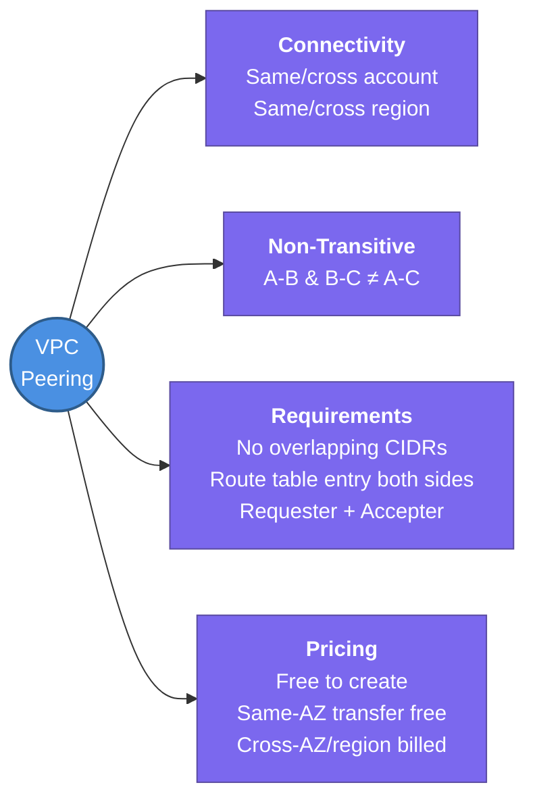

---
tags:
  - aws/networking
  - vpc
status: completed
---
# VPC Peering

## 📖 Core Concepts
- **VPC Peering**: a networking connection between two VPCs that lets them route traffic to each other using private IPv4/IPv6 addresses, as if they were on the same network.
- Can connect VPCs in the **same or different AWS accounts**, and in the **same or different regions** (inter-region peering).
- **Non-transitive** ⭐ Important: if VPC A peers with VPC B, and VPC B peers with VPC C, A *cannot* reach C through B. Each pair needs its own direct peering connection, which becomes a full mesh at scale — this is the main reason [[2.Transit Gateway|Transit Gateway]] exists for larger multi-VPC topologies.
- The two VPCs being peered **cannot have overlapping CIDR blocks**.
- **Setup flow:**
  1. Requester creates a peering connection request against the target VPC.
  2. Accepter (owner of the other VPC/account) accepts the request.
  3. Both sides must manually add a route in their **route tables** pointing the peer's CIDR at the peering connection (`pcx-xxxxxxxx`).
  4. Security groups/NACLs updated on both sides if the peer's CIDR needs explicit access.
- **DNS resolution support** (optional): when enabled on the peering connection, private DNS hostnames resolve to private IP addresses across the peering connection instead of falling back to public IPs.
- **Pricing**: no charge to create or accept a peering connection itself. Data transferred between instances in the **same AZ** over the peering connection is free; data that crosses an **AZ or region boundary** is billed at standard data transfer rates on both sides.

## 🔗 Connections (Zettelkasten)
- **Part of:** [[1. VPC Deep Dive]]
- **Relates to:** [[VPC/Router & Route Tables|Router & Route Tables]] (routes must be added manually on both sides — peering doesn't auto-propagate), [[2.Transit Gateway|Transit Gateway]] (the hub-and-spoke alternative once you need transitive routing between more than a couple of VPCs)
- **Core Use Case:** A small, fixed number of VPCs that need direct connectivity — e.g. a shared-services VPC peered straight to a Prod VPC — where standing up a full Transit Gateway hub would be overkill.

---

## 🛠️ Study Aids

### 🧠 Mind Map

### 🗂️ Flashcards

#flashcards/aws

**Is a VPC Peering connection transitive? If VPC A is peered with VPC B, and VPC B is peered with VPC C, can A reach C?**
?
No. VPC Peering is non-transitive. A cannot reach C through B — you would need a direct A-to-C peering connection, or use a Transit Gateway instead.

---

**What CIDR requirement must two VPCs meet before they can be peered?**
?
Their CIDR blocks must not overlap. If they do, the peering connection cannot be created.

---

**After a VPC Peering connection is accepted, what two things still need to be configured before traffic actually flows?**
?
Route table entries on both sides pointing the peer VPC's CIDR at the peering connection (`pcx-xxxxxxxx`), and security group/NACL rules allowing traffic from the peer's CIDR if needed.

---

**Does VPC Peering support connections across different AWS accounts and different regions?**
?
Yes — VPC Peering supports both cross-account and cross-region (inter-region) connections.

---

**How is data transfer billed over a VPC Peering connection?**
?
Creating/accepting the connection is free. Traffic between instances in the same Availability Zone over the peering connection is free; traffic that crosses an AZ or region boundary is billed at standard data transfer rates on both ends.

---

**Why would you choose a Transit Gateway over VPC Peering when connecting many VPCs together?**
?
VPC Peering is non-transitive, so connecting N VPCs directly requires a full mesh of peering connections. A Transit Gateway acts as a central hub — each VPC attaches once and can route to every other attached VPC, avoiding the mesh.
