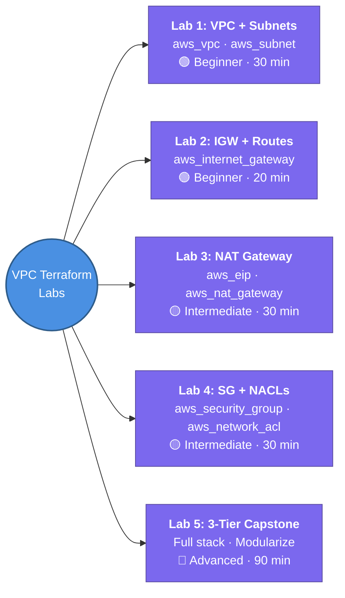

---
tags:
  - aws/networking
  - iac/terraform
  - review
status: not-started
---
# VPC Terraform Labs

Hands-on exercises to reinforce VPC concepts by building them with Terraform. Work through these **after** completing the VPC theory notes and when starting the [[Terraform]] module.

> [!TIP]
> Each lab maps directly to a concept note — re-read the theory before attempting. Use `terraform plan` liberally to preview changes before applying.

---

## 🧪 Lab 1 — Basic VPC + Subnets

**Concept notes:** [[VPC/Subnets|Subnets]], [[1. VPC Deep Dive]]
**Difficulty:** 🟢 Beginner | **Est. time:** 30 min
**Terraform resources:** `aws_vpc`, `aws_subnet`

**Objective:** Create a VPC with a custom CIDR block and 4 subnets (2 public, 2 private) across 2 AZs.

- [ ] Create a VPC with CIDR `10.0.0.0/16`
- [ ] Create 2 public subnets (`10.0.1.0/24`, `10.0.2.0/24`) in `ap-south-1a` and `ap-south-1b`
- [ ] Create 2 private subnets (`10.0.3.0/24`, `10.0.4.0/24`) in `ap-south-1a` and `ap-south-1b`
- [ ] Use `terraform output` to print all subnet IDs
- [ ] Verify: confirm 5 reserved IPs per subnet — try pinging `.0`, `.1`, `.2`, `.3`, and last IP

**Stretch:** Use `count` or `for_each` to DRY up the subnet declarations.

---

## 🧪 Lab 2 — Internet Gateway + Public Route Table

**Concept notes:** [[VPC/Internet Gateway (IGW)|Internet Gateway (IGW)]], [[VPC/Router & Route Tables|Router & Route Tables]]
**Difficulty:** 🟢 Beginner | **Est. time:** 20 min
**Terraform resources:** `aws_internet_gateway`, `aws_route_table`, `aws_route`, `aws_route_table_association`

**Objective:** Attach an IGW and make the public subnets actually public.

- [ ] Create an Internet Gateway and attach it to the VPC
- [ ] Create a public route table with a `0.0.0.0/0 → IGW` route
- [ ] Associate both public subnets with this route table
- [ ] Verify: launch a `t3.micro` in a public subnet with a public IP — `curl ifconfig.me` should return the public IP

---

## 🧪 Lab 3 — NAT Gateway for Private Subnets

**Concept notes:** [[VPC/NAT Gateway|NAT Gateway]]
**Difficulty:** 🟡 Intermediate | **Est. time:** 30 min
**Terraform resources:** `aws_eip`, `aws_nat_gateway`, `aws_route_table`, `aws_route_table_association`

**Objective:** Give private subnets outbound internet access via a NAT Gateway.

- [ ] Allocate an Elastic IP (`aws_eip`)
- [ ] Create a NAT Gateway in one of the public subnets with the EIP
- [ ] Create a private route table with `0.0.0.0/0 → NAT Gateway`
- [ ] Associate both private subnets with this route table
- [ ] Verify: SSH to an EC2 in a private subnet (via bastion or SSM) and run `sudo yum update -y` — it should succeed
- [ ] Check: confirm the internet **cannot** initiate connections to the private instance

**Stretch:** Deploy one NAT Gateway per AZ for HA (mirrors production best practice from the NAT Gateway note).

---

## 🧪 Lab 4 — Security Groups & NACLs

**Concept notes:** [[VPC/Security-group & NACLS|Security Groups & NACLs]]
**Difficulty:** 🟡 Intermediate | **Est. time:** 30 min
**Terraform resources:** `aws_security_group`, `aws_security_group_rule`, `aws_network_acl`, `aws_network_acl_rule`

**Objective:** Layer stateful (SG) and stateless (NACL) firewall rules.

- [ ] Create an SG allowing SSH (port 22) from your IP only and HTTP (port 80) from anywhere
- [ ] Create a NACL for the public subnets — allow inbound 80, 443, 22; allow outbound ephemeral ports (1024–65535)
- [ ] Verify: access the EC2 on port 80 ✅, try port 3306 ❌ — should be blocked
- [ ] Experiment: remove the NACL outbound ephemeral rule — observe that even allowed SG traffic breaks (stateless!)

---

## 🧪 Lab 5 — Full 3-Tier VPC (Capstone)

**Concept notes:** [[1. VPC Deep Dive]] (all subtopics)
**Difficulty:** 🔴 Advanced | **Est. time:** 60–90 min
**Terraform resources:** All of the above + `aws_instance`, `aws_lb`, `aws_db_subnet_group`

**Objective:** Build a production-style 3-tier architecture end-to-end.

- [ ] VPC with `/16` CIDR
- [ ] 6 subnets: 2 public (ALB + NAT GW) · 2 private app · 2 private DB — across 2 AZs
- [ ] IGW + public route table
- [ ] NAT Gateway per AZ + private route tables
- [ ] Security Groups: ALB SG → App SG → DB SG (chained references)
- [ ] ALB in public subnets pointing to EC2 targets in private app subnets
- [ ] RDS subnet group using the 2 DB subnets
- [ ] Verify: hit the ALB DNS → reaches app EC2 → app EC2 can reach RDS → RDS is unreachable from internet
- [ ] Run `terraform state list` and confirm all resources exist
- [ ] `terraform destroy` to clean up

**Stretch:** Modularize — one module for `networking`, one for `compute`, one for `database`.

---

## 🔗 Connections (Zettelkasten)
- **Part of:** [[1. VPC Deep Dive]]
- **Relates to:** [[Terraform]] — these labs are the hands-on bridge between VPC theory and IaC practice
- **Relates to:** [[VPC/Subnets|Subnets]], [[VPC/NAT Gateway|NAT Gateway]], [[VPC/Internet Gateway (IGW)|Internet Gateway (IGW)]], [[VPC/Security-group & NACLS|Security Groups & NACLs]]
- **Core Use Case:** Reinforce VPC concepts through hands-on Terraform practice; build muscle memory for the aws_vpc / aws_subnet / aws_nat_gateway resource lifecycle.

---

## 🛠️ Study Aids

### 🧠 Mind Map

### 🗂️ Flashcards

#flashcards/aws

**What Terraform resource creates a VPC, and what is its only required argument?**
?
`aws_vpc` — the only required argument is `cidr_block`. Example: `resource "aws_vpc" "main" { cidr_block = "10.0.0.0/16" }`

---

**In Terraform, what 3 resources do you need to make a subnet "public"?**
?
`aws_internet_gateway` (attached to the VPC), `aws_route_table` with a route `0.0.0.0/0 → IGW`, and `aws_route_table_association` linking the subnet to that route table.

---

**What Terraform resources are required to give a private subnet outbound internet access?**
?
`aws_eip` (Elastic IP), `aws_nat_gateway` (placed in a public subnet with the EIP), `aws_route_table` with `0.0.0.0/0 → NAT GW`, and `aws_route_table_association` for the private subnet.

---

**Why should you use `for_each` instead of `count` for subnets in Terraform?**
?
`for_each` uses a map key (e.g., AZ name) as the resource identifier, so adding/removing subnets doesn't shift indices and force-recreate unrelated subnets. `count` uses numeric indices — removing index 0 causes all subsequent resources to shift.
