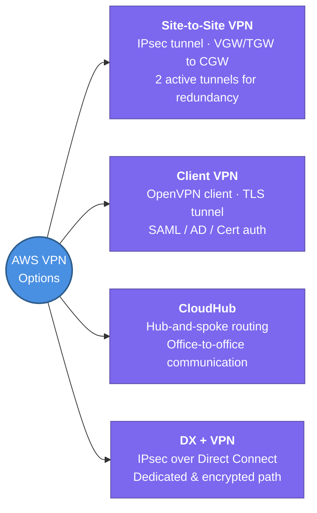

---
tags:
  - aws/networking
  - vpc
  - review
status: completed
---
# VPN Connections

## 📖 Core Concepts

### The Feynman Analogy
> [!NOTE]
> Imagine trying to connect your remote branch offices or individual workers to your main office. Instead of paying to lay down thousands of miles of expensive private physical cables across the country, you create secure, encrypted Virtual Private Network (VPN) tunnels directly over the public internet. This gives you the security of a private network at a fraction of the cost, leveraging the global infrastructure of the internet.

AWS offers several VPN connectivity options to securely link your Amazon Virtual Private Cloud (VPC) to on-premises systems and remote users:

### Key Terminology
- **Virtual Private Gateway (VGW)**: The VPN concentrator on the AWS side of a Site-to-Site VPN connection, attached to a single VPC.
- **Customer Gateway (CGW)**: A resource that represents the physical gateway device or software appliance in your on-premises network. You provide its IP address and configuration.
- **Transit Gateway (TGW)**: A network transit hub that can scale connections across multiple VPCs and on-premises systems, allowing a single VPN connection to route traffic to multiple VPCs.

### AWS VPN Options

| VPN connectivity option | Description |
| --- | --- |
| **AWS Site-to-Site VPN** | Creates an IPsec VPN connection between your VPC and your remote network. On the AWS side, a **Virtual Private Gateway (VGW)** or **Transit Gateway (TGW)** provides **two VPN endpoints (tunnels)** in separate Availability Zones for automatic failover. You configure your Customer Gateway (CGW) device on the remote side. [AWS Site-to-Site VPN User Guide](https://docs.aws.amazon.com/vpn/latest/s2svpn/VPC_VPN.html). |
| **AWS Client VPN** | A managed client-based VPN service that enables users to securely access AWS or on-premises resources from any location using an OpenVPN-based client. Establishes secure **TLS sessions** and integrates with Active Directory, SAML 2.0 (e.g., Okta/Entra ID), or client certificates. [AWS Client VPN Administrator Guide](https://docs.aws.amazon.com/vpn/latest/clientvpn-admin/). |
| **AWS VPN CloudHub** | A hub-and-spoke model allowing multiple branch offices to communicate with each other (and the VPC) through a single Virtual Private Gateway (VGW) using Site-to-Site VPNs. [VPN CloudHub Guide](https://docs.aws.amazon.com/vpn/latest/s2svpn/VPN_CloudHub.html). |
| **Third-Party Software VPN** | Run a partner software appliance (e.g., pfSense, Cisco ASAv, OpenVPN) on an EC2 instance in a public subnet. The customer is fully responsible for managing, patching, licensing, and scaling. [AWS Marketplace](https://aws.amazon.com/marketplace/search/results/ref=brs_navgno_search_box?searchTerms=vpn). |

### Static vs. Dynamic (BGP) Routing (Site-to-Site VPN)
- **Static Routing**: Requires you to manually define route destinations. Necessary if your Customer Gateway does not support Border Gateway Protocol (BGP).
- **Dynamic Routing**: Uses **BGP** to automatically propagate routes. If one of the two AWS VPN tunnels goes down, BGP routing automatically switches path traffic to the secondary tunnel without manual intervention.

### Secure Private Transit (Direct Connect + VPN)
You can combine **AWS Direct Connect (DX)** with **AWS Site-to-Site VPN** to run an IPsec-encrypted tunnel over a dedicated, private connection. This ensures both **consistent, high-speed network performance** and **end-to-end encryption** for sensitive workloads. [Direct Connect User Guide](https://docs.aws.amazon.com/directconnect/latest/UserGuide/Welcome.html).

---
## 📋 Summary

- **Site-to-Site VPN** — IPsec tunnel over the internet between your VPC (VGW/TGW) and on-prem (CGW); AWS provisions **2 tunnels** per connection for automatic failover
- **Client VPN** — managed OpenVPN service for individual remote users; supports AD, SAML 2.0, and certificate auth
- **VPN CloudHub** — hub-and-spoke model letting multiple branch offices talk to each other and the VPC through one VGW
- **Third-party software VPN** — self-managed appliance on EC2; full control but you own patching, HA, and scaling
- **Static routing** = manual routes; **Dynamic (BGP)** = auto route propagation + automatic failover between tunnels
- VPN over **Direct Connect** = IPsec over DX for encrypted + dedicated private transit (DX alone is unencrypted)
- VPN is quick to set up but has variable latency (internet-dependent); **Direct Connect** is more reliable but takes weeks to provision

---

## 🔗 Connections (Zettelkasten)
- **Part of:** [[1. VPC Deep Dive]]
- **Relates to:** [[2.Transit Gateway|Transit Gateway]], [[5. Route53 & Hybrid DNS|Route53 & Hybrid DNS]]
- **Core Use Case:** Bridging on-premises corporate offices (Site-to-Site VPN), interconnecting branch offices (CloudHub), or enabling remote workforce access (Client VPN) to private AWS subnets.

---

## 🛠️ Study Aids

### 🧠 Mind Map

### 🗂️ Flashcards

#flashcards/aws

**What is the difference between a Virtual Private Gateway (VGW) and a Customer Gateway (CGW) in AWS Site-to-Site VPN?**
?
The Virtual Private Gateway (VGW) is the VPN concentrator on the AWS side of the connection attached to your VPC. The Customer Gateway (CGW) represents the physical appliance or software application on the on-premises/remote side of the connection.

---

**How does AWS ensure high availability for an AWS Site-to-Site VPN connection?**
?
AWS automatically provisions two active VPN tunnels in separate Availability Zones (endpoints) for every Site-to-Site VPN connection. The customer is responsible for configuring their Customer Gateway device to support automatic failover between these two tunnels.

---

**What is AWS VPN CloudHub and what is its primary use case?**
?
AWS VPN CloudHub is a feature that allows multiple remote sites (e.g., branch offices) connected via Site-to-Site VPNs to communicate directly with each other and the VPC using a hub-and-spoke model through a single Virtual Private Gateway (VGW).

---

**Which protocol does AWS Client VPN run on, and what authentication methods does it support?**
?
AWS Client VPN uses the OpenVPN protocol (TLS session). It supports Active Directory integration, SAML 2.0 (for identity providers like Okta/Azure AD), and Mutual Authentication (using client certificates).

---

**Why would you run a Site-to-Site VPN over an AWS Direct Connect (DX) connection?**
?
To combine the high-speed, consistent private connection of Direct Connect with the end-to-end encryption of IPsec VPN. (Direct Connect alone is not encrypted by default).

