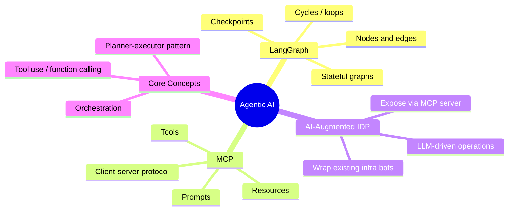

---
tags:
  - agent-ai/fundamentals
  - review
status: not-started
---
# AI Agents Fundamentals

This is the hub note for Agentic AI. It covers the high-level concept and links out to each subtopic — LangGraph, Model Context Protocol (MCP), and AI-augmented Internal Developer Platforms (IDPs) — which each carry their own detailed notes, mind map, and flashcards.

## 📖 Core Concepts
- **AI Agent**: A system that uses an LLM to decide a sequence of actions (tool calls, retrievals, sub-tasks) toward a goal, rather than producing a single static response.
- **Tool Use / Function Calling**: The mechanism by which an agent invokes external functions (APIs, scripts, infra bots) and feeds results back into its reasoning loop.
- **Orchestration**: Coordinating multiple steps or multiple agents (planner, executor, reviewer) to complete a larger task.
- **Model Context Protocol (MCP)**: An open standard for connecting LLM applications to external tools and data sources through a common server/client interface. See [modelcontextprotocol.io](https://modelcontextprotocol.io/docs/getting-started/intro).
- **LangGraph**: A framework for building stateful, multi-step agent workflows as graphs (nodes = steps, edges = control flow), useful for cyclic/looping agent behavior that plain chains don't support.

## 🧭 Subtopics
- [[Agentic-AI/LangGraph|LangGraph]] — graph-based agent orchestration, state, cycles, and checkpoints.
- [[Agentic-AI/MCP|Model Context Protocol (MCP)]] — server/client architecture for exposing tools and data to LLMs.
- [[Agentic-AI/AI-Augmented IDP|AI-Augmented IDP]] — wrapping existing infra bots/tools behind an MCP server for an AI-augmented internal developer platform.

## 🔗 Connections (Zettelkasten)
- **Relates to:** [[Terraform]], [[GitHub Actions]]
- **Core Use Case:** Build one MCP server that wraps existing infra bots/automation (e.g. Boto3 fleet scripts, ticket-based sandbox provisioning) so an LLM agent can operate them directly — an "AI-augmented IDP."

---

## 🛠️ Study Aids

### 🧠 Mind Map (Overview)

### 🗂️ Flashcards

#flashcards

**What problem does LangGraph solve that a simple prompt chain doesn't?**
?
It supports stateful, cyclic workflows — agents that loop, revisit steps, or branch conditionally — instead of a fixed linear sequence.

**What is MCP (Model Context Protocol)?**
?
An open standard defining how LLM applications (clients) connect to external tools and data sources (servers) through a common interface.

**What is an "AI-augmented IDP" in the context of this vault's projects?**
?
An internal developer platform where existing infra bots (e.g. fleet management, sandbox provisioning) are wrapped and exposed through an MCP server so an LLM agent can invoke them directly.
