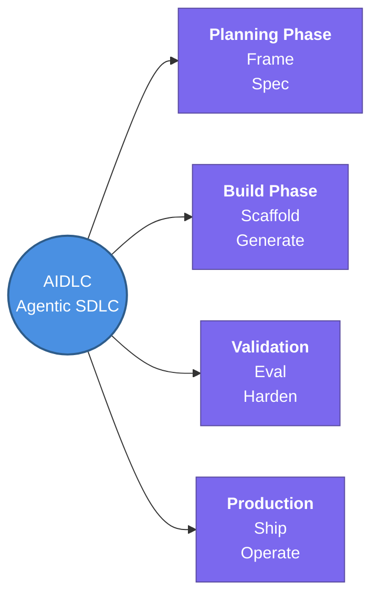

---
tags:
  - agent-ai/fundamentals
  - review
status: not-started
Repetition: rep/1
Next-Review: 
---

# 2. AI Development Life Cycle (AIDLC)

## 📖 Core Concepts
The **AI Development Life Cycle (AIDLC)** refers to the modern framework of software development where Artificial Intelligence (specifically, AI agents) is natively integrated throughout the entire lifecycle. In this new paradigm, AI does much of the heavy lifting rather than simply serving as an assistive tool.

This is fundamentally different from the traditional *AI/ML Model Lifecycle* (which focuses on data preparation and training a machine learning model). In Agentic Engineering, AIDLC is the evolution of the traditional Software Development Life Cycle (SDLC) for an AI-native world.

### The 8-Phase Agentic AIDLC Model
1. **Frame:** Defining the problem, constraints, and success criteria.
2. **Spec:** Writing detailed, clear requirements designed specifically for AI consumption.
3. **Scaffold:** The AI sets up the project structure and boilerplate.
4. **Generate:** The AI agents write the core code and logic based on the spec.
5. **Eval:** Automated evaluation (sometimes by other AI agents) to test the generated output against the spec.
6. **Harden:** Securing, optimizing, and refining the code for production.
7. **Ship:** Deploying the application to the target environment.
8. **Operate:** Ongoing monitoring, observability, and iterative refinement.

In this model, the human developer's role shifts from "primary coder" to "architect and reviewer," managing the governance, strategy, and guardrails for autonomous agents.

## 🔗 Connections (Zettelkasten)
- **Relates to:** [[1. AI Agents Fundamentals]]
- **Core Use Case:** Transitioning software engineering teams from traditional, manual SDLC to AI-native, agentic software development workflows.

---
## 🏗️ Proof of Work
- **Lab/Script:** [[ ]]
- **Verification Command:** ` `

---
## 🛠️ Study Aids

### 🧠 Mind Map

### 🗂️ Flashcards
What does AIDLC stand for in the context of modern software engineering?
?
AI Development Life Cycle (or AI-Native Software Development Life Cycle).
#flashcards/agent-ai

What is the primary difference between the traditional SDLC and the new Agentic AIDLC?
?
In SDLC, humans write most of the code. In Agentic AIDLC, AI agents perform the heavy lifting (code generation, testing) while humans act as architects and reviewers.
#flashcards/agent-ai

What are the typical phases in the 8-phase Agentic AIDLC model?
?
Frame, Spec, Scaffold, Generate, Eval, Harden, Ship, and Operate.
#flashcards/agent-ai
