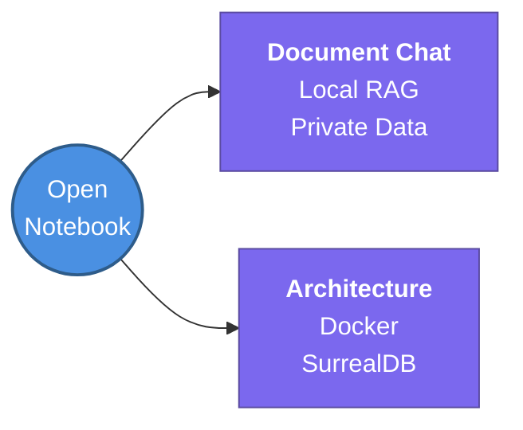

---
tags:
  - agent-ai/tools
  - review
status: not-started
Repetition: rep/1
Next-Review: 
---
# 3. Open Notebook
## 📖 Core Concepts
- A *NotebookLM* alternative using *Docker* and *SurrealDB* to chat with your own documents.
- Provides a self-hosted, privacy-first alternative to cloud-based RAG platforms.

## 🔗 Connections (Zettelkasten)
- **Relates to:** [[1. AI Agents Fundamentals]]
- **Core Use Case:** Local document chat, RAG, and private knowledge retrieval.
---
## 🏗️ Proof of Work
- **Lab/Script:** [[ ]]
- **Verification Command:** `docker-compose ps` (Verify SurrealDB and app containers are running)
---
## 🛠️ Study Aids
### 🧠 Mind Map

### 🗂️ Flashcards
#flashcards/agent-ai
**What is the core database engine used by Open Notebook to store and query document data?**
?
SurrealDB.
