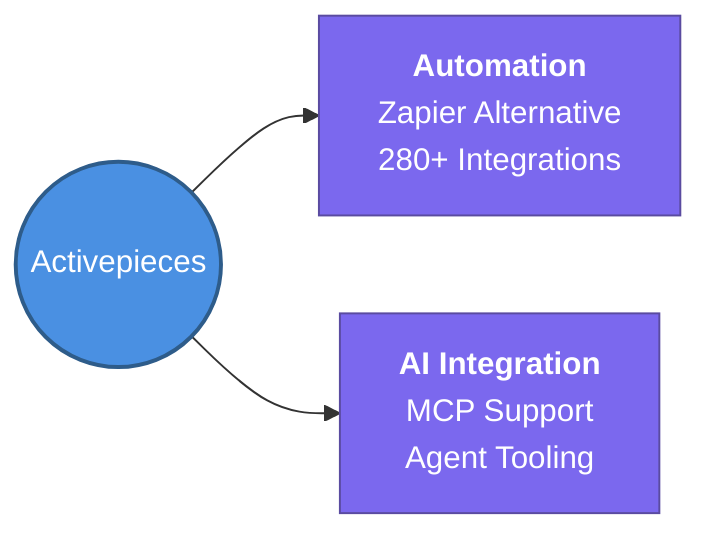

---
tags:
  - agent-ai/tools
  - review
status: not-started
Repetition: rep/1
Next-Review: 
---
# 4. Activepieces
## 📖 Core Concepts
- An open-source *Zapier* replacement.
- Features over 280 integrations and native support for MCP (Model Context Protocol).
- Allows building scalable workflow automations that can integrate directly with AI agents.

## 🔗 Connections (Zettelkasten)
- **Relates to:** [[1. AI Agents Fundamentals]]
- **Core Use Case:** Automating API workflows and providing agentic tool calling through MCP.
---
## 🏗️ Proof of Work
- **Lab/Script:** [[ ]]
- **Verification Command:** `docker-compose up` (Test the Activepieces setup locally)
---
## 🛠️ Study Aids
### 🧠 Mind Map

### 🗂️ Flashcards
#flashcards/agent-ai
**Which protocol does Activepieces support that allows direct integration with AI agents?**
?
MCP (Model Context Protocol).
