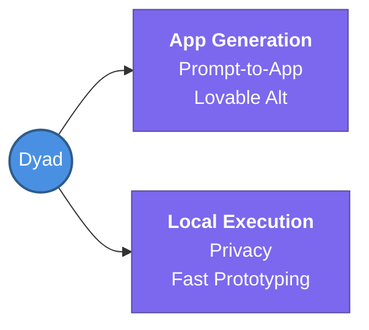

---
tags:
  - agent-ai/tools
  - review
status: not-started
Repetition: rep/1
Next-Review: 
---
# 5. Dyad
## 📖 Core Concepts
- A local prompt-to-app generator that serves as a replacement for *Lovable*.
- Allows users to generate functional applications purely from natural language prompts, running entirely locally.

## 🔗 Connections (Zettelkasten)
- **Relates to:** [[2. AI Development Life Cycle (AIDLC)]]
- **Core Use Case:** Rapid local application prototyping and generation.
---
## 🏗️ Proof of Work
- **Lab/Script:** [[ ]]
- **Verification Command:** Run local Dyad CLI to generate a hello-world app
---
## 🛠️ Study Aids
### 🧠 Mind Map

### 🗂️ Flashcards
#flashcards/agent-ai
**What is Dyad designed to replace in the AI stack?**
?
It is a local prompt-to-app generator replacing tools like Lovable.
