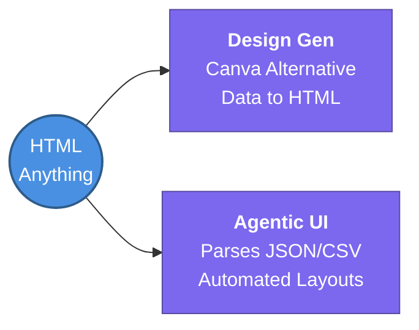

---
tags:
  - agent-ai/tools
  - review
status: not-started
Repetition: rep/1
Next-Review: 
---
# 6. HTML Anything
## 📖 Core Concepts
- An agentic layout generator designed to replace tools like *Canva Pro*.
- It works by taking structured data (like CSV, JSON) and automatically generating aesthetic HTML layouts.

## 🔗 Connections (Zettelkasten)
- **Relates to:** [[2. AI Development Life Cycle (AIDLC)]]
- **Core Use Case:** Automated data-to-design generation.
---
## 🏗️ Proof of Work
- **Lab/Script:** [[ ]]
- **Verification Command:** Run CLI/Script to generate HTML from a sample JSON file
---
## 🛠️ Study Aids
### 🧠 Mind Map

### 🗂️ Flashcards
#flashcards/agent-ai
**What is HTML Anything used for?**
?
It is an agentic layout generator that replaces Canva Pro by creating designs from data (CSV/JSON) in HTML format.
