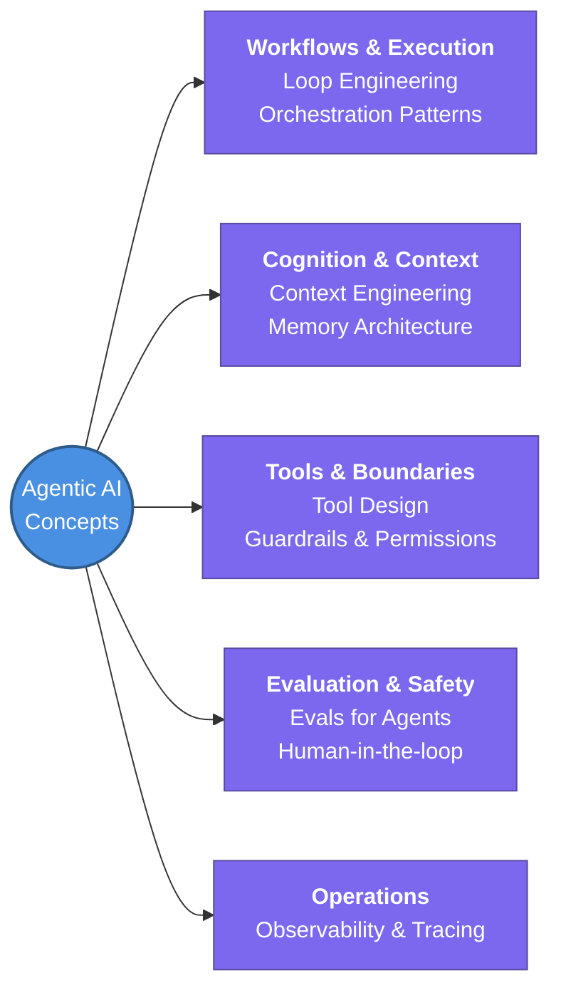

---
tags:
  - agent-ai/fundamentals
  - review
  - rep/1
status: in-progress
---
# 0. Agentic AI Concepts Index

This hub note covers 10 fundamental Agentic AI concepts, outlining their core definitions and essential sub-points.

## 📖 Core Concepts

### 1. Harness Engineering
* **Retry & fallback logic:** Handling cases when calls fail.
* **Sandboxed execution environments:** Running code safely.
* **Rate limiting & cost controls:** Managing API usage limits and expenses.
* **Graceful degradation:** Managing situations when tools break.

### 2. Loop Engineering
* **The reason -> act -> observe cycle:** The core loop driving agentic behavior.
* **Termination conditions:** Defining exactly when the agent should stop.
* **Max-iteration budgets:** Imposing hard limits to prevent runaway execution.
* **Detecting and escaping:** Strategies to break out of infinite loops.

### 3. Context Engineering
* **What goes in the window vs what gets retrieved:** Balancing context size limits.
* **Compression & summarization:** Condensing history to maintain context limits.
* **Context rot:** Understanding why long contexts degrade performance over time.
* **Prioritizing recency vs relevance:** Selecting which context matters most right now.

### 4. Tool Design
* **Clear naming & descriptions:** Crafting definitions the model can easily parse.
* **Strict input schemas:** Defining exact schemas with validation.
* **Error messages:** Ensuring tool errors help the agent self-correct.
* **Fewer, better tools:** Why a focused toolset is better than many overlapping ones (>).

### 5. Memory Architecture
* **Short-term (in-context) vs long-term (stored):** Different scopes of memory.
* **What to persist across sessions:** Deciding what memory to keep and what to discard.
* **Retrieval strategies:** Leveraging search, embeddings, and files.
* **Memory writes:** Knowing when the agent should update its own notes.

### 6. Orchestration Patterns
* **Single agent vs orchestrator-workers:** Architectural choices for complex tasks.
* **Handoffs & routing:** Managing flow between specialized subagents.
* **Parallel vs sequential task execution:** Organizing task graphs.
* **When one good agent beats:** Why a single capable agent often outperforms a multi-agent system.

### 7. Guardrails & Permissions
* **Scoping tool access:** Limiting tools per task based on need.
* **Read vs write vs execute permissions:** Applying granular control.
* **Input/output filtering & validation:** Securing the inputs and verifying the outputs.
* **Blast radius:** Limiting what a failure can damage if the agent goes rogue.

### 8. Evals for Agents
* **Trajectory evals vs outcome evals:** Evaluating the path vs. the result.
* **Building golden test sets:** Crafting robust tests from real failures.
* **LLM-as-judge:** Uses and pitfalls of automated evaluation.
* **Regression testing:** Validating functionality after every prompt change.

### 9. Human-in-the-loop Design
* **Approval gates:** Requiring manual approval for irreversible actions.
* **Confidence thresholds:** Setting levels for escalation to a human.
* **Async review vs blocking review:** Deciding when the agent waits.
* **Designing interrupts:** Creating ways to pause an agent that don't kill autonomy.

### 10. Observability & Tracing
* **Logging every step:** Capturing every tool call and token used.
* **Trace visualization:** Creating UI traces for effective debugging.
* **Cost & latency tracking:** Monitoring operations per run.
* **Feeding production failures:** Routing operational bugs back into evals.

## 🧭 Subtopics
- [[Harness Engineering]]
- [[Loop Engineering]]
- [[Context Engineering]]
- [[Tool Design]]
- [[Memory Architecture]]
- [[Orchestration Patterns]]
- [[Guardrails & Permissions]]
- [[Evals for Agents]]
- [[Human-in-the-loop Design]]
- [[Observability & Tracing]]

## 🔗 Connections (Zettelkasten)
- **Relates to:** [[1. AI Agents Fundamentals]]
- **Core Use Case:** Mapping the core concepts, patterns, and guardrails necessary to build production-ready agentic AI systems.
---
## 🏗️ Proof of Work
- **Lab/Script:** [[ ]]
- **Verification Command:** ` `
---
## 🛠️ Study Aids
### 🧠 Mind Map

### 🗂️ Flashcards
**What is the core reason -> act -> observe cycle in Loop Engineering?**
?
The fundamental loop that drives agentic behavior, allowing the agent to continuously assess its environment, decide on an action, execute it, and observe the results before iterating.
#flashcards/agent-ai

**Why do long contexts degrade in Context Engineering?**
?
Context rot occurs because as the context window fills up, the model struggles to retrieve or prioritize relevant information accurately, requiring compression, summarization, or prioritization of recent/relevant data.
#flashcards/agent-ai
