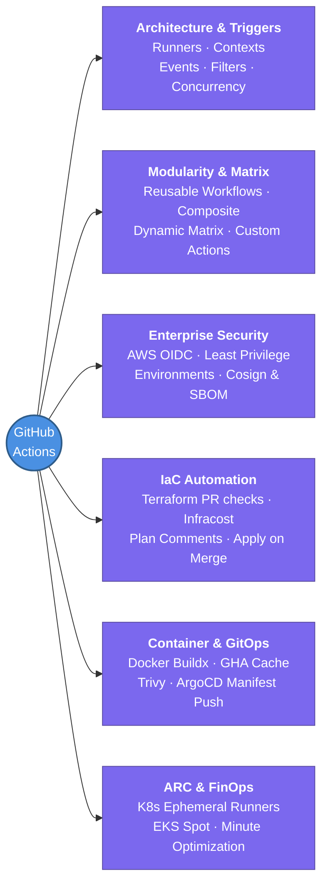

---
tags:
  - cicd/actions
  - review
status: not-started
Repetition: rep/1
Next-Review: 
---
# 1. GitHub Actions

This is the hub note for all GitHub Actions study — covering workflow orchestration, event triggers, AWS OIDC identity federation, matrix strategies, reusable workflows, and self-hosted Kubernetes runners (ARC).

## 📖 Core Concepts

GitHub Actions is an event-driven automation platform integrated directly into GitHub repositories. It serves as the industry standard for modern continuous integration, continuous delivery (CI/CD), security scanning, and cloud deployment automation.

### Architecture & Runtime Model
A workflow run executes according to the following execution hierarchy:
1. **Event Trigger:** An activity (such as `push`, `pull_request`, or `schedule`) triggers the workflow.
2. **Workflow:** A configurable automated process defined as a YAML file in `.github/workflows/`.
3. **Jobs:** A collection of steps executing on the same runner. Jobs run in **parallel** by default, but can be sequentially ordered or gated using `needs:`.
4. **Steps:** Sequential tasks inside a job. Steps can either run shell commands (`run:`) or invoke pre-built actions (`uses:`).
5. **Runners:** Virtual machines or containers executing the jobs. Available as GitHub-hosted (ephemeral Azure VMs) or self-hosted (e.g., **Actions Runner Controller (ARC)** on Kubernetes).

```
Trigger (push/PR/schedule)
  │
  ├── Job 1 (Lint & Security Scan) ──┐ (runs in parallel)
  ├── Job 2 (Unit & Integration Tests) ┘
  │       │ (needs: [Job 1, Job 2])
  ▼       ▼
  └── Job 3 (Build & Push Docker Image / Terraform Apply)
          └── Steps: Checkout → Setup Go → Test → Build
```

### Core Execution Engine & Syntax
- **Contexts & Expressions:** Dynamic evaluation of runtime properties via `${{ <expression> }}`. Key contexts include `github` (metadata, ref, sha, actor), `env` (environment variables), `secrets` (encrypted secrets), `vars` (configuration variables), `matrix` (current matrix parameters), and `steps` (step outputs).
- **Status Check Functions:** Conditional step execution using `if: ${{ success() }}`, `failure()`, `always()`, or `cancelled()`.
- **Identity & Least Privilege:** Workflows run with an automatic short-lived `GITHUB_TOKEN`. Modern enterprise setups enforce fine-grained `permissions:` per job and authenticate to cloud providers (AWS, GCP, Azure) strictly via **OIDC (OpenID Connect)** web identity tokens, completely eliminating static long-lived credentials (`AWS_ACCESS_KEY_ID`).

### GitHub Actions vs Other CI/CD Platforms
| Feature | GitHub Actions | Jenkins | GitLab CI | Argo Workflows |
| :--- | :--- | :--- | :--- | :--- |
| **Config Location** | `.github/workflows/*.yml` | `Jenkinsfile` (Groovy/Declarative) | `.gitlab-ci.yml` | Kubernetes CRDs (YAML) |
| **Hosting Model** | Cloud hosted + Self-hosted | Self-hosted controller & agents | Cloud hosted + Self-managed | Kubernetes native cluster |
| **Marketplace / Ecosystem** | 20,000+ Actions in Marketplace | Jenkins Plugins (legacy maintenance) | GitLab Components & templates | Container step templates |
| **Cloud Auth** | Native OIDC Web Identity | Cloud plugins / static secrets | OIDC ID tokens | K8s ServiceAccount / IRSA |
| **Primary Use Case** | Full CI/CD + Developer Automation | Legacy enterprise CI | Integrated GitLab DevOps | Data pipelines / K8s jobs |

---

## 🧭 Subtopics

- [[GitHub-Actions/1. Workflows & Architecture|1. Workflows & Architecture]] — anatomy of `.github/workflows`, runners, contexts, expressions, and step execution lifecycle.
- [[GitHub-Actions/2. Triggers & Event Filters|2. Triggers & Event Filters]] — push, pull_request, workflow_dispatch, schedules, path filtering, and concurrency cancelation.
- [[GitHub-Actions/3. Reusable Workflows & Custom Actions|3. Reusable Workflows & Custom Actions]] — workflow_call, composite actions, JS/Docker custom actions, and dynamic matrix builds.
- [[GitHub-Actions/4. AWS OIDC & Enterprise Security|4. AWS OIDC & Enterprise Security]] — passwordless AWS IAM federation, least-privilege token permissions, environments, and SLSA/Cosign supply chain security.
- [[GitHub-Actions/5. Terraform & IaC Automation|5. Terraform & IaC Automation]] — automated fmt, validate, tflint, Checkov, Infracost budget guardrails, PR plan comments, and apply on merge.
- [[GitHub-Actions/6. Container CI & Caching|6. Container CI & Caching]] — Docker Buildx, multi-arch builds, GHA layer caching, Trivy vulnerability scanning, and ECR/GHCR publishing.
- [[GitHub-Actions/7. GitOps Bridge & Release Orchestration|7. GitOps Bridge & Release Orchestration]] — Automated ArgoCD repo updates, Semantic Versioning, release-please, and bot-driven PR automation.
- [[GitHub-Actions/8. ARC & FinOps Optimization|8. ARC & FinOps Optimization]] — Actions Runner Controller on AWS EKS, Spot instance autoscaling, workflow minute optimization, and caching.

---

## 🔗 Connections (Zettelkasten)
- **Relates to:** [[1. Terraform Core Concepts]] — automated linting, security scanning, Infracost estimation, and deployment pipelines.
- **Relates to:** [[3. Atlantis]] — comparing centralized PR-driven Terraform execution against GitHub Actions workflows.
- **Relates to:** [[ArgoCD]] — CI/CD handoff boundary: GitHub Actions builds containers and updates GitOps manifest repos for ArgoCD synchronization.
- **Relates to:** [[6. EKS Architecture]] — deploying Actions Runner Controller (ARC) on worker nodes to provide scalable, ephemeral self-hosted runners.
- **Relates to:** [[VPC/VPC-Terraform-Labs|VPC Terraform Labs]] — continuous integration verification for multi-tier AWS network topologies.
- **Core Use Case:** Automating software integration, automated static analysis, zero-trust cloud provisioning, containerized releases, and GitOps repository reconciliation.

---

## 🏗️ Proof of Work
- **Lab/Script:** [[GitHub Actions Todo|GitHub Actions Hands-on Labs & Roadmap]]
- **Verification Command:** `gh run list --limit 5`

---

## 🛠️ Study Aids

### 🧠 Mind Map


### 🗂️ Flashcards
#flashcards/cicd

**What is the core execution hierarchy of GitHub Actions from trigger to individual tasks?**
?
Event Trigger (e.g. `push`, `pull_request`) $\rightarrow$ Workflow (`.github/workflows/*.yml`) $\rightarrow$ Jobs (parallel by default, or chained via `needs:`) $\rightarrow$ Steps (sequential shell commands with `run:` or pre-built modules with `uses:` running on a Runner).

---

**Why is AWS IAM OIDC preferred over storing AWS_ACCESS_KEY_ID and AWS_SECRET_ACCESS_KEY in GitHub Secrets?**
?
OIDC provides **short-lived, passwordless authentication** via cryptographic JWT tokens exchanged with AWS STS. It eliminates long-lived credentials that can leak, supports automatic credential rotation, and allows scoping access down to specific repos, branches, and environments using the token's `sub` claim.

---

**What is the difference between Reusable Workflows (`workflow_call`) and Composite Actions?**
?
**Reusable Workflows** run entire multi-job workflows, execute on their own runners, can declare matrix strategies, and manage secrets and environments. **Composite Actions** package multiple sequential steps into a single reusable action (`uses: ./my-action`), running inside the caller job's existing runner and environment.

---

**How does Actions Runner Controller (ARC) reduce CI spend and improve security for Kubernetes teams?**
?
ARC deploys an autoscaling operator on Kubernetes (e.g., EKS) that spins up **clean, ephemeral runner pods** on demand (scale-to-zero when idle) running on cheap **Spot Instances** (70–80% cost reduction vs GitHub-hosted runners) with native access to private VPC resources without exposing public ingress.
