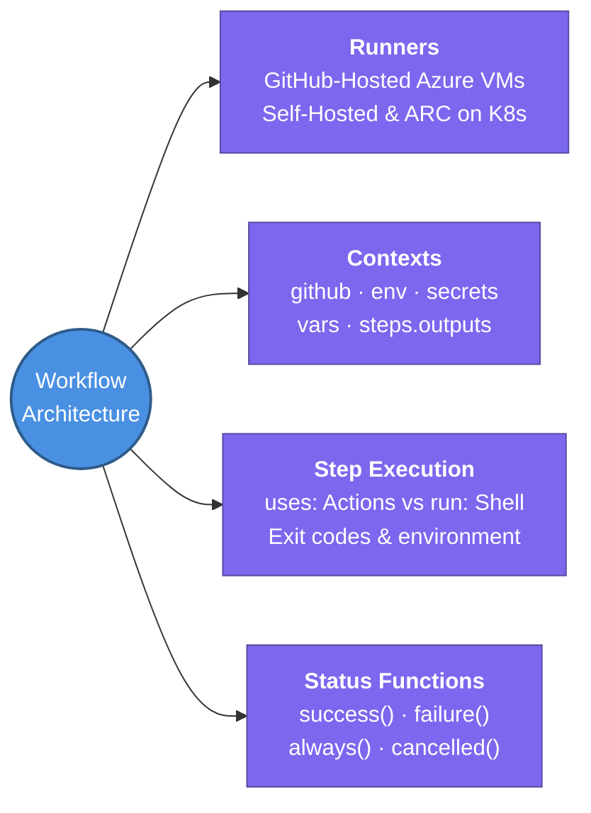

---
tags:
  - cicd/actions
  - review
status: not-started
Repetition: rep/1
Next-Review: 
---
# 1. Workflows & Architecture

This note covers the foundational execution engine of GitHub Actions — including directory structure, jobs, steps, runner execution environments, runtime contexts, expressions, and the step lifecycle.

## 📖 Core Concepts

GitHub Actions workflows are declared in YAML files inside the `.github/workflows/` directory of a repository. Each file represents an independent automation pipeline managed by the GitHub Actions runtime engine.

### Anatomy of a Workflow File
A production workflow file consists of:
```yaml
name: Continuous Integration             # Display name on GitHub Actions UI

on:                                      # Events that trigger the workflow
  push:
    branches: [main]

permissions:                             # Job-level security permissions
  contents: read

jobs:                                    # Collection of execution units
  build-and-test:
    runs-on: ubuntu-latest               # Execution runner target
    timeout-minutes: 15                  # FinOps guardrail against runaway jobs
    steps:
      - name: Checkout repository
        uses: actions/checkout@v4        # Action step

      - name: Run test suite
        run: go test -v ./...            # Shell command step
```

### Runners: GitHub-Hosted vs Self-Hosted
- **GitHub-Hosted Runners:** Fully managed, clean, ephemeral VMs provisioned in Microsoft Azure for each job run. Pre-installed with comprehensive toolsets (Docker, AWS CLI, Go, Node, Python). Available on Linux (`ubuntu-latest`), Windows (`windows-latest`), and macOS (`macos-latest`). Billing is calculated per minute based on operating system multipliers.
- **Self-Hosted Runners:** Physical machines, VMs, or containers managed by your organization. Ideal for private network access (connecting directly to private AWS subnets without opening public inbound ports) and custom hardware (GPUs, persistent disks).
- **Actions Runner Controller (ARC):** The modern cloud-native standard for self-hosted runners. Deploys an operator on Kubernetes (EKS) that dynamically schedules ephemeral runner pods on-demand.

### Contexts & Expressions Engine
GitHub Actions evaluates expressions using the `${{ <expression> }}` syntax before running each step:
- `github`: Runtime metadata about the workflow run (`github.sha`, `github.ref`, `github.actor`, `github.repository`, `github.event_name`).
- `env`: Environment variables set at workflow, job, or step level.
- `secrets`: Sensitive values encrypted via Libsodium (`secrets.AWS_ROLE_ARN`). Masked automatically in logs.
- `vars`: Plaintext organization or repository configuration variables (`vars.AWS_REGION`).
- `steps.<step_id>.outputs`: Inter-step communication allowing downstream steps to read outputs generated by earlier steps (`steps.get_version.outputs.tag`).
- `runner`: Information about the machine running the job (`runner.os`, `runner.arch`, `runner.temp`).

### Conditional Execution & Status Checks
By default, a step fails if its exit code is non-zero, immediately aborting all subsequent steps in that job. You can control execution flow using status check functions:
- `if: ${{ success() }}`: (Default) Run only if prior steps succeeded.
- `if: ${{ failure() }}`: Run only if an earlier step in the current job failed (used for alert notifications or incident logging).
- `if: ${{ always() }}`: Run unconditionally, even if previous steps failed or were cancelled (mandatory for artifact uploads, log dumping, and cleanup).
- `if: ${{ cancelled() }}`: Run only if the workflow was explicitly cancelled.

---

## 🔗 Connections (Zettelkasten)
- **Part of:** [[1. GitHub Actions]]
- **Relates to:** [[GitHub-Actions/2. Triggers & Event Filters|2. Triggers & Event Filters]]
- **Relates to:** [[GitHub-Actions/8. ARC & FinOps Optimization|8. ARC & FinOps Optimization]]
- **Core Use Case:** Defining deterministic, isolated, and observable build environments for modern cloud-native CI pipelines.

---

## 🏗️ Proof of Work
- **Lab/Script:** [[GitHub Actions Todo#🧪 GitHub Actions Mastery Labs (Hands-On Path)|Lab 1 — Foundational Workflow & Matrix Builds]]
- **Verification Command:** `gh run view $(gh run list --limit 1 --json databaseId -q '.[0].databaseId') --log`

---

## 🛠️ Study Aids

### 🧠 Mind Map


### 🗂️ Flashcards
#flashcards/cicd

**How do you pass an output variable from one step to a downstream step in GitHub Actions?**
?
Write to the special environment file `$GITHUB_OUTPUT` using `echo "key=value" >> "$GITHUB_OUTPUT"`. Downstream steps reference it using `${{ steps.<step_id>.outputs.key }}` (provided the producing step has an `id`).

---

**Why is it critical to use `if: ${{ always() }}` for teardown or artifact upload steps?**
?
By default, if any step returns a non-zero exit code, subsequent steps are skipped. Using `if: ${{ always() }}` guarantees that diagnostic logs, test reports, and cloud cleanup scripts execute even when the primary test or build step fails.

---

**What is the difference between `github.ref` and `github.sha` during a pull request event?**
?
During a `pull_request` event, `github.ref` is `refs/pull/:prNumber/merge` (a synthetic test merge commit created by GitHub between the PR branch and base branch), whereas `github.sha` is the latest commit on the PR source branch.
