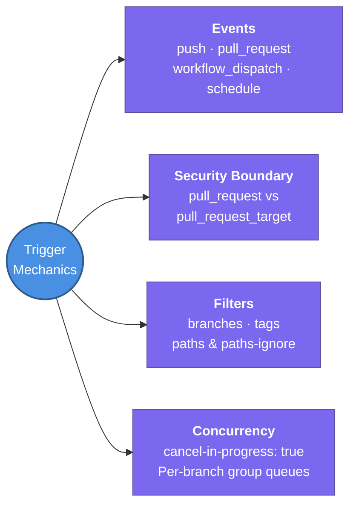

---
tags:
  - cicd/actions
  - review
status: not-started
Repetition: rep/1
Next-Review: 
---
# 2. Triggers & Event Filters

This note covers workflow trigger mechanics in GitHub Actions — webhook events, manual execution, cron scheduling, branch and path filters, and concurrency control to eliminate wasted runner minutes.

## 📖 Core Concepts

Every GitHub Actions workflow run begins with an event. The `on:` block configures one or more trigger conditions and allows fine-grained filtering to prevent unnecessary pipeline invocations.

### Core Webhook Triggers
- `push`: Triggered when commits are pushed or tags are created. Often restricted to `main`, `release/*`, or SemVer tags (`v*`).
- `pull_request`: Triggered on pull request activities (`opened`, `synchronize`, `reopened`). Executes in the context of the synthetic merge commit (`refs/pull/:prNumber/merge`).
- `pull_request_target`: **Security-critical trigger.** Runs in the context of the **base branch** (e.g., `main`), granting it access to repository secrets and write tokens. Used to triage public pull requests or label forks, but must NEVER blindly checkout and execute untrusted fork code (`actions/checkout` with `ref: ${{ github.event.pull_request.head.sha }}`), which leads to complete repository secret exfiltration!

### Manual & External Triggers
- `workflow_dispatch`: Enables manual triggering directly via the GitHub UI, GitHub CLI (`gh workflow run`), or REST API. Supports strongly-typed inputs:
  ```yaml
  on:
    workflow_dispatch:
      inputs:
        environment:
          description: 'Deployment Target'
          required: true
          default: 'staging'
          type: choice
          options: [staging, production]
        skip_tests:
          description: 'Bypass unit tests'
          type: boolean
          default: false
  ```
- `repository_dispatch`: External webhook trigger for cross-repo or third-party webhooks (e.g., triggering deployment when a Docker base image updates).

### Scheduled Triggers
Workflows can run periodically using POSIX cron syntax:
```yaml
on:
  schedule:
    # Runs at 02:00 UTC every Monday through Friday
    - cron: '0 2 * * 1-5'
```
*Note:* Scheduled workflows only run from the default branch (`main`).

### Event Filters (Paths, Branches & Tags)
In monorepos or multi-service repositories, path filtering prevents running unrelated test suites when only documentation or frontend files change:
```yaml
on:
  push:
    branches:
      - main
      - 'release/**'
    paths:
      - 'backend/**'
      - 'go.mod'
      - 'go.sum'
    paths-ignore:
      - '**.md'
      - 'docs/**'
```

### Concurrency Control & Auto-Cancellation
By default, rapid pushes to a pull request queue up multiple redundant workflow runs. The `concurrency` block cancels stale in-flight runs, saving significant CI minutes and preventing out-of-order deployments:
```yaml
concurrency:
  group: ${{ github.workflow }}-${{ github.ref }}
  cancel-in-progress: true
```
For production deployment workflows, set `cancel-in-progress: false` to ensure deployments queue cleanly rather than terminating mid-apply.

---

## 🔗 Connections (Zettelkasten)
- **Part of:** [[1. GitHub Actions]]
- **Relates to:** [[GitHub-Actions/1. Workflows & Architecture|1. Workflows & Architecture]]
- **Relates to:** [[GitHub-Actions/4. AWS OIDC & Enterprise Security|4. AWS OIDC & Enterprise Security]]
- **Core Use Case:** Precise event orchestration, monorepo path isolation, and FinOps runner minute optimization.

---

## 🏗️ Proof of Work
- **Lab/Script:** [[GitHub Actions Todo#🧪 GitHub Actions Mastery Labs (Hands-On Path)|Lab 1 — Foundational Workflow & Matrix Builds]]
- **Verification Command:** `gh workflow run deploy.yml -f environment=staging`

---

## 🛠️ Study Aids

### 🧠 Mind Map


### 🗂️ Flashcards
#flashcards/cicd

**Why is `pull_request_target` dangerous when checking out code from a pull request?**
?
`pull_request_target` executes with repository secrets and write tokens from the base branch context. If the workflow checks out the PR head SHA (`actions/checkout` with `ref: ${{ github.event.pull_request.head.sha }}`) and runs `npm test` or build scripts, an attacker can open a fork PR running malicious code to exfiltrate all secrets.

---

**How does `concurrency` with `cancel-in-progress: true` optimize FinOps CI spending?**
?
When a developer pushes multiple commits in quick succession to a PR branch, earlier running jobs are automatically terminated immediately. This prevents runners from wasting compute minutes on outdated commits.

---

**Can a scheduled workflow (`schedule: - cron: ...`) run on a feature branch?**
?
No. Scheduled workflows only execute against the repository's default branch (`main` or `master`). If defined in a feature branch, GitHub Actions ignores the cron trigger until merged.
