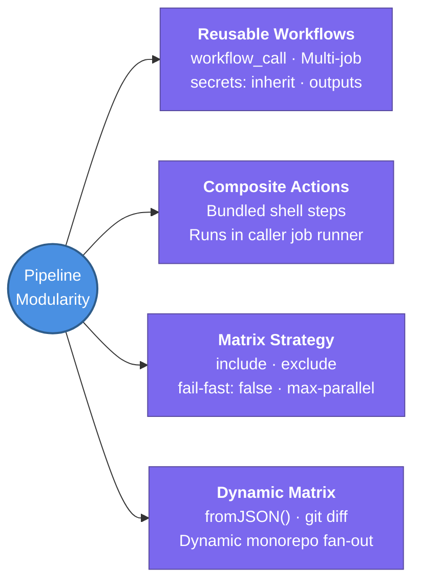

---
tags:
  - cicd/actions
  - review
status: not-started
Repetition: rep/1
Next-Review: 
---
# 3. Reusable Workflows & Custom Actions

This note covers DRY pipeline design in GitHub Actions — comparing Reusable Workflows against Composite Actions, authoring Custom Actions, and implementing advanced Matrix execution strategies.

## 📖 Core Concepts

Large organizations avoid repeating identical CI/CD logic across dozens of repositories by standardizing common pipeline stages into reusable abstractions.

### Reusable Workflows (`workflow_call`)
A Reusable Workflow is a standalone workflow file that can be called by other workflows across the organization (`org/central-repo/.github/workflows/standard-ci.yml@v1`).
```yaml
# In reusable-workflow.yml
name: Reusable Build Pipeline
on:
  workflow_call:
    inputs:
      go-version:
        required: false
        type: string
        default: '1.22'
    secrets:
      DOCKER_TOKEN:
        required: true
    outputs:
      image-digest:
        description: 'Built image SHA'
        value: ${{ jobs.build.outputs.digest }}

jobs:
  build:
    runs-on: ubuntu-latest
    outputs:
      digest: ${{ steps.push.outputs.digest }}
    steps:
      - uses: actions/checkout@v4
      - name: Build
        id: push
        run: echo "digest=sha256:abc1234" >> "$GITHUB_OUTPUT"
```
**Calling a reusable workflow:**
```yaml
jobs:
  invoke-ci:
    uses: my-org/shared-workflows/.github/workflows/reusable-workflow.yml@v2
    with:
      go-version: '1.23'
    secrets: inherit  # Inherits caller secrets automatically
```

### Composite Actions
A Composite Action bundles multiple sequential steps into a single reusable action (`action.yml`). Unlike reusable workflows, composite actions run inside the caller job's existing runner context:
```yaml
# .github/actions/setup-and-lint/action.yml
name: 'Setup and Lint Go'
description: 'Installs Go and executes golangci-lint'
inputs:
  version:
    description: 'Go version'
    required: true
    default: '1.22'
runs:
  using: 'composite'
  steps:
    - uses: actions/setup-go@v5
      with:
        go-version: ${{ inputs.version }}
    - name: Run linter
      shell: bash  # Mandatory in composite action steps!
      run: golangci-lint run
```

### Reusable Workflows vs Composite Actions
| Feature | Reusable Workflow (`workflow_call`) | Composite Action (`using: composite`) |
| :--- | :--- | :--- |
| **Scope** | Manages entire jobs, runners, matrices | Single step or sequence of steps inside a job |
| **Runners** | Declares its own `runs-on` per job | Executes on the caller job's runner |
| **Environments & Secrets** | Can bind to GitHub Environments | Cannot bind directly to GitHub Environments |
| **Best For** | Standardizing organization-wide delivery pipelines | Shared build utilities, linter configs, test setups |

### Matrix Strategies & Dynamic Matrices
Matrix builds execute parallel combinations of variables:
```yaml
jobs:
  test:
    runs-on: ${{ matrix.os }}
    strategy:
      fail-fast: false       # Don't cancel remaining jobs if one matrix fails
      max-parallel: 4        # Cap concurrent runners (FinOps throttle)
      matrix:
        os: [ubuntu-latest, macos-latest]
        node-version: [18, 20, 22]
        include:
          - os: ubuntu-latest
            node-version: 22
            experimental: true
        exclude:
          - os: macos-latest
            node-version: 18
```
**Dynamic Matrix Generation:** A pre-job dynamically calculates directories or packages changed using `git diff`, formats the result into a JSON array, and sets it as an output for `matrix: ${{ fromJSON(needs.detect.outputs.packages) }}`.

---

## 🔗 Connections (Zettelkasten)
- **Part of:** [[1. GitHub Actions]]
- **Relates to:** [[GitHub-Actions/1. Workflows & Architecture|1. Workflows & Architecture]]
- **Relates to:** [[GitHub-Actions/5. Terraform & IaC Automation|5. Terraform & IaC Automation]]
- **Core Use Case:** Eliminating YAML boilerplate across microservices and running high-throughput multi-platform test suites.

---

## 🏗️ Proof of Work
- **Lab/Script:** [[GitHub Actions Todo#🧪 GitHub Actions Mastery Labs (Hands-On Path)|Lab 1 — Foundational Workflow & Matrix Builds]]
- **Verification Command:** `gh workflow view standard-ci.yml`

---

## 🛠️ Study Aids

### 🧠 Mind Map


### 🗂️ Flashcards
#flashcards/cicd

**What is the syntax requirement for shell execution in a Composite Action?**
?
In composite actions, every step that executes a `run:` command **must explicitly specify `shell:`** (e.g. `shell: bash`). In regular workflows `shell:` is optional (defaulting to bash on Linux).

---

**How does `fail-fast: false` change the default behavior of a matrix job?**
?
By default (`fail-fast: true`), if any single matrix combination fails, GitHub immediately cancels all other currently running matrix jobs. Setting `fail-fast: false` allows all OS and version combinations to finish running so developers can see the complete test report.

---

**How can you pass all caller repository secrets to a reusable workflow without enumerating each one?**
?
Use `secrets: inherit` under the calling job's `uses:` declaration. This automatically passes all accessible repository and organization secrets down to the called workflow.
