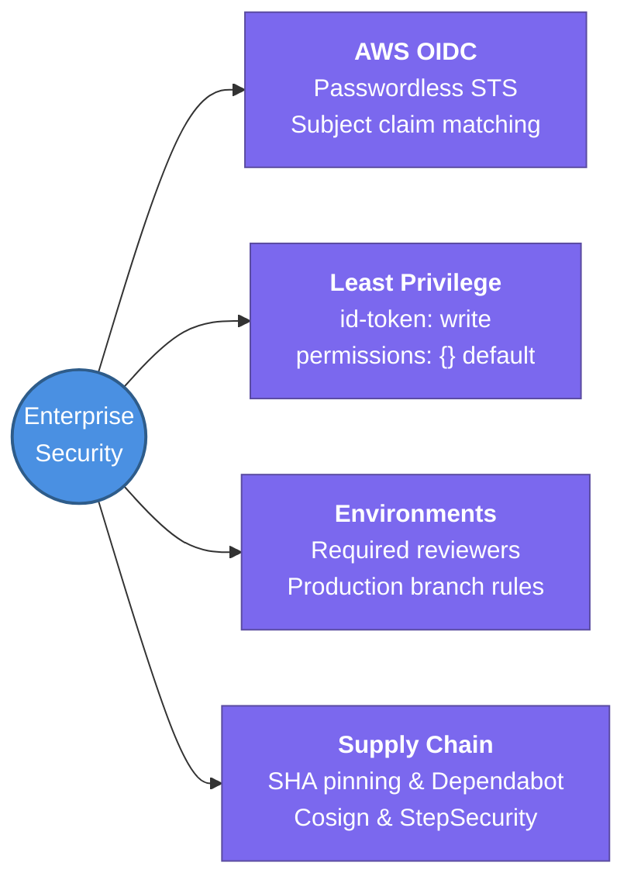

---
tags:
  - cicd/actions
  - review
status: not-started
Repetition: rep/1
Next-Review: 
---
# 4. AWS OIDC & Enterprise Security

This note covers enterprise-grade security hardening in GitHub Actions — passwordless cloud authentication using OpenID Connect (OIDC), fine-grained GITHUB_TOKEN permissions, deployment environments, and software supply chain protection.

## 📖 Core Concepts

Traditional CI/CD pipelines relied on long-lived cloud credentials (`AWS_ACCESS_KEY_ID` / `AWS_SECRET_ACCESS_KEY`) stored as static repository secrets. These credentials present severe security risks: they rarely rotate, can be exposed via log outputs or malicious PRs, and grant broad blast radiuses across cloud environments.

### Passwordless Authentication: OpenID Connect (OIDC)
GitHub Actions provides an OIDC provider that issues cryptographically signed JSON Web Tokens (JWTs) per workflow run. AWS Security Token Service (STS) validates the token against GitHub’s public keys and exchanges it for temporary, short-lived AWS IAM credentials (valid for 1 hour).

```
GitHub Actions Runner           GitHub OIDC Provider           AWS STS
        │                                │                        │
        │── 1. Request OIDC Token ──────▶│                        │
        │◀── 2. Returns Signed JWT ──────│                        │
        │                                                         │
        │── 3. AssumeRoleWithWebIdentity(JWT, RoleArn) ──────────▶│
        │                                                         │ (Validates JWT claims
        │                                                         │  against Trust Policy)
        │◀── 4. Returns Temporary AWS STS Credentials (1 hr) ─────│
        │
        ▼ (Runs terraform apply / aws s3 sync / docker push)
```

#### AWS IAM Trust Policy Configuration
The IAM Role's trust policy must enforce strict condition checks on the `token.actions.githubusercontent.com:sub` (subject) claim to ensure only authorized repositories and branches can assume the role:
```json
{
  "Version": "2012-10-17",
  "Statement": [
    {
      "Effect": "Allow",
      "Principal": {
        "Federated": "arn:aws:iam::<ACCOUNT_ID>:oidc-provider/token.actions.githubusercontent.com"
      },
      "Action": "sts:AssumeRoleWithWebIdentity",
      "Condition": {
        "StringEquals": {
          "token.actions.githubusercontent.com:aud": "sts.amazonaws.com"
        },
        "StringLike": {
          "token.actions.githubusercontent.com:sub": "repo:my-org/my-infra:ref:refs/heads/main"
        }
      }
    }
  ]
}
```

#### Workflow Implementation
To receive an OIDC token, the workflow job MUST declare `id-token: write`:
```yaml
permissions:
  id-token: write   # Required to request OIDC JWT
  contents: read    # Required to checkout code

jobs:
  deploy:
    runs-on: ubuntu-latest
    steps:
      - uses: actions/checkout@v4
      - name: Configure AWS Credentials
        uses: aws-actions/configure-aws-credentials@v4
        with:
          role-to-assume: arn:aws:iam::123456789012:role/github-actions-deploy-role
          aws-region: us-east-1
      - name: Verify AWS Identity
        run: aws sts get-caller-identity
```

### Least-Privilege GITHUB_TOKEN Permissions
The built-in `GITHUB_TOKEN` secret can read and write code, packages, and pull requests. Senior engineers set top-level permissions to empty, explicitly granting only what each job requires:
```yaml
permissions: {}  # Deny all permissions by default

jobs:
  triage:
    permissions:
      issues: write
      pull-requests: write
    # ...
```

### GitHub Environments & Manual Approvals
GitHub Environments add deployment gates between stages (e.g., `dev` $\rightarrow$ `staging` $\rightarrow$ `production`):
- **Required Reviewers:** Workflows pause until designated platform/security leads approve the release in the GitHub UI.
- **Wait Timers:** Introduce mandatory bake periods (e.g., wait 15 minutes before running post-deploy smoke tests).
- **Deployment Branches:** Restrict production secrets so only runs originating from `main` or protected tags can access them.

### Supply Chain Security & SHA Pinning
- **Commit SHA Pinning:** Instead of mutable tags (`uses: actions/checkout@v4`), pin to immutable 40-character commit SHAs (`uses: actions/checkout@11bd71901bbe5b1630ceea73d27597364c9af683`) to prevent compromised action updates. Combine with **Dependabot** to automate periodic updates.
- **Network Egress Guardrails:** Use tools like StepSecurity's `harden-runner` to monitor outbound network connections and block compromised actions from exfiltrating environment variables to untrusted IP addresses.
- **Artifact Signing & Provenance:** Sign container images using **Cosign** (Sigstore keyless signing) and generate SLSA provenance attestations (`actions/attest-build-provenance`).

---

## 🔗 Connections (Zettelkasten)
- **Part of:** [[1. GitHub Actions]]
- **Relates to:** [[GitHub-Actions/5. Terraform & IaC Automation|5. Terraform & IaC Automation]]
- **Relates to:** [[Knowledge Base/AWS/4. VPC Advanced Features|4. VPC Advanced Features]]
- **Core Use Case:** Zero-trust cloud identity management, credential leak elimination, and secure enterprise CI/CD gates.

---

## 🏗️ Proof of Work
- **Lab/Script:** [[GitHub Actions Todo#🧪 GitHub Actions Mastery Labs (Hands-On Path)|Lab 2 — Passwordless AWS IAM OIDC Federation]]
- **Verification Command:** `aws sts get-caller-identity --output table`

---

## 🛠️ Study Aids

### 🧠 Mind Map


### 🗂️ Flashcards
#flashcards/cicd

**What two permissions are strictly required for a GitHub Actions job to authenticate to AWS via OIDC and checkout repository code?**
?
`id-token: write` (to request the cryptographically signed OIDC JWT from GitHub's token service) and `contents: read` (to download the repository files via `actions/checkout`).

---

**In an AWS IAM OIDC Trust Policy, what does the `token.actions.githubusercontent.com:sub` condition claim prevent?**
?
It prevents unauthorized GitHub repositories or unauthorized branches from assuming your AWS IAM role. Without scoping `sub` to `repo:org/repo:ref:refs/heads/main`, *any* public or private repository on GitHub could request a token and assume your AWS role.

---

**Why is pinning actions by commit SHA safer than pinning by release tag (e.g. `@v4`)?**
?
Git release tags are mutable references that can be deleted and force-pushed by an action maintainer or an attacker who compromises the maintainer's account. A commit SHA is cryptographically immutable, guaranteeing that the exact reviewed code is executed every time.
