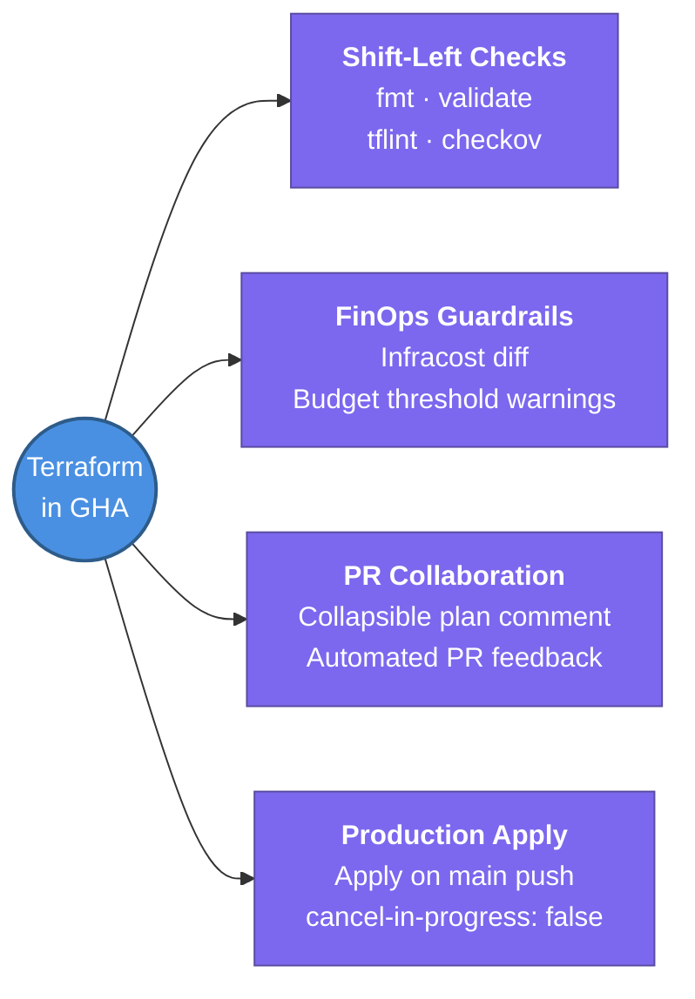

---
tags:
  - cicd/actions
  - review
status: not-started
Repetition: rep/1
Next-Review: 
---
# 5. Terraform & IaC Automation

This note covers building production-grade Infrastructure as Code (IaC) pipelines in GitHub Actions — automated linting, security scanning, Infracost FinOps guardrails, pull request plan commenting, and gated apply workflows.

## 📖 Core Concepts

Managing Terraform via GitHub Actions establishes Git as the single source of truth for cloud infrastructure. A senior-level Terraform pipeline enforces rigorous shift-left static analysis, policy verification, cost visibility, and controlled deployment boundaries.

### Production Terraform PR Pipeline Flow
```
PR Opened / Updated
  │
  ├── 1. terraform fmt -check (Style & standard formatting)
  ├── 2. terraform validate   (Syntax & attribute validity)
  ├── 3. tflint               (Provider-aware deprecated syntax & naming)
  ├── 4. checkov / trivy      (Security misconfigurations: unencrypted S3, open SGs)
  ├── 5. infracost diff       (FinOps: monthly cloud cost variance estimation)
  │
  ▼
  └── 6. terraform plan       (Diff against S3/DynamoDB remote state)
          │
          └── 7. Post PR Comment (Markdown report with Plan + Cost diff)
```

### Shift-Left Static Analysis & Security Checks
1. **`terraform fmt -check`:** Fails the job if unformatted HCL files are committed.
2. **`tflint`:** Catches provider-specific bugs that pass `validate` (e.g., invalid EC2 instance types, missing required tags).
3. **`checkov` / `tfsec`:** Scans HCL code against CIS benchmarks and security baselines. Flags critical violations (e.g., `0.0.0.0/0` SSH ingress on security groups).

### FinOps Guardrails with Infracost
Infracost evaluates the Terraform plan output and posts an exact cost comparison directly on the pull request:
```yaml
- name: Setup Infracost
  uses: infracost/actions/setup@v3
  with:
    api-key: ${{ secrets.INFRACOST_API_KEY }}

- name: Generate Infracost Diff
  run: |
    infracost breakdown --path=. --format=json --out-file=/tmp/infracost-base.json
    infracost diff --path=. --format=json --compare-to=/tmp/infracost-base.json --out-file=/tmp/infracost.json

- name: Post Infracost PR Comment
  run: |
    infracost comment github --path=/tmp/infracost.json \
      --repo=$GITHUB_REPOSITORY \
      --github-token=${{ github.token }} \
      --pull-request=${{ github.event.pull_request.number }} \
      --behavior=update
```

### Posting Clean `terraform plan` to PR Comments
Developers should not have to dig into GitHub Actions log consoles to inspect planned infrastructure changes. Use `peter-evans/create-or-update-comment` or GitHub CLI (`gh pr comment`) to post a formatted collapsible block:
```yaml
- name: Post Plan to PR
  uses: actions/github-script@v7
  if: github.event_name == 'pull_request'
  with:
    script: |
      const output = `#### Terraform Format and Style 🖌\`${{ steps.fmt.outcome }}\`
      #### Terraform Initialization ⚙️\`${{ steps.init.outcome }}\`
      #### Terraform Validation 🤖\`${{ steps.validate.outcome }}\`
      #### Terraform Plan 📖\`${{ steps.plan.outcome }}\`

      <details><summary>Show Plan</summary>

      \`\`\`hcl
      ${{ steps.plan.outputs.stdout }}
      \`\`\`

      </details>`;

      github.rest.issues.createComment({
        issue_number: context.issue.number,
        owner: context.repo.owner,
        repo: context.repo.repo,
        body: output
      })
```

### Apply on Merge Workflow & Concurrency Protection
To prevent race conditions where concurrent applies collide against DynamoDB locks:
```yaml
name: Terraform Apply
on:
  push:
    branches: [main]
    paths: ['terraform/**']

concurrency:
  group: terraform-production
  cancel-in-progress: false   # NEVER cancel an active terraform apply!

jobs:
  apply:
    runs-on: ubuntu-latest
    environment: production   # Requires manual approval if configured
    permissions:
      id-token: write
      contents: read
    steps:
      - uses: actions/checkout@v4
      - uses: aws-actions/configure-aws-credentials@v4
        with:
          role-to-assume: ${{ secrets.PROD_TERRAFORM_ROLE_ARN }}
          aws-region: us-east-1
      - run: terraform init
      - run: terraform apply -auto-approve
```

### GitHub Actions vs Atlantis for Terraform
| Dimension | GitHub Actions | Atlantis |
| :--- | :--- | :--- |
| **Execution Trigger** | Push / PR events | PR comments (`atlantis plan`, `atlantis apply`) |
| **Server Infrastructure** | Managed GitHub runners or ARC | Self-hosted stateful server container |
| **Locking Behavior** | DynamoDB state locks | Branch lock + Project directory locks in UI |
| **Multi-Directory Monorepo** | Requires matrix or path filters | Native `atlantis.yaml` project discovery |
| **Ecosystem Integration** | Seamless with Infracost, Trivy, Slack | Configured via custom Atlantis workflow hooks |

---

## 🔗 Connections (Zettelkasten)
- **Part of:** [[1. GitHub Actions]]
- **Relates to:** [[1. Terraform Core Concepts]]
- **Relates to:** [[3. Atlantis]]
- **Relates to:** [[Knowledge Base/Infrastructure-as-Code/Terraform/8. FinOps & Cost Optimization (Infracost)|FinOps & Infracost]]
- **Core Use Case:** Safe, audited, cost-controlled, and automated cloud infrastructure provisioning across AWS accounts.

---

## 🏗️ Proof of Work
- **Lab/Script:** [[GitHub Actions Todo#🧪 GitHub Actions Mastery Labs (Hands-On Path)|Lab 3 — Automated Terraform PR Pipeline with Infracost]]
- **Verification Command:** `gh pr comment --help`

---

## 🛠️ Study Aids

### 🧠 Mind Map


### 🗂️ Flashcards
#flashcards/cicd

**Why should `cancel-in-progress` be set to `false` in a Terraform Apply deployment workflow?**
?
If `cancel-in-progress` is set to `true`, a newly pushed commit will forcefully terminate a currently executing `terraform apply` job. This can leave cloud resources in a partially provisioned state, corrupt state files, or leave DynamoDB lock entries orphaned.

---

**What is the advantage of running `tflint` in CI in addition to standard `terraform validate`?**
?
`terraform validate` only checks HCL syntax and internal schema validity; it does not query provider-specific constraints. `tflint` inspects real cloud rules—catching invalid EC2 instance types, missing recommended tags, deprecated provider arguments, and module-level errors.

---

**How does Infracost act as an automated FinOps guardrail in GitHub Actions PRs?**
?
Infracost analyzes the Terraform plan JSON output, calculates the exact monthly delta cost (e.g., "+$180/month for 2x t3.large instances"), and posts it on the PR. Teams can add policy checks to automatically fail the build or require Director approval if the delta exceeds a budget threshold.
