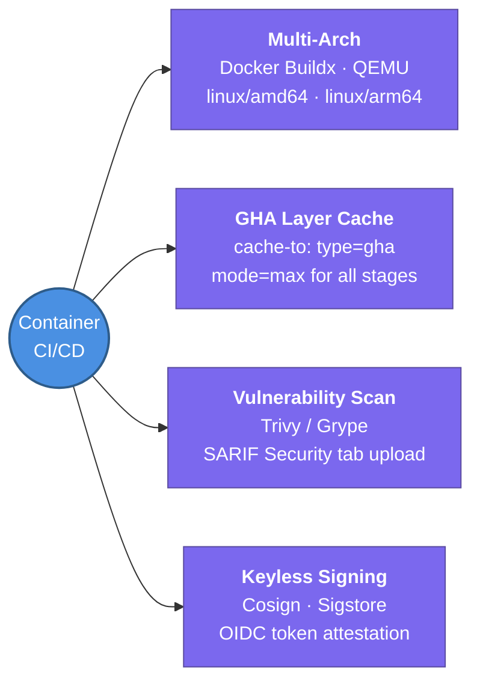

---
tags:
  - cicd/actions
  - review
status: not-started
Repetition: rep/1
Next-Review: 
---
# 6. Container CI & Caching

This note covers high-performance container pipelines in GitHub Actions — Docker Buildx multi-architecture builds, GitHub Actions cache backends (`type=gha`), Trivy security scanning, and Cosign image signing.

## 📖 Core Concepts

Container builds in enterprise CI/CD must be fast, multi-architecture compatible (`amd64` and `arm64`), and secure against container supply-chain vulnerabilities.

### High-Performance Docker Buildx Pipeline
Using Moby BuildKit via `docker/setup-buildx-action` enables concurrent multi-stage builds, rootless execution, and external cache storage.
```yaml
name: Build & Push Container Image
on:
  push:
    branches: [main]
    tags: ['v*']

permissions:
  contents: read
  packages: write
  id-token: write  # For Cosign keyless signing & AWS ECR

jobs:
  docker-build:
    runs-on: ubuntu-latest
    steps:
      - uses: actions/checkout@v4

      - name: Set up QEMU
        uses: docker/setup-qemu-action@v3

      - name: Set up Docker Buildx
        uses: docker/setup-buildx-action@v3

      - name: Login to GitHub Container Registry
        uses: docker/login-action@v3
        with:
          registry: ghcr.io
          username: ${{ github.actor }}
          password: ${{ secrets.GITHUB_TOKEN }}

      - name: Extract Docker metadata
        id: meta
        uses: docker/metadata-action@v5
        with:
          images: ghcr.io/${{ github.repository }}
          tags: |
            type=ref,event=branch
            type=semver,pattern={{version}}
            type=sha,format=short

      - name: Build and push container image
        uses: docker/build-push-action@v6
        with:
          context: .
          platforms: linux/amd64,linux/arm64
          push: true
          tags: ${{ steps.meta.outputs.tags }}
          labels: ${{ steps.meta.outputs.labels }}
          cache-from: type=gha
          cache-to: type=gha,mode=max
```

### Advanced Docker Caching: `type=gha` vs Registry Cache
1. **GitHub Actions Cache Backend (`type=gha`):**
   - Utilizes GitHub's dedicated cache storage service (up to 10GB per repository).
   - `mode=max` caches all build stages, not just the final target stage.
   - Extremely fast for ephemeral runners since data stays within GitHub's network.
2. **Registry Cache (`type=registry`):**
   - Pushes build cache layers directly to an OCI registry (e.g., AWS ECR or GHCR) alongside image manifests.
   - Ideal for large multi-gigabyte layers or when using self-hosted runners in external clouds.

### Dependency Caching (`actions/cache`)
To prevent re-downloading Go modules, Python wheels, or Node modules on every workflow execution:
```yaml
- name: Cache Go modules
  uses: actions/cache@v4
  with:
    path: |
      ~/.cache/go-build
      ~/go/pkg/mod
    key: ${{ runner.os }}-go-${{ hashFiles('**/go.sum') }}
    restore-keys: |
      ${{ runner.os }}-go-
```
*Note:* Modern setup actions (`actions/setup-go@v5`, `actions/setup-node@v4`, `actions/setup-python@v5`) feature built-in cache parameters (`cache: 'go'`) that automatically configure optimal directory paths and hash keys.

### Container Vulnerability Scanning with Trivy
Scans built images for known CVEs, misconfigurations, and leaked secrets before promotion to production. Uploading SARIF files surfaces issues directly inside GitHub's Security tab:
```yaml
- name: Run Trivy Vulnerability Scanner
  uses: aquasecurity/trivy-action@master
  with:
    image-ref: ghcr.io/${{ github.repository }}:${{ steps.meta.outputs.version }}
    format: 'sarif'
    output: 'trivy-results.sarif'
    severity: 'CRITICAL,HIGH'

- name: Upload SARIF report
  uses: github/codeql-action/upload-sarif@v3
  if: always()
  with:
    sarif_file: 'trivy-results.sarif'
```

### Keyless Image Signing with Cosign
Using GitHub Actions OIDC tokens, **Cosign** (Sigstore) signs container images without requiring developers to manage long-lived private keys:
```yaml
- name: Install Cosign
  uses: sigstore/cosign-installer@v3

- name: Sign container image
  run: |
    cosign sign --yes \
      ghcr.io/${{ github.repository }}@${{ steps.build-push.outputs.digest }}
```

---

## 🔗 Connections (Zettelkasten)
- **Part of:** [[1. GitHub Actions]]
- **Relates to:** [[GitHub-Actions/4. AWS OIDC & Enterprise Security|4. AWS OIDC & Enterprise Security]]
- **Relates to:** [[GitHub-Actions/7. GitOps Bridge & Release Orchestration|7. GitOps Bridge & Release Orchestration]]
- **Core Use Case:** Publishing secure, scanned, signed, multi-platform container images with sub-minute build times.

---

## 🏗️ Proof of Work
- **Lab/Script:** [[GitHub Actions Todo#🧪 GitHub Actions Mastery Labs (Hands-On Path)|Lab 4 — Multi-Arch Container CI with GHA Caching & Trivy]]
- **Verification Command:** `docker buildx imagetools inspect ghcr.io/<org>/<repo>:latest`

---

## 🛠️ Study Aids

### 🧠 Mind Map


### 🗂️ Flashcards
#flashcards/cicd

**What is the difference between `cache-to: type=gha` with `mode=min` vs `mode=max` in Docker Buildx?**
?
`mode=min` (the default) only caches the layers of the final build stage. `mode=max` caches all intermediate layers across all multi-stage build targets (e.g. test runner, compiler, asset minifier), significantly accelerating subsequent CI builds.

---

**How does Cosign achieve keyless container signing inside GitHub Actions?**
?
Cosign requests an OIDC identity token from GitHub Actions (`id-token: write`). It submits this token to the Sigstore Fulcio Certificate Authority, which issues a short-lived x509 signing certificate bound to the GitHub repository and workflow identity. The signature is recorded in the Rekor transparency log.

---

**Why is QEMU required when building multi-architecture container images on standard GitHub-hosted runners?**
?
Standard GitHub-hosted runners run on x86_64 architecture. To build ARM64 container binaries without native ARM hardware, QEMU translates non-native CPU instructions during the Docker build process.
