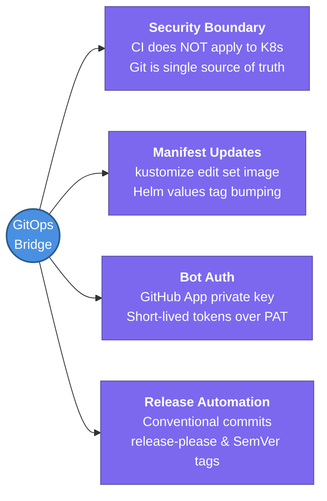

---
tags:
  - cicd/actions
  - review
status: not-started
Repetition: rep/1
Next-Review: 
---
# 7. GitOps Bridge & Release Orchestration

This note covers connecting GitHub Actions CI pipelines to GitOps delivery engines (ArgoCD / Flux) — automating manifest repo updates, managing cross-repo permissions, and orchestrating releases using Semantic Versioning.

## 📖 Core Concepts

In pure GitOps architecture, CI pipelines NEVER interact directly with the production Kubernetes API (`kubectl apply`). Doing so breaks Git as the single source of truth and requires broad cluster admin credentials inside CI runners. Instead, GitHub Actions builds and verifies artifacts, then triggers deployment by updating the declarative GitOps repository.

### The CI/CD GitOps Hand-Off Flow
```
Application Repo (GitHub Actions CI)
  │
  ├── 1. Run unit/integration tests
  ├── 2. Build multi-arch container image
  ├── 3. Sign & push to GHCR / ECR with image tag: sha-7a91bf3
  │
  ▼
  └── 4. GitOps Bridge Step:
          Update GitOps Manifest Repo (kustomize edit set image / Helm values.yaml)
                  │
                  ▼
          GitOps Repository (Target of ArgoCD)
                  │ (Webhook or 3-minute poll)
                  ▼
          ArgoCD Operator (Running inside Amazon EKS)
                  │
                  ▼
          Kubernetes Cluster (Reconciles live state to match Git commit)
```

### Automating GitOps Manifest Updates
When a container image is pushed, the workflow writes the new tag to the GitOps config repository using Kustomize:
```yaml
name: Promote to Staging
on:
  push:
    branches: [main]

jobs:
  update-manifest:
    runs-on: ubuntu-latest
    steps:
      - name: Generate GitHub App Token
        id: app-token
        uses: actions/create-github-app-token@v1
        with:
          app-id: ${{ secrets.GITOPS_BOT_APP_ID }}
          private-key: ${{ secrets.GITOPS_BOT_PRIVATE_KEY }}
          owner: my-org
          repositories: gitops-fleet-manifests

      - name: Checkout GitOps Repository
        uses: actions/checkout@v4
        with:
          repository: my-org/gitops-fleet-manifests
          token: ${{ steps.app-token.outputs.token }}
          path: gitops-repo

      - name: Update Kustomize Image Tag
        working-directory: gitops-repo/environments/staging
        run: |
          kustomize edit set image backend-api=ghcr.io/my-org/backend-api:${{ github.sha }}
          git config user.name "gitops-deploy-bot[bot]"
          git config user.email "bot@users.noreply.github.com"
          git add kustomization.yaml
          git commit -m "chore(deploy): promote backend-api to ${{ github.sha }}"
          git push origin main
```

### GitHub App Token vs Personal Access Token (PAT)
For cross-repository Git automation:
- **PAT (Personal Access Token):** Bound to an individual developer's identity. If that engineer leaves the organization or changes teams, all automated deployments immediately fail.
- **GitHub App:** The enterprise gold standard. Created at the GitHub Organization level, authenticates via RSA private keys, and generates short-lived installation tokens (1-hour expiration) scoped to specific target repositories.

### Automated Semantic Versioning with Release-Please
Google's `release-please` action parses **Conventional Commits** (`feat:`, `fix:`, `chore:`, `feat!:`) to automatically maintain changelogs, bump SemVer versions, and open Release PRs:
```yaml
name: Release Orchestration
on:
  push:
    branches: [main]

permissions:
  contents: write
  pull-requests: write

jobs:
  release-please:
    runs-on: ubuntu-latest
    steps:
      - uses: googleapis/release-please-action@v4
        with:
          release-type: node
```

---

## 🔗 Connections (Zettelkasten)
- **Part of:** [[1. GitHub Actions]]
- **Relates to:** [[ArgoCD]]
- **Relates to:** [[6. EKS Architecture]]
- **Relates to:** [[GitHub-Actions/6. Container CI & Caching|6. Container CI & Caching]]
- **Core Use Case:** Decoupling continuous integration from continuous deployment while enforcing GitOps security boundaries.

---

## 🏗️ Proof of Work
- **Lab/Script:** [[GitHub Actions Todo#🧪 GitHub Actions Mastery Labs (Hands-On Path)|Lab 5 — GitOps Delivery Bridge to ArgoCD]]
- **Verification Command:** `git log -1 --stat` (in GitOps repository)

---

## 🛠️ Study Aids

### 🧠 Mind Map


### 🗂️ Flashcards
#flashcards/cicd

**Why should CI pipelines in GitHub Actions avoid running `kubectl apply` directly against Kubernetes clusters?**
?
Direct `kubectl apply` requires granting cluster-admin or broad deployment credentials to CI runners (a severe security attack vector) and creates "drift" between what is in Git and what is live in the cluster. GitOps ensures the cluster reconciles itself by watching Git as the single source of truth.

---

**Why are GitHub Apps preferred over Personal Access Tokens (PATs) for cross-repository Git automation?**
?
PATs are tied to individual user accounts (introducing security debt and failure when an employee departs) and often have broad account-wide scope. GitHub Apps belong to the organization, use private-key cryptography to issue 1-hour tokens, and can be scoped strictly to individual target repositories.

---

**How does `release-please` determine whether to bump a Major, Minor, or Patch version?**
?
It inspects Conventional Commits: `fix:` triggers a **Patch** bump (1.0.0 $\rightarrow$ 1.0.1); `feat:` triggers a **Minor** bump (1.0.0 $\rightarrow$ 1.1.0); and any commit with a `BREAKING CHANGE:` footer or `!` after the type (e.g. `feat!:`) triggers a **Major** bump (1.0.0 $\rightarrow$ 2.0.0).
