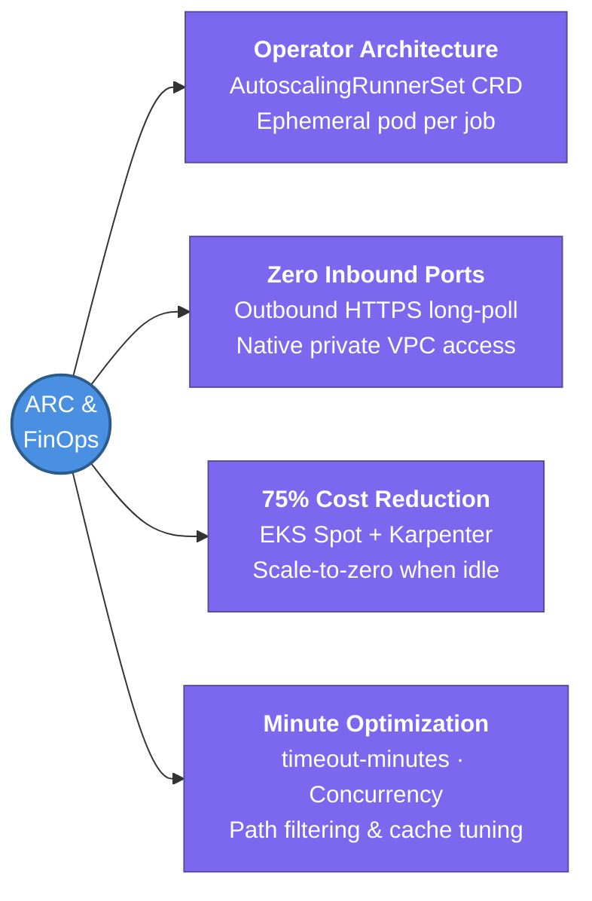

---
tags:
  - cicd/actions
  - review
status: not-started
Repetition: rep/1
Next-Review: 
---
# 8. ARC & FinOps Optimization

This note covers enterprise platform engineering with Actions Runner Controller (ARC) on Kubernetes (Amazon EKS) — dynamic ephemeral runners, autoscaling with Spot instances, and FinOps CI minute optimization.

## 📖 Core Concepts

As engineering organizations scale, GitHub-hosted runner minutes quickly become one of the top line items on engineering SaaS bills. In addition, organizations building secure applications frequently require runners that can reach private VPC resources (internal databases, private Artifactory/ECR, on-premises networks) without traversing the public internet.

### What is Actions Runner Controller (ARC)?
**Actions Runner Controller (ARC)** is a Kubernetes operator maintained by GitHub that automates the provisioning, autoscaling, and lifecycle of self-hosted GitHub Actions runners inside Kubernetes clusters.

#### ARC Architecture (Modern AutoscalingRunnerSet)
1. **ARC Controller Pod:** Monitors runner scale sets and GitHub webhook/polling APIs for pending workflow jobs.
2. **Listener Pod:** Opens an outbound HTTPS long-poll connection to GitHub's Actions service. Does NOT require any public inbound ports or ingress controllers!
3. **Ephemeral Runner Pods:** Spun up dynamically on-demand when a workflow with `runs-on: [arc-runners]` is queued. The pod executes the single job and is **immediately terminated and deleted** upon job completion, guaranteeing a clean, uncompromised environment for every run.

```
GitHub Service (github.com)
  ▲
  │ (Outbound HTTPS Long-Poll / Webhooks)
  ▼
EKS Worker Nodes (Private Subnet)
  ├── ARC Controller & Listener
  │         │ (Detects queued job)
  │         ▼
  └── Runner Pod (Ephemeral) ──▶ Accesses Private VPC (RDS, EKS, Vault)
            │ (Job completes)
            ▼
      [Pod Terminated & Replaced]
```

### Deploying ARC on Amazon EKS with Helm
ARC is deployed using two Helm charts: the base controller and the runner scale set:
```bash
# 1. Install ARC Controller
helm install arc \
  --namespace arc-systems \
  --create-namespace \
  oci://ghcr.io/actions/actions-runner-controller-charts/gha-runner-scale-set-controller

# 2. Install Runner Scale Set
helm install arc-runner-set \
  --namespace arc-runners \
  --create-namespace \
  -f values.yaml \
  oci://ghcr.io/actions/actions-runner-controller-charts/gha-runner-scale-set
```

### FinOps: Slashing CI Spend by 75–80% with EKS Spot Instances
GitHub-hosted runners cost **$0.008 per minute** ($0.48/hour) for standard 2-core Linux instances. By combining ARC with **AWS EC2 Spot Instances** and **Karpenter** on Amazon EKS:
- An AWS `c6i.xlarge` (4 vCPU, 8 GB RAM) on EC2 Spot costs ~$0.05/hour.
- Running four concurrent CI jobs on this node costs ~$0.0125/hour per job (~$0.0002/minute).
- **FinOps ROI:** Organizations running >50,000 CI minutes/month typically reduce runner compute expenditure by over **75%**.

| Dimension | GitHub-Hosted Runners | ARC on EKS Spot Instances |
| :--- | :--- | :--- |
| **Compute Cost** | $0.008 / min ($480 / 1k hrs) | ~$0.0015 / min ($90 / 1k hrs) |
| **Private VPC Access** | Requires complex VPN or Proxy | Native (runs inside private subnet) |
| **Hardware Customization** | Fixed vCPU/RAM sizes | Custom CPU/RAM, ARM64, GPU nodes |
| **Isolation Model** | Ephemeral Azure VM | Ephemeral Kubernetes Pod |
| **Maintenance Overhead** | Zero (fully managed by GitHub) | Requires K8s cluster maintenance |

### Workflow FinOps Optimization Checklist
1. **Mandatory `timeout-minutes`:** Runaway test scripts or deadlocked integration tests can burn runner minutes indefinitely. Default every job to `timeout-minutes: 15` or lower.
2. **Selective Path Filtering:** Never trigger backend pipelines when updating README or frontend assets (`paths-ignore: ['**.md', 'docs/**']`).
3. **Smart Concurrency:** Always add `concurrency: cancel-in-progress: true` on PR validation workflows to kill obsolete commits.
4. **Cache Tuning:** Measure cache hit/miss rates. Caching large bloated directories that change on every build can actually slow down pipelines due to download/upload latency.

---

## 🔗 Connections (Zettelkasten)
- **Part of:** [[1. GitHub Actions]]
- **Relates to:** [[6. EKS Architecture]]
- **Relates to:** [[1. VPC Deep Dive]]
- **Relates to:** [[Knowledge Base/Infrastructure-as-Code/Terraform/8. FinOps & Cost Optimization (Infracost)|FinOps & Infracost]]
- **Core Use Case:** Enterprise-scale CI infrastructure, massive cost reduction, and secure private cloud network connectivity.

---

## 🏗️ Proof of Work
- **Lab/Script:** [[GitHub Actions Todo#🧪 GitHub Actions Mastery Labs (Hands-On Path)|Lab 6 — Ephemeral Runners with Actions Runner Controller (ARC) on EKS]]
- **Verification Command:** `kubectl get autoscalingrunnersets -n arc-runners`

---

## 🛠️ Study Aids

### 🧠 Mind Map


### 🗂️ Flashcards
#flashcards/cicd

**Why are ARC runner pods created as ephemeral (one pod per job) rather than persistent?**
?
Ephemeral pods guarantee strict security isolation and deterministic builds. Because the entire pod is destroyed and recreated after every single job run, leftover test data, modified environment variables, or malicious artifacts from a previous build cannot contaminate subsequent runs.

---

**Does Actions Runner Controller require opening inbound firewall ports or public ingress on the Kubernetes cluster?**
?
No. The ARC listener pod establishes an **outbound HTTPS connection** (port 443) to GitHub to listen for workflow events. The cluster remains completely private without any exposed ingress endpoints.

---

**How does running ARC on AWS EC2 Spot instances achieve massive FinOps savings?**
?
EC2 Spot instances offer up to 70–90% discounts compared to on-demand pricing. Because CI jobs are inherently stateless and retriable, running ephemeral runner pods on Spot instances provides massive compute scale at a fraction of the cost of GitHub-hosted minutes.
