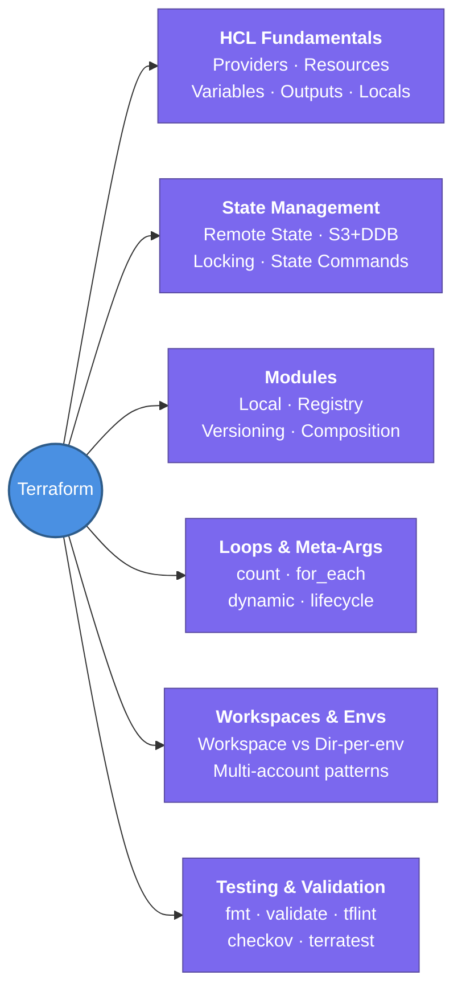

---
tags:
  - iac/terraform
  - review
status: not-started
---
# Terraform Core Concepts

This is the hub note for all Terraform study — covering HCL basics through modules, state management, and CI/CD integration.

## 📖 Core Concepts

Terraform is a declarative IaC tool by HashiCorp. You describe **desired state** in HCL; Terraform computes a diff against the **state file** and mutates real infrastructure to match.

**Core CLI Workflow:**
```
terraform init      → download providers & modules, set up backend
terraform fmt       → auto-format HCL files
terraform validate  → check syntax & logical consistency (no cloud calls)
terraform plan      → preview changes (diff config vs state)
terraform apply     → create/update/destroy real resources
terraform destroy   → tear down all managed resources
```

**Four fundamental concepts:**
1. **Providers** — plugins that translate HCL into API calls (e.g. `hashicorp/aws`)
2. **Resources** — the unit of managed infrastructure (`aws_vpc`, `aws_instance`)
3. **State** — JSON file mapping each resource block → real resource ID
4. **Modules** — reusable, composable chunks of configuration

**Terraform vs other IaC tools:**
| Tool | Style | State | Multi-cloud |
|------|-------|-------|-------------|
| Terraform | Declarative HCL | External state file | ✅ Yes |
| CloudFormation | Declarative YAML/JSON | Managed by AWS | ❌ AWS only |
| Pulumi | Imperative (Python/Go/TS) | External | ✅ Yes |
| CDK | Imperative (Python/TS) | CloudFormation stack | ❌ AWS only |

## 🧭 Subtopics

- [[Terraform/HCL Fundamentals|HCL Fundamentals]] — providers, resources, variables, outputs, locals, data sources, type system
- [[Terraform/State Management|State Management]] — remote state, S3+DynamoDB backend, locking, state CLI commands
- [[Terraform/Modules|Modules]] — module structure, local vs registry, versioning, composition patterns
- [[Terraform/Loops & Meta-Arguments|Loops & Meta-Arguments]] — count vs for_each, dynamic blocks, lifecycle, depends_on
- [[Terraform/Workspaces & Environments|Workspaces & Environments]] — workspace-per-env vs directory-per-env, multi-account patterns
- [[Terraform/Testing & Validation|Testing & Validation]] — fmt, validate, tflint, checkov, terratest, native terraform test

## 🔗 Connections (Zettelkasten)
- **Relates to:** [[2. Terragrunt]] — DRY wrapper that removes backend/provider repetition across environments
- **Relates to:** [[3. Atlantis]] — GitOps PR automation for running plan/apply via pull requests
- **Relates to:** [[VPC/VPC-Terraform-Labs|VPC Terraform Labs]] — hands-on bridge: VPC theory built with Terraform
- **Relates to:** [[1. VPC Deep Dive]] — primary AWS resource domain used in Terraform labs
- **Core Use Case:** Provision and manage repeatable, version-controlled AWS infrastructure across multiple accounts and environments

---

## 🏗️ Proof of Work
- **Lab/Script:** [[VPC/VPC-Terraform-Labs|VPC Terraform Labs]] — 5 progressively harder labs (VPC → 3-tier capstone)
- **Verification Command:** `terraform state list`

---

## 🛠️ Study Aids

### 🧠 Mind Map


### 🗂️ Flashcards
#flashcards/iac

**What are the 5 core Terraform CLI commands and what does each do?**
?
`init` (download providers/modules, init backend) → `fmt` (auto-format) → `validate` (syntax + logic check, no cloud calls) → `plan` (diff config vs state, preview changes) → `apply` (mutate real infrastructure). `destroy` = apply with all resources targeted for deletion.

---

**What is the Terraform state file and why is it essential?**
?
A JSON file (`terraform.tfstate`) mapping each HCL resource block to a real cloud resource ID. Without it, Terraform can't diff current config vs deployed reality — every plan would try to create everything from scratch. Remote state (S3) enables team collaboration and state locking (DynamoDB).
