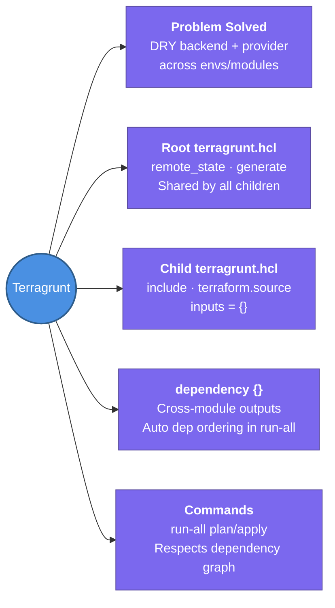

---
tags:
  - iac/terragrunt
  - review
status: not-started
---
# Terragrunt

Terragrunt is a thin Terraform wrapper by Gruntwork that solves the DRY (Don't Repeat Yourself) problem — eliminating repeated backend, provider, and variable configuration across every environment and module.

## 📖 Core Concepts

### The Problem Terragrunt Solves
In a bare Terraform directory-per-env setup, every module repeats the same boilerplate:
```hcl
# environments/dev/vpc/backend.tf   (repeated in stg, prod)
terraform {
  backend "s3" {
    bucket         = "my-tfstate"
    key            = "dev/vpc/terraform.tfstate"
    region         = "us-east-1"
    dynamodb_table = "terraform-lock"
    encrypt        = true
  }
}
```
Terragrunt generates this automatically from a single root config.

### Folder Structure
```
infrastructure/
├── terragrunt.hcl              ← root config (shared by all)
├── dev/
│   ├── vpc/
│   │   └── terragrunt.hcl     ← child config (inputs only)
│   └── eks/
│       └── terragrunt.hcl
└── prod/
    ├── vpc/
    │   └── terragrunt.hcl
    └── eks/
        └── terragrunt.hcl
```

### Root `terragrunt.hcl` — The DRY Hub
```hcl
# infrastructure/terragrunt.hcl

locals {
  account_id  = get_aws_account_id()
  env         = basename(get_original_terragrunt_dir())
}

remote_state {
  backend = "s3"
  generate = {
    path      = "backend.tf"
    if_exists = "overwrite_terragrunt"
  }
  config = {
    bucket         = "tfstate-${local.account_id}"
    key            = "${path_relative_to_include()}/terraform.tfstate"
    region         = "us-east-1"
    dynamodb_table = "terraform-lock"
    encrypt        = true
  }
}

generate "provider" {
  path      = "provider.tf"
  if_exists = "overwrite_terragrunt"
  contents  = <<EOF
provider "aws" {
  region = "us-east-1"
}
EOF
}
```

### Child `terragrunt.hcl` — Inputs Only
```hcl
# infrastructure/dev/vpc/terragrunt.hcl

include "root" {
  path = find_in_parent_folders()   # walks up to find root terragrunt.hcl
}

terraform {
  source = "../../../modules//vpc"  # double slash = module root
}

inputs = {
  vpc_cidr    = "10.0.0.0/16"
  environment = "dev"
  azs         = ["us-east-1a", "us-east-1b"]
}
```

### Key Terragrunt Blocks

#### `generate {}` — Auto-create files
Generates a `.tf` file in the module directory at runtime:
```hcl
generate "versions" {
  path      = "versions.tf"
  if_exists = "overwrite_terragrunt"
  contents  = <<EOF
terraform {
  required_version = ">= 1.5"
}
EOF
}
```

#### `include {}` — Inherit from Parent
Child configs inherit all settings from the referenced `terragrunt.hcl`:
```hcl
include "root" {
  path   = find_in_parent_folders()
  expose = true  # makes root locals accessible in child
}
```

#### `dependency {}` — Cross-Module References
Read outputs from another Terragrunt module (replaces `terraform_remote_state`):
```hcl
dependency "vpc" {
  config_path = "../vpc"
}

inputs = {
  subnet_ids = dependency.vpc.outputs.private_subnet_ids
  vpc_id     = dependency.vpc.outputs.vpc_id
}
```
Automatically resolves the dependency order on `run-all`.

#### `inputs = {}` — Variable Values
Replaces `terraform.tfvars` — pass variables directly in `terragrunt.hcl`:
```hcl
inputs = {
  instance_type = "t3.micro"
  min_size      = 2
  max_size      = 10
}
```

### Key Commands
```bash
terragrunt init                           # init current module
terragrunt plan                           # plan current module
terragrunt apply                          # apply current module
terragrunt destroy                        # destroy current module
terragrunt run-all plan                   # plan all modules in tree (respects deps)
terragrunt run-all apply                  # apply all modules in dependency order
terragrunt run-all apply --include-dir=dev  # limit to a subtree
```

### `dependency` vs `terraform_remote_state`
| | `dependency {}` (Terragrunt) | `terraform_remote_state` (native) |
|-|------------------------------|----------------------------------|
| Syntax | Clean, one block | Verbose S3 config block |
| Auto-dependency ordering | ✅ Yes (`run-all` respects it) | ❌ Manual |
| Backend config duplication | ✅ None | ❌ Repeat backend config |
| Works without Terragrunt | ❌ No | ✅ Yes |

## 🔗 Connections (Zettelkasten)
- **Relates to:** [[1. Terraform Core Concepts]] — Terragrunt wraps Terraform; all Terraform concepts still apply
- **Relates to:** [[Terraform/Modules|Modules]] — Terragrunt's `source` points at Terraform module directories
- **Relates to:** [[Terraform/Workspaces & Environments|Workspaces & Environments]] — Terragrunt's dir-per-env + `include` is the recommended alternative to workspaces at scale
- **Relates to:** [[Terraform/State Management|State Management]] — `remote_state {}` block auto-generates the S3+DDB backend config per module
- **Relates to:** [[3. Atlantis]] — Atlantis `atlantis.yaml` can define `terragrunt` workflows to run Terragrunt commands on PRs
- **Core Use Case:** Manage 10+ environments/modules without repeating backend and provider config in every directory

---

## 🏗️ Proof of Work
- **Lab/Script:** Upcoming — Terragrunt Multi-env Stack lab (see canvas)
- **Verification Command:** `terragrunt run-all plan` from the root infrastructure directory

---

## 🛠️ Study Aids

### 🧠 Mind Map


### 🗂️ Flashcards
#flashcards

**What problem does Terragrunt solve that bare Terraform doesn't?**
?
DRY (Don't Repeat Yourself) across environments and modules. In bare Terraform, every module directory repeats the same backend config, provider block, and common tags. Terragrunt's root `terragrunt.hcl` defines these once; child modules inherit via `include "root"` and only specify their `inputs`. It also adds `dependency {}` blocks for clean cross-module references and `run-all` for ordered multi-module deploys.

---

**What is the difference between `dependency {}` in Terragrunt and `terraform_remote_state` in native Terraform?**
?
Both read outputs from another module's state. `dependency {}` is cleaner: no need to repeat the S3 backend config, and `run-all` automatically respects dependency ordering. `terraform_remote_state` requires a full backend config block in every consumer and doesn't provide automatic ordering. Use `dependency {}` when using Terragrunt; use `terraform_remote_state` in plain Terraform setups.

---

**What does `find_in_parent_folders()` do in a Terragrunt `include` block?**
?
Walks up the directory tree from the current module directory until it finds a `terragrunt.hcl` file, then returns its path. This lets every child module `include "root" { path = find_in_parent_folders() }` without hardcoding the relative path — so moving a module directory doesn't break the include.
